# FORTRESS-USB — Architecture Documentation

> **Project:** Advanced Self-Protecting Encrypted Removable USB Storage System
> **Classification:** CONFIDENTIAL — Internal Engineering Use Only
> **Revision:** 1.0.0 · Spiral 1
> **Last Updated:** 2026-06-02

---

## Table of Contents

1. [System Context Diagram (C4 Level 1)](#1-system-context-diagram-c4-level-1)
2. [Container Diagram (C4 Level 2)](#2-container-diagram-c4-level-2)
3. [Component Diagram (C4 Level 3)](#3-component-diagram-c4-level-3)
4. [Key Hierarchy Diagram](#4-key-hierarchy-diagram)
5. [Data Flow Diagram (DFD)](#5-data-flow-diagram-dfd)
6. [Sequence Diagrams](#6-sequence-diagrams)
7. [State Machine Diagram](#7-state-machine-diagram)
8. [Deployment Diagram](#8-deployment-diagram)
9. [Class Diagram](#9-class-diagram)
10. [Physical Partition Layout Diagram](#10-physical-partition-layout-diagram)

---

## 1. System Context Diagram (C4 Level 1)

The System Context diagram establishes the highest-level view of FORTRESS-USB. It identifies the system boundary, all external actors, and the nature of every interaction that crosses that boundary. This is the starting point for all downstream architectural reasoning.

**External Actors:**

| Actor | Type | Trust Level |
|---|---|---|
| Authorized User | Human | Trusted (after authentication) |
| Host Machine | System | Semi-Trusted (unknown environment) |
| USB Physical Drive | Hardware | Trusted (tamper-evident) |
| Adversary | Human/System | Untrusted |

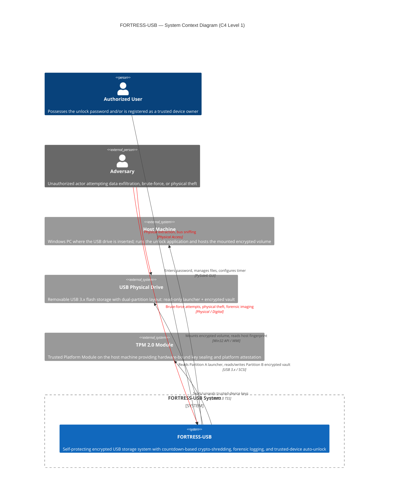

**Key Design Decisions at This Level:**

- The system boundary encapsulates *both* the on-device components (Partition A/B) and the host-side application. Neither operates independently.
- The TPM is an optional external dependency — the system degrades gracefully to password-only mode when unavailable.
- The adversary model includes both remote (brute-force via host) and physical (stolen drive) attack vectors.

---

## 2. Container Diagram (C4 Level 2)

The Container diagram decomposes the FORTRESS-USB system boundary into its four major deployable containers. Each container is an independently addressable runtime unit with clear responsibilities, interfaces, and data ownership.

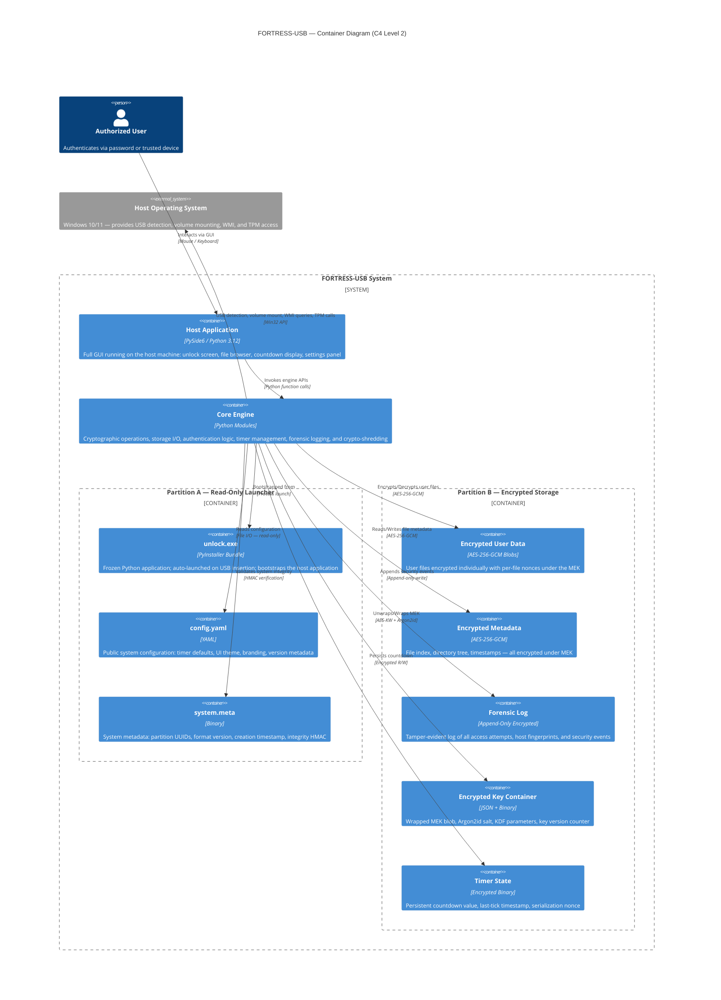

**Container Responsibilities:**

| Container | Primary Responsibility | Data Ownership |
|---|---|---|
| Partition A (Read-Only) | Bootstrap, public config, integrity anchor | `unlock.exe`, `config.yaml`, `system.meta` |
| Partition B (Encrypted) | Secure vault for all sensitive data | Encrypted blobs, key container, logs, timer |
| Host Application | User-facing GUI and interaction layer | Transient UI state only (nothing persisted on host) |
| Core Engine | All security-critical business logic | In-memory keys, session state |

> **Critical Invariant:** No sensitive data (keys, plaintext, passwords) is *ever* persisted on the host machine. All persistence is on Partition B.

---

## 3. Component Diagram (C4 Level 3)

The Component diagram provides the deepest structural view, decomposing the Core Engine container into its constituent modules. Each module is a cohesive unit of functionality with explicitly defined interfaces.

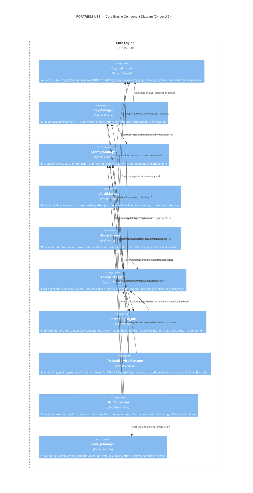

### Module Interface Summary

| Module | Key Public Methods | Thread Safety |
|---|---|---|
| **CryptoEngine** | `encrypt_aes_gcm()`, `decrypt_aes_gcm()`, `derive_kek_argon2id()`, `wrap_key_aeskw()`, `unwrap_key_aeskw()`, `generate_nonce()` | Stateless — inherently thread-safe |
| **KeyManager** | `derive_and_unwrap_mek(password)`, `rotate_mek()`, `destroy_all_keys()`, `is_mek_loaded()` | Mutex-protected key state |
| **StorageManager** | `detect_partitions()`, `mount_volume()`, `read_blob()`, `write_blob()`, `read_metadata_index()` | File-level locking |
| **AuthManager** | `validate_password(pw)`, `get_remaining_attempts()`, `reset_attempts()`, `is_locked_out()` | Atomic attempt counter |
| **TimerEngine** | `start(seconds)`, `pause()`, `resume()`, `get_remaining()`, `serialize_state()`, `restore_state()` | Timer thread isolation |
| **ForensicLogger** | `log_event(event_type, data)`, `collect_host_fingerprint()`, `export_log()` | Append-only, write-locked |
| **ShreddingEngine** | `shred_mek()`, `shred_kek()`, `shred_key_container()`, `verify_destruction()` | Exclusive lock — blocks all |
| **TrustedDeviceManager** | `register_device()`, `check_trusted()`, `auto_unlock()`, `revoke_device()` | Read-write lock on registry |
| **GUIController** | `show_screen(name)`, `bind_signals()`, `update_countdown()`, `show_destruction_dialog()` | Qt event loop only |
| **ConfigManager** | `load()`, `get(key)`, `get_kdf_params()`, `get_timer_defaults()` | Immutable after load |

---

## 4. Key Hierarchy Diagram

The cryptographic key hierarchy is the most security-critical aspect of FORTRESS-USB. It implements a two-tier key wrapping architecture that enables crypto-shredding: destroying a single 256-bit MEK renders all encrypted data permanently irrecoverable.

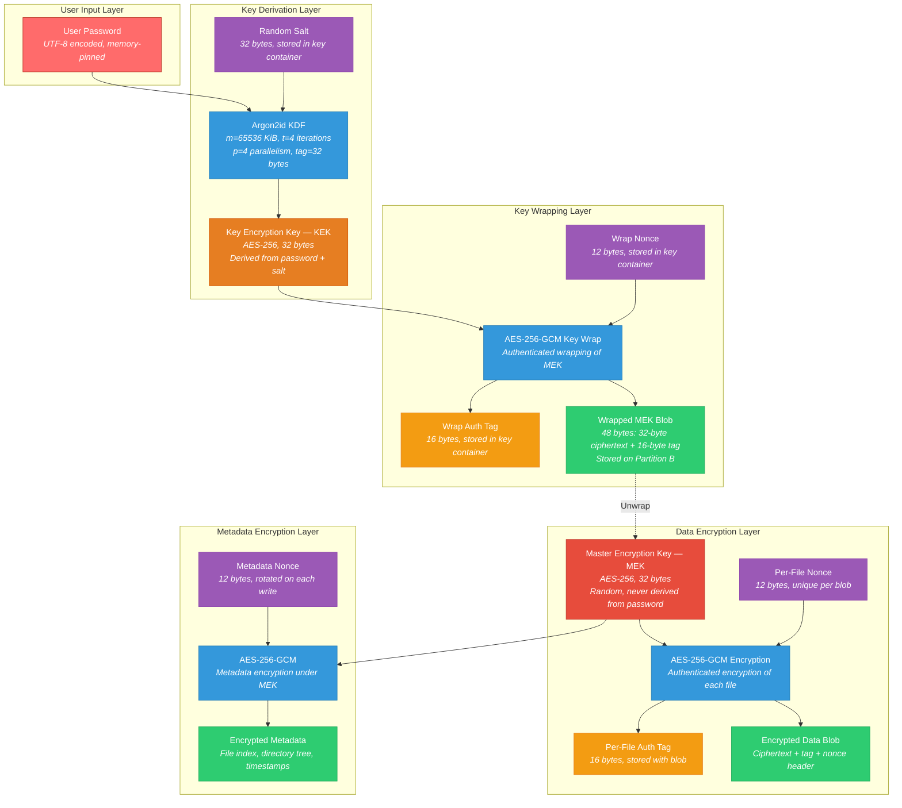

### Key Container File Structure

The key container is a binary file stored on Partition B. Its layout:

| Offset | Length | Field | Description |
|---|---|---|---|
| `0x00` | 4 | Magic | `0x464F5254` ("FORT") |
| `0x04` | 2 | Version | Key container format version (currently `0x0001`) |
| `0x06` | 2 | KDF ID | `0x0001` = Argon2id |
| `0x08` | 4 | Argon2id Memory | KiB (default: 65536) |
| `0x0C` | 4 | Argon2id Time | Iterations (default: 4) |
| `0x10` | 4 | Argon2id Parallelism | Lanes (default: 4) |
| `0x14` | 32 | Salt | Random salt for Argon2id |
| `0x34` | 12 | Wrap Nonce | Nonce used for AES-GCM key wrapping |
| `0x40` | 32 | Wrapped MEK | MEK ciphertext encrypted under KEK |
| `0x60` | 16 | Wrap Auth Tag | GCM authentication tag for wrapped MEK |
| `0x70` | 4 | Key Version | Monotonic counter, incremented on rotation |
| `0x74` | 32 | Integrity HMAC | HMAC-SHA256 over bytes `0x00–0x73` |

> **Crypto-Shredding Guarantee:** Overwriting bytes `0x40–0x6F` (the Wrapped MEK) with random data and then zeroing the in-memory MEK renders *all* encrypted data on Partition B permanently irrecoverable. No amount of computational power can reconstruct a randomly-generated 256-bit key.

---

## 5. Data Flow Diagram (DFD)

### Level 0 — Context DFD

The Level 0 DFD shows FORTRESS-USB as a single process with all external data flows.

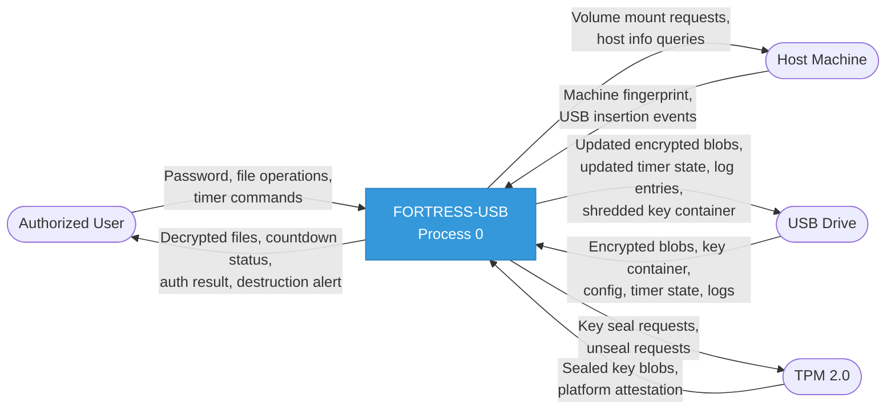

### Level 1 — Decomposed DFD

The Level 1 DFD expands Process 0 into its constituent sub-processes, showing all internal data stores and inter-process flows.

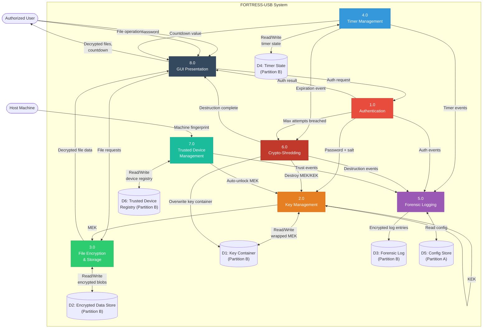

**Data Store Definitions:**

| Store | Location | Encryption | Access Pattern |
|---|---|---|---|
| D1: Key Container | Partition B, `/vault/keystore.bin` | AES-KW wrapped MEK + HMAC | Read on unlock, write on rotation/shred |
| D2: Encrypted Data | Partition B, `/vault/data/` | AES-256-GCM per blob | Read/Write during unlocked session |
| D3: Forensic Log | Partition B, `/vault/forensic.log` | AES-256-GCM per entry | Append-only |
| D4: Timer State | Partition B, `/vault/timer.state` | AES-256-GCM | Read/Write on every tick |
| D5: Config Store | Partition A, `/config.yaml` | Plaintext (public) | Read-only |
| D6: Trusted Device Registry | Partition B, `/vault/trusted.db` | AES-256-GCM | Read on insertion, write on registration |

---

## 6. Sequence Diagrams

### 6a. Normal Unlock Flow

The standard authentication sequence from password entry through to decrypted data access.

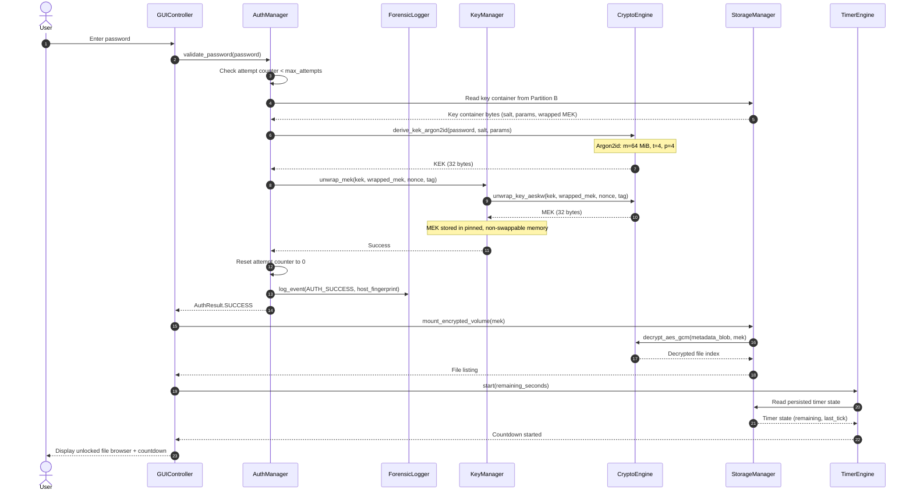

### 6b. Failed Authentication Flow

What happens when a wrong password is entered, including the escalation path to crypto-shredding.

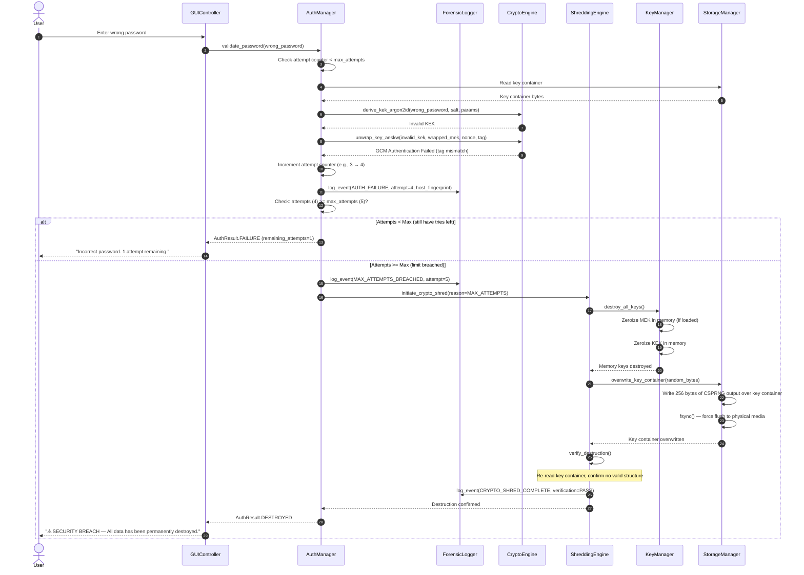

### 6c. Timer Expiration Flow

The countdown timer reaching zero triggers an irreversible crypto-shredding sequence.

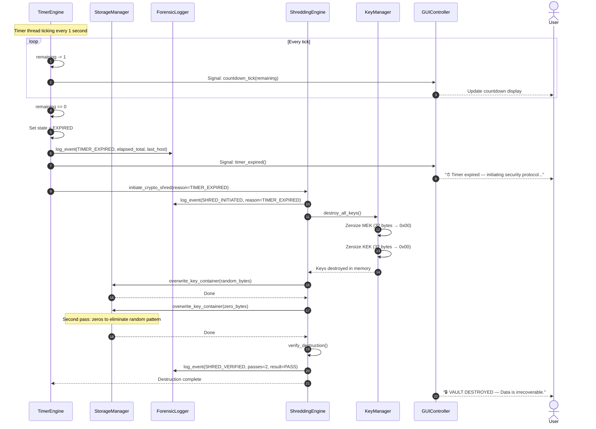

### 6d. USB Removal and Reinsertion Flow

Demonstrates the persistent timer mechanism that survives USB removal and host changes.

```mermaid
sequenceDiagram
    autonumber
    actor User
    participant GUI as GUIController
    participant Timer as TimerEngine
    participant Storage as StorageManager
    participant Crypto as CryptoEngine
    participant Auth as AuthManager
    participant Forensic as ForensicLogger

    Note over GUI: System is in UNLOCKED state, timer running
    User->>User: Physically removes USB drive

    GUI->>GUI: Detect USB removal (WMI event)
    GUI->>Timer: pause()
    Timer->>Timer: Record removal_timestamp = now()
    Timer->>Crypto: encrypt_aes_gcm(timer_state, session_key)
    Crypto-->>Timer: Encrypted timer state blob
    Timer->>Storage: write_timer_state(encrypted_blob)
    Note over Storage: Write completes if device still<br/>briefly accessible; otherwise<br/>last persisted state is used
    Timer->>Timer: Stop timer thread
    GUI->>GUI: Zeroize MEK from memory
    GUI->>GUI: Clear all decrypted data from memory
    GUI-->>User: Application closes / "USB Removed"

    Note over User: Time passes... USB is reinserted (same or different host)

    User->>User: Physically inserts USB drive
    Note over GUI: unlock.exe auto-launches from Partition A
    GUI->>Storage: detect_partitions()
    Storage-->>GUI: Partition A (read-only), Partition B (encrypted) found
    GUI->>Storage: read_timer_state()
    Storage-->>GUI: Encrypted timer state blob
    GUI->>Auth: Prompt for password
    User->>GUI: Enter password
    GUI->>Auth: validate_password(password)
    Auth-->>GUI: AuthResult.SUCCESS + MEK available

    GUI->>Timer: restore_state(encrypted_blob, mek)
    Timer->>Crypto: decrypt_aes_gcm(encrypted_blob, session_key)
    Crypto-->>Timer: Decrypted timer state
    Timer->>Timer: Calculate offline_duration = now() - removal_timestamp
    Timer->>Timer: remaining = persisted_remaining - offline_duration
    Note over Timer: Timer counted DOWN during offline period!

    alt remaining > 0
        Timer->>Timer: Resume countdown from adjusted value
        Timer->>Forensic: log_event(TIMER_RESUMED, offline_duration, new_remaining)
        Timer-->>GUI: Countdown resumed
        GUI-->>User: Display file browser + adjusted countdown
    else remaining <= 0 (expired while offline)
        Timer->>Forensic: log_event(TIMER_EXPIRED_OFFLINE, offline_duration)
        Timer->>Timer: Trigger expiration flow
        Note over Timer: → See Sequence 6c: Timer Expiration Flow
    end
```

### 6e. Trusted Host Auto-Unlock Flow

When the USB is inserted into a previously-registered trusted machine, authentication can be automatic.

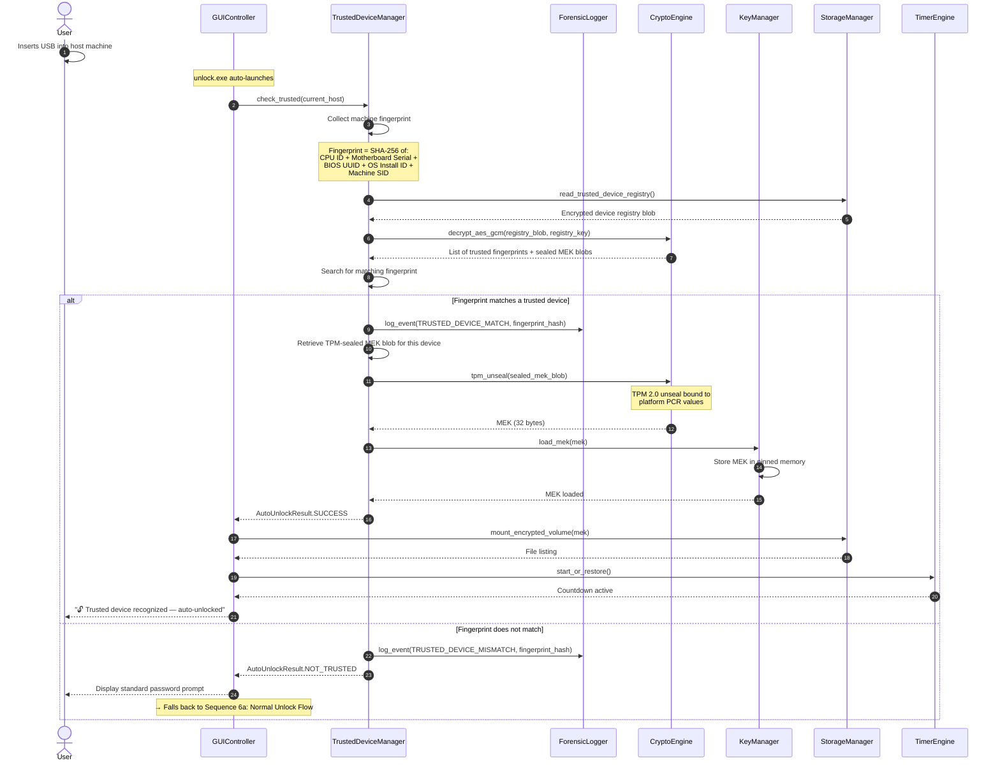

### 6f. Crypto-Shredding Flow

The detailed, step-by-step destruction sequence with multi-pass overwrite and verification.

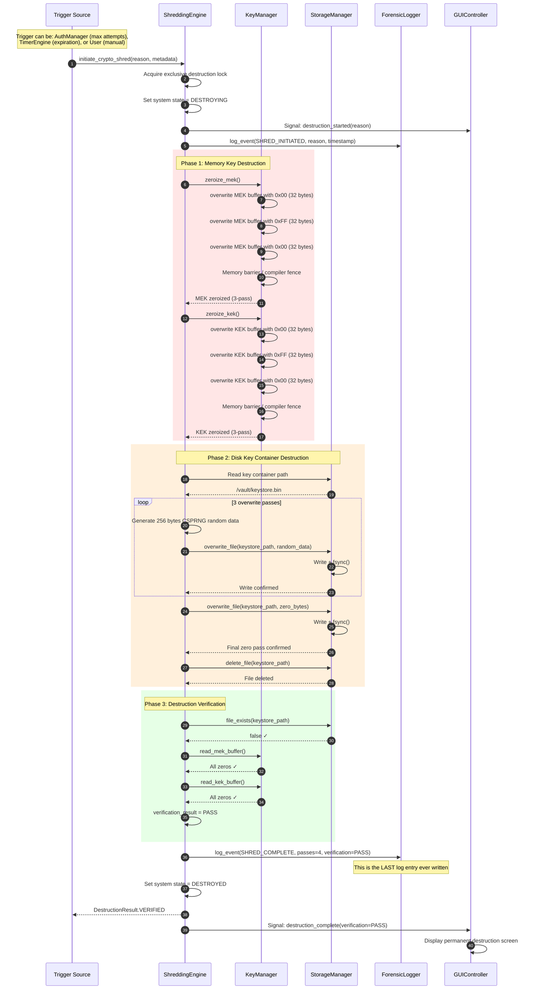

---

## 7. State Machine Diagram

The system state machine defines every valid state, every allowed transition, and every guard condition. Once the `DESTROYED` state is reached, there is no recovery path — this is by design.

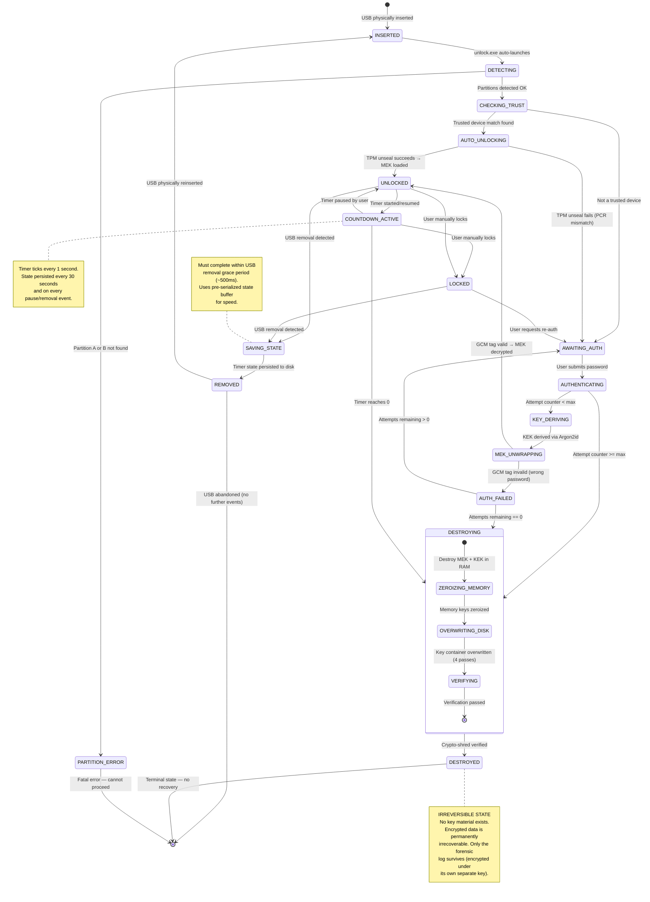

**State Transition Summary:**

| From | To | Trigger | Guard |
|---|---|---|---|
| INSERTED | DETECTING | unlock.exe launches | — |
| DETECTING | CHECKING_TRUST | Valid partitions found | Both partitions readable |
| CHECKING_TRUST | AUTO_UNLOCKING | Trusted device match | Fingerprint in registry |
| CHECKING_TRUST | AWAITING_AUTH | No trust match | — |
| AWAITING_AUTH | AUTHENTICATING | Password submitted | — |
| AUTHENTICATING | KEY_DERIVING | — | attempts < max |
| AUTHENTICATING | DESTROYING | — | attempts >= max |
| KEY_DERIVING | MEK_UNWRAPPING | KEK ready | — |
| MEK_UNWRAPPING | UNLOCKED | Valid GCM tag | — |
| MEK_UNWRAPPING | AUTH_FAILED | Invalid GCM tag | — |
| AUTH_FAILED | AWAITING_AUTH | — | remaining > 0 |
| AUTH_FAILED | DESTROYING | — | remaining == 0 |
| UNLOCKED | COUNTDOWN_ACTIVE | Timer started | — |
| COUNTDOWN_ACTIVE | DESTROYING | remaining == 0 | — |
| ANY (Unlocked/Locked) | SAVING_STATE | USB removal event | — |
| DESTROYING | DESTROYED | Verification passes | — |

---

## 8. Deployment Diagram

The deployment diagram shows the physical and logical deployment topology across the USB drive and the host machine.

```mermaid
flowchart TB
    subgraph USBDrive["USB 3.x Flash Drive"]
        direction TB
        subgraph PartA["Partition A — FAT32, Read-Only"]
            direction TB
            autorun["autorun.inf<br/><i>Auto-launch configuration</i>"]
            unlockExe["unlock.exe<br/><i>PyInstaller single-file bundle</i><br/><i>~45 MB, code-signed</i>"]
            configYaml["config.yaml<br/><i>Timer defaults, UI settings,</i><br/><i>branding, version info</i>"]
            systemMeta["system.meta<br/><i>Partition UUIDs, format version,</i><br/><i>creation timestamp, HMAC</i>"]
            icon["icon.ico<br/><i>Custom drive icon</i>"]
            readme["README.txt<br/><i>User instructions</i>"]
        end

        subgraph PartB["Partition B — RAW/Unformatted, Hidden"]
            direction TB
            vaultHeader["vault_header.bin<br/><i>Magic bytes, version,</i><br/><i>partition integrity hash</i>"]
            keystore["keystore.bin<br/><i>Wrapped MEK, salt, KDF params,</i><br/><i>nonce, auth tag, key version</i>"]
            subgraph dataDir["data/"]
                blob1["blob_001.enc"]
                blob2["blob_002.enc"]
                blobN["blob_NNN.enc"]
            end
            metadataEnc["metadata.enc<br/><i>Encrypted file index,</i><br/><i>directory tree, timestamps</i>"]
            forensicLog["forensic.log<br/><i>Append-only, encrypted</i><br/><i>per-entry AES-256-GCM</i>"]
            timerState["timer.state<br/><i>Encrypted countdown value,</i><br/><i>last-tick timestamp</i>"]
            trustedDB["trusted.db<br/><i>Encrypted device registry</i><br/><i>with TPM-sealed MEK blobs</i>"]
        end
    end

    subgraph HostMachine["Host Machine — Windows 10/11"]
        direction TB
        subgraph Runtime["Runtime Environment"]
            pythonRT["Python 3.12 Runtime<br/><i>Embedded in PyInstaller bundle</i>"]
            pyside6["PySide6 / Qt 6<br/><i>GUI framework</i>"]
            cryptoLibs["cryptography 42.x<br/><i>OpenSSL 3.x backend</i>"]
            argon2Lib["argon2-cffi<br/><i>Argon2id implementation</i>"]
            wmiLib["wmi / pywin32<br/><i>Host fingerprinting</i>"]
            tpmLib["tpm2-pytss<br/><i>TPM 2.0 access</i>"]
        end

        subgraph OSServices["OS Services"]
            usbDriver["USB 3.x Host Controller Driver"]
            volumeMgr["Volume Manager / Disk Management"]
            tpmDriver["TPM 2.0 Device Driver"]
            wmiService["WMI Service (winmgmt)"]
        end

        subgraph Memory["In-Memory Only (Never Persisted)"]
            mekRAM["MEK — 32 bytes<br/><i>Pinned, non-pageable</i>"]
            kekRAM["KEK — 32 bytes<br/><i>Ephemeral, zeroized after use</i>"]
            sessionState["Session State<br/><i>Decrypted metadata cache</i>"]
        end
    end

    unlockExe -->|"Launches"| pythonRT
    pythonRT --> pyside6
    pythonRT --> cryptoLibs
    pythonRT --> argon2Lib
    pythonRT --> wmiLib
    pythonRT --> tpmLib

    usbDriver -->|"USB 3.x"| PartA
    usbDriver -->|"USB 3.x"| PartB
    wmiService -->|"COM"| wmiLib
    tpmDriver -->|"TSS"| tpmLib

    cryptoLibs --> mekRAM
    cryptoLibs --> kekRAM

    style PartA fill:#2ecc71,stroke:#27ae60,color:#fff
    style PartB fill:#e74c3c,stroke:#c0392b,color:#fff
    style Runtime fill:#3498db,stroke:#2980b9,color:#fff
    style Memory fill:#e67e22,stroke:#d35400,color:#fff
    style OSServices fill:#95a5a6,stroke:#7f8c8d,color:#fff
```

### PyInstaller Build Configuration

| Parameter | Value | Rationale |
|---|---|---|
| `--onefile` | Yes | Single `unlock.exe` for simplicity |
| `--noconsole` | Yes | GUI application, no terminal window |
| `--icon` | `icon.ico` | Custom drive/application icon |
| `--add-data` | Qt plugins, SSL certs | Required runtime dependencies |
| `--uac-admin` | No | Runs without elevation (user-space) |
| Code Signing | Authenticode (EV cert) | Prevents SmartScreen/AV warnings |
| Anti-Tamper | HMAC of exe hash in `system.meta` | Detects launcher modification |

---

## 9. Class Diagram

The class diagram captures all major classes, their attributes, methods, visibility modifiers, and inter-class relationships (inheritance, composition, dependency).

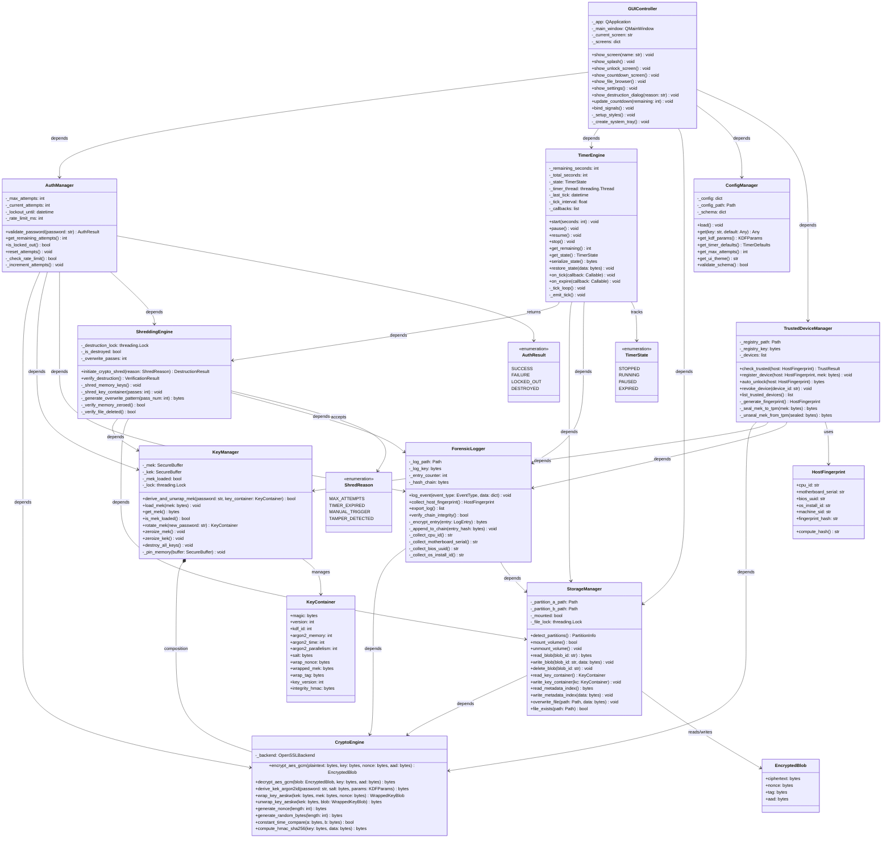

---

## 10. Physical Partition Layout Diagram

This diagram provides a byte-level view of the USB drive's physical layout, showing both partitions, their filesystem structures, and the exact on-disk format of security-critical data.

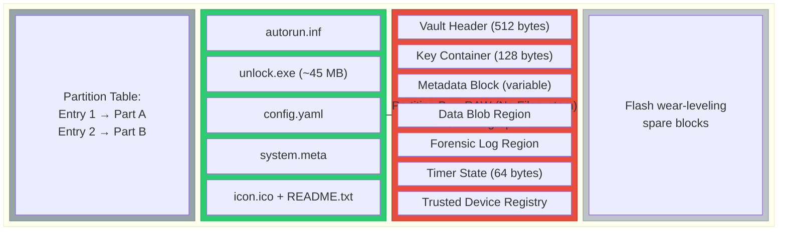

### Detailed Partition B On-Disk Layout

The following diagram shows the internal structure of Partition B at byte-level granularity. This partition uses raw block access — there is no filesystem layer, which prevents host OS indexing and casual browsing.

```mermaid
flowchart TD
    subgraph PartB["Partition B — Raw Block Layout"]
        direction TB

        subgraph VaultHeader["Vault Header — Offset 0x0000, Size 512 bytes"]
            VH1["Bytes 0x00-0x03: Magic = 0x464F5254 'FORT'"]
            VH2["Bytes 0x04-0x05: Format Version = 0x0001"]
            VH3["Bytes 0x06-0x09: Flags (encrypted, timer-enabled, etc.)"]
            VH4["Bytes 0x0A-0x11: Creation Timestamp (uint64, Unix epoch)"]
            VH5["Bytes 0x12-0x31: Partition B UUID (32 bytes)"]
            VH6["Bytes 0x32-0x51: Reserved"]
            VH7["Bytes 0x1E0-0x1FF: HMAC-SHA256 of header (integrity)"]
        end

        subgraph KeyStore["Key Container — Offset 0x0200, Size 128 bytes"]
            KS1["Bytes 0x00-0x03: Magic = 0x4B455953 'KEYS'"]
            KS2["Bytes 0x04-0x07: KDF Params (mem, time, par)"]
            KS3["Bytes 0x08-0x27: Salt (32 bytes)"]
            KS4["Bytes 0x28-0x33: Wrap Nonce (12 bytes)"]
            KS5["Bytes 0x34-0x53: Wrapped MEK (32 bytes ciphertext)"]
            KS6["Bytes 0x54-0x63: Wrap Auth Tag (16 bytes)"]
            KS7["Bytes 0x64-0x67: Key Version Counter"]
            KS8["Bytes 0x68-0x7F: HMAC-SHA256 of container"]
        end

        subgraph MetaBlock["Metadata Block — Offset 0x0280"]
            MB1["AES-256-GCM encrypted blob"]
            MB2["Contains: file index, directory tree,"]
            MB3["file sizes, timestamps, blob mappings"]
            MB4["Preceded by: 12-byte nonce + 16-byte tag"]
        end

        subgraph DataRegion["Data Blob Region — Offset 0x10000"]
            DR1["Each blob: 12B nonce | 16B tag | ciphertext"]
            DR2["Blob index in metadata maps ID → offset"]
            DR3["Free space tracked in metadata block"]
            DR4["No padding between blobs (compact)"]
        end

        subgraph LogRegion["Forensic Log Region — Last 1 MB"]
            LR1["Append-only ring buffer"]
            LR2["Each entry: sequence | timestamp | type |"]
            LR3["data | prev_hash | entry_HMAC"]
            LR4["Encrypted individually under log key"]
        end

        subgraph TimerRegion["Timer + Trust Region — Last 4 KB"]
            TR1["Timer State: remaining_sec (4B) |"]
            TR2["last_tick (8B) | total_sec (4B) |"]
            TR3["nonce (12B) | tag (16B)"]
            TR4["Trusted Device Registry: encrypted"]
            TR5["list of fingerprint-hash + sealed-MEK pairs"]
        end
    end

    VaultHeader --> KeyStore
    KeyStore --> MetaBlock
    MetaBlock --> DataRegion
    DataRegion --> LogRegion
    LogRegion --> TimerRegion

    style VaultHeader fill:#34495e,stroke:#2c3e50,color:#fff
    style KeyStore fill:#e74c3c,stroke:#c0392b,color:#fff
    style MetaBlock fill:#e67e22,stroke:#d35400,color:#fff
    style DataRegion fill:#3498db,stroke:#2980b9,color:#fff
    style LogRegion fill:#9b59b6,stroke:#8e44ad,color:#fff
    style TimerRegion fill:#1abc9c,stroke:#16a085,color:#fff
```

### Partition Comparison Table

| Property | Partition A | Partition B |
|---|---|---|
| **Filesystem** | FAT32 | Raw (no filesystem) |
| **Visibility** | Visible as removable drive | Hidden from OS |
| **Access Mode** | Read-only | Direct block I/O |
| **Size** | ~200 MB (fixed) | Remaining capacity |
| **Encryption** | None (public data only) | AES-256-GCM (all data) |
| **Purpose** | Auto-launch, configuration, branding | Secure vault for all sensitive data |
| **Survives Shred** | Yes | Encrypted data survives, keys do not |
| **OS Indexing** | Yes (FAT32 directory) | No (raw blocks, no FS metadata) |

---

## Appendix A: Diagram Legend

| Color | Meaning |
|---|---|
| 🟢 Green | Public / read-only / safe data |
| 🔴 Red | Security-critical / encrypted / sensitive |
| 🔵 Blue | Processing / computation / engine |
| 🟠 Orange | Key material / cryptographic state |
| 🟣 Purple | Logging / auditing / forensics |
| ⚪ Gray | Infrastructure / OS services |

## Appendix B: Acronyms

| Acronym | Definition |
|---|---|
| **MEK** | Master Encryption Key — the randomly-generated AES-256 key that encrypts all user data |
| **KEK** | Key Encryption Key — derived from user password via Argon2id; wraps the MEK |
| **KDF** | Key Derivation Function — Argon2id in this system |
| **GCM** | Galois/Counter Mode — authenticated encryption mode for AES |
| **AES-KW** | AES Key Wrap — NIST SP 800-38F compliant key wrapping |
| **TPM** | Trusted Platform Module — hardware security module for key sealing |
| **HMAC** | Hash-based Message Authentication Code |
| **CSPRNG** | Cryptographically Secure Pseudo-Random Number Generator |
| **PCR** | Platform Configuration Register — TPM measurement register |
| **WMI** | Windows Management Instrumentation — hardware/OS query interface |
| **DFD** | Data Flow Diagram |
| **C4** | Context, Containers, Components, Code — architecture model by Simon Brown |

---

> **Document Control:** This architecture document is the single source of truth for FORTRESS-USB system design. All implementation must conform to these diagrams. Any deviation requires a formal Architecture Decision Record (ADR) and approval from the security lead.
