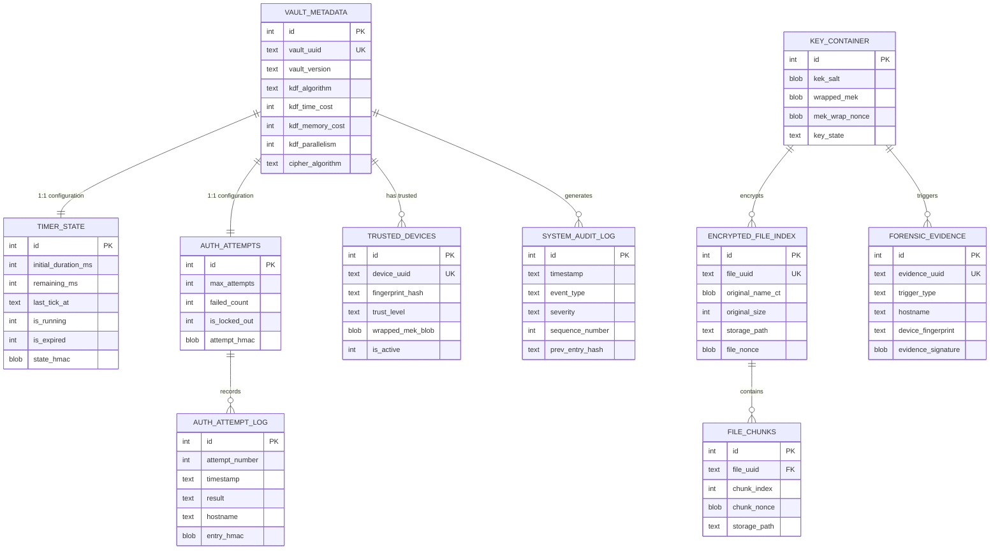

# FORTRESS-USB Database Schema

## Overview

The system uses **two separate SQLite databases** for security isolation:

| Database | Location | Purpose | Encryption |
|----------|----------|---------|------------|
| `system.db` | Partition A (Read-Only Launcher) | Timer state, attempt counter, trusted devices, audit trail | Integrity-protected (HMAC) |
| `vault.db` | Partition B (Encrypted Storage) | Vault header, key container, forensic logs | AES-256-GCM encrypted |

> **Design Decision**: Separating databases ensures that security-critical state (timer, attempts)
> lives on the read-only partition where it cannot be tampered with by modifying the encrypted
> partition. The vault database holds cryptographic material that must be destroyed during
> crypto-shredding.

---

## Database 1: System Database (`system.db`)

Located on Partition A (Read-Only Launcher). This database maintains security state that
must survive USB removal, reinsertion, and reboot attempts.

> **Note**: While Partition A is conceptually "read-only" to users, the system application
> itself must be able to write to this database. This is achieved by storing `system.db`
> in a hidden, system-protected area of Partition A with ACL restrictions.

### Table: `vault_metadata`

Stores vault configuration and version information.

```sql
CREATE TABLE vault_metadata (
    id              INTEGER PRIMARY KEY CHECK (id = 1),  -- Singleton row
    vault_uuid      TEXT    NOT NULL UNIQUE,              -- UUID v4 for this vault instance
    vault_version   TEXT    NOT NULL DEFAULT '1.0.0',     -- Schema version for migrations
    created_at      TEXT    NOT NULL,                     -- ISO 8601 timestamp
    last_accessed   TEXT,                                 -- ISO 8601 timestamp
    device_label    TEXT    NOT NULL DEFAULT 'FORTRESS',  -- User-visible drive label
    
    -- Argon2id parameters (stored for future-proof parameter upgrades)
    kdf_algorithm   TEXT    NOT NULL DEFAULT 'argon2id',
    kdf_time_cost   INTEGER NOT NULL DEFAULT 4,
    kdf_memory_cost INTEGER NOT NULL DEFAULT 262144,      -- 256 MiB in KiB
    kdf_parallelism INTEGER NOT NULL DEFAULT 8,
    kdf_hash_len    INTEGER NOT NULL DEFAULT 32,           -- 256 bits
    kdf_salt_len    INTEGER NOT NULL DEFAULT 16,           -- 128 bits
    
    -- Encryption parameters
    cipher_algorithm TEXT   NOT NULL DEFAULT 'AES-256-GCM',
    nonce_length     INTEGER NOT NULL DEFAULT 12,          -- 96 bits for GCM
    tag_length       INTEGER NOT NULL DEFAULT 16,          -- 128-bit auth tag
    
    -- Integrity
    metadata_hmac   BLOB   NOT NULL                        -- HMAC-SHA256 of all fields
);
```

### Table: `timer_state`

Persistent countdown timer that survives USB removal and power cycles.

```sql
CREATE TABLE timer_state (
    id                  INTEGER PRIMARY KEY CHECK (id = 1),  -- Singleton row
    
    -- Timer configuration
    initial_duration_ms INTEGER NOT NULL DEFAULT 120000,      -- 120 seconds in ms
    
    -- Current state
    remaining_ms        INTEGER NOT NULL DEFAULT 120000,      -- Remaining time in ms
    last_tick_at        TEXT    NOT NULL,                      -- ISO 8601 with microseconds
    is_running          INTEGER NOT NULL DEFAULT 0,            -- Boolean: 1=running, 0=paused
    is_expired          INTEGER NOT NULL DEFAULT 0,            -- Boolean: 1=expired
    
    -- Anti-tamper
    state_nonce         BLOB   NOT NULL,                      -- Random nonce for state integrity
    state_hmac          BLOB   NOT NULL,                      -- HMAC-SHA256 of timer state
    
    -- Audit
    total_elapsed_ms    INTEGER NOT NULL DEFAULT 0,            -- Total time elapsed since creation
    pause_count         INTEGER NOT NULL DEFAULT 0,            -- Number of pause events (USB removals)
    resume_count        INTEGER NOT NULL DEFAULT 0,            -- Number of resume events (USB insertions)
    created_at          TEXT    NOT NULL,                       -- ISO 8601 timestamp
    last_modified_at    TEXT    NOT NULL                        -- ISO 8601 timestamp
);

-- Index for fast state checks
CREATE INDEX idx_timer_expired ON timer_state(is_expired);
```

### Table: `auth_attempts`

Tracks authentication attempts with persistence across USB removal.

```sql
CREATE TABLE auth_attempts (
    id                  INTEGER PRIMARY KEY CHECK (id = 1),  -- Singleton row
    
    -- Attempt tracking
    max_attempts        INTEGER NOT NULL DEFAULT 3,
    failed_count        INTEGER NOT NULL DEFAULT 0,
    successful_count    INTEGER NOT NULL DEFAULT 0,
    is_locked_out       INTEGER NOT NULL DEFAULT 0,           -- Boolean: 1=locked out
    
    -- Timestamps
    first_attempt_at    TEXT,                                  -- ISO 8601
    last_attempt_at     TEXT,                                  -- ISO 8601
    lockout_at          TEXT,                                  -- ISO 8601 (when lockout triggered)
    
    -- Anti-tamper
    attempt_nonce       BLOB   NOT NULL,                      -- Random nonce
    attempt_hmac        BLOB   NOT NULL,                      -- HMAC-SHA256 of attempt state
    
    -- Metadata
    created_at          TEXT   NOT NULL,
    last_modified_at    TEXT   NOT NULL
);
```

### Table: `auth_attempt_log`

Detailed log of each individual authentication attempt.

```sql
CREATE TABLE auth_attempt_log (
    id              INTEGER PRIMARY KEY AUTOINCREMENT,
    attempt_number  INTEGER NOT NULL,                 -- 1, 2, 3...
    timestamp       TEXT    NOT NULL,                  -- ISO 8601 with microseconds
    result          TEXT    NOT NULL CHECK (result IN ('SUCCESS', 'FAILURE', 'LOCKOUT')),
    
    -- Host information at time of attempt
    hostname        TEXT,
    username        TEXT,
    machine_uuid    TEXT,
    ip_address      TEXT,
    mac_address     TEXT,
    os_info         TEXT,
    
    -- Error details (for failures)
    failure_reason  TEXT,
    
    -- Integrity
    entry_hmac      BLOB   NOT NULL                   -- HMAC-SHA256 of this log entry
);

CREATE INDEX idx_attempt_timestamp ON auth_attempt_log(timestamp);
CREATE INDEX idx_attempt_result ON auth_attempt_log(result);
```

### Table: `trusted_devices`

Registry of trusted host machines for automatic unlock.

```sql
CREATE TABLE trusted_devices (
    id                  INTEGER PRIMARY KEY AUTOINCREMENT,
    device_uuid         TEXT    NOT NULL UNIQUE,        -- UUID v4 for this trusted device entry
    
    -- Machine fingerprint components
    machine_uuid        TEXT    NOT NULL,               -- SMBIOS System UUID
    motherboard_serial  TEXT,                           -- Baseboard serial number
    windows_sid         TEXT,                           -- Windows Security Identifier
    tpm_public_key_hash TEXT,                           -- SHA-256 of TPM endorsement key
    
    -- Composite fingerprint
    fingerprint_hash    TEXT    NOT NULL,               -- SHA-256(uuid|serial|sid|tpm)
    fingerprint_version INTEGER NOT NULL DEFAULT 1,     -- Version for hash algorithm changes
    
    -- Authorization
    device_name         TEXT    NOT NULL,               -- User-assigned friendly name
    is_active           INTEGER NOT NULL DEFAULT 1,     -- Boolean: can auto-unlock
    trust_level         TEXT    NOT NULL DEFAULT 'STANDARD' 
                        CHECK (trust_level IN ('STANDARD', 'ELEVATED', 'ADMIN')),
    
    -- Wrapped key material for auto-unlock
    wrapped_mek_blob    BLOB,                          -- MEK wrapped with device-specific KEK
    device_kek_salt     BLOB,                          -- Salt for device-specific KEK derivation
    device_kek_nonce    BLOB,                          -- Nonce used for MEK wrapping
    
    -- Timestamps
    registered_at       TEXT    NOT NULL,               -- ISO 8601
    last_used_at        TEXT,                           -- ISO 8601
    expires_at          TEXT,                           -- ISO 8601 (optional expiry)
    
    -- Integrity
    entry_hmac          BLOB   NOT NULL                 -- HMAC-SHA256 of this entry
);

CREATE INDEX idx_trusted_fingerprint ON trusted_devices(fingerprint_hash);
CREATE INDEX idx_trusted_active ON trusted_devices(is_active);
```

### Table: `system_audit_log`

System-level audit trail for security events.

```sql
CREATE TABLE system_audit_log (
    id              INTEGER PRIMARY KEY AUTOINCREMENT,
    timestamp       TEXT    NOT NULL,                  -- ISO 8601 with microseconds
    event_type      TEXT    NOT NULL CHECK (event_type IN (
        'USB_INSERTED', 'USB_REMOVED',
        'TIMER_STARTED', 'TIMER_PAUSED', 'TIMER_RESUMED', 'TIMER_EXPIRED',
        'AUTH_SUCCESS', 'AUTH_FAILURE', 'AUTH_LOCKOUT',
        'VAULT_UNLOCKED', 'VAULT_LOCKED',
        'TRUSTED_DEVICE_REGISTERED', 'TRUSTED_DEVICE_REMOVED', 'TRUSTED_AUTO_UNLOCK',
        'CRYPTO_SHRED_INITIATED', 'CRYPTO_SHRED_COMPLETED',
        'FORENSIC_LOG_CAPTURED',
        'CONFIG_CHANGED',
        'INTEGRITY_VIOLATION',
        'SYSTEM_ERROR'
    )),
    severity        TEXT    NOT NULL DEFAULT 'INFO' CHECK (severity IN (
        'DEBUG', 'INFO', 'WARNING', 'ERROR', 'CRITICAL'
    )),
    
    -- Event details
    description     TEXT    NOT NULL,
    details_json    TEXT,                              -- JSON blob with event-specific data
    
    -- Source information
    source_module   TEXT    NOT NULL,                  -- Module that generated the event
    hostname        TEXT,
    username        TEXT,
    
    -- Integrity
    sequence_number INTEGER NOT NULL,                  -- Monotonic counter for ordering
    prev_entry_hash TEXT,                              -- Hash chain: SHA-256 of previous entry
    entry_hmac      BLOB   NOT NULL                    -- HMAC-SHA256 of this entry
);

CREATE INDEX idx_audit_timestamp ON system_audit_log(timestamp);
CREATE INDEX idx_audit_event_type ON system_audit_log(event_type);
CREATE INDEX idx_audit_severity ON system_audit_log(severity);
CREATE INDEX idx_audit_sequence ON system_audit_log(sequence_number);
```

---

## Database 2: Vault Database (`vault.db`)

Located on Partition B (Encrypted Storage). Contains cryptographic key material
and forensic evidence. **This database is the primary target of crypto-shredding.**

### Table: `key_container`

Stores the encrypted Media Encryption Key (MEK) and related cryptographic material.

```sql
CREATE TABLE key_container (
    id              INTEGER PRIMARY KEY CHECK (id = 1),  -- Singleton row
    
    -- Key Encryption Key (KEK) derivation parameters
    kek_salt        BLOB    NOT NULL,                    -- 16-byte Argon2id salt
    
    -- Wrapped MEK (encrypted by KEK)
    wrapped_mek     BLOB    NOT NULL,                    -- AES-256-GCM(KEK, MEK)
    mek_wrap_nonce  BLOB    NOT NULL,                    -- 12-byte GCM nonce for MEK wrapping
    mek_wrap_tag    BLOB    NOT NULL,                    -- 16-byte GCM auth tag
    
    -- MEK verification (encrypted known value to verify correct password)
    verification_ct BLOB    NOT NULL,                    -- AES-256-GCM(MEK, "FORTRESS-VERIFY")
    verify_nonce    BLOB    NOT NULL,                    -- 12-byte GCM nonce
    verify_tag      BLOB    NOT NULL,                    -- 16-byte GCM auth tag
    
    -- Key metadata
    mek_created_at  TEXT    NOT NULL,                    -- ISO 8601
    mek_version     INTEGER NOT NULL DEFAULT 1,          -- For key rotation tracking
    key_state       TEXT    NOT NULL DEFAULT 'ACTIVE' 
                    CHECK (key_state IN ('ACTIVE', 'ROTATING', 'DESTROYED')),
    
    -- Integrity
    container_hmac  BLOB   NOT NULL                      -- HMAC-SHA256 of entire container
);
```

### Table: `encrypted_file_index`

Index of all encrypted files stored in the vault.

```sql
CREATE TABLE encrypted_file_index (
    id                  INTEGER PRIMARY KEY AUTOINCREMENT,
    file_uuid           TEXT    NOT NULL UNIQUE,          -- UUID v4 for each file
    
    -- Original file metadata (encrypted)
    original_name_ct    BLOB    NOT NULL,                 -- Encrypted original filename
    original_path_ct    BLOB    NOT NULL,                 -- Encrypted original relative path
    original_size       INTEGER NOT NULL,                 -- Original file size in bytes
    original_hash       TEXT    NOT NULL,                 -- SHA-256 of plaintext file
    mime_type_ct        BLOB,                             -- Encrypted MIME type
    
    -- Encrypted file location
    storage_path        TEXT    NOT NULL,                  -- Path to encrypted blob on disk
    encrypted_size      INTEGER NOT NULL,                  -- Encrypted blob size
    
    -- Per-file encryption metadata
    file_nonce          BLOB    NOT NULL,                  -- 12-byte GCM nonce
    file_tag            BLOB    NOT NULL,                  -- 16-byte GCM auth tag
    
    -- Chunking (for large files)
    chunk_count         INTEGER NOT NULL DEFAULT 1,
    chunk_size          INTEGER NOT NULL DEFAULT 1048576,  -- 1 MiB default chunk size
    
    -- Timestamps
    created_at          TEXT    NOT NULL,
    modified_at         TEXT    NOT NULL,
    accessed_at         TEXT,
    
    -- State
    is_deleted          INTEGER NOT NULL DEFAULT 0,        -- Soft delete flag
    
    -- Integrity
    entry_hmac          BLOB   NOT NULL
);

CREATE INDEX idx_file_uuid ON encrypted_file_index(file_uuid);
CREATE INDEX idx_file_storage ON encrypted_file_index(storage_path);
CREATE INDEX idx_file_deleted ON encrypted_file_index(is_deleted);
```

### Table: `file_chunks`

For large files, tracks individual encrypted chunks.

```sql
CREATE TABLE file_chunks (
    id              INTEGER PRIMARY KEY AUTOINCREMENT,
    file_uuid       TEXT    NOT NULL,                  -- FK to encrypted_file_index
    chunk_index     INTEGER NOT NULL,                  -- 0-based chunk index
    
    -- Chunk encryption metadata
    chunk_nonce     BLOB    NOT NULL,                  -- 12-byte GCM nonce per chunk
    chunk_tag       BLOB    NOT NULL,                  -- 16-byte GCM auth tag per chunk
    chunk_size      INTEGER NOT NULL,                  -- Size of this specific chunk
    storage_path    TEXT    NOT NULL,                  -- Path to chunk file
    
    -- Integrity
    chunk_hash      TEXT    NOT NULL,                  -- SHA-256 of encrypted chunk
    
    FOREIGN KEY (file_uuid) REFERENCES encrypted_file_index(file_uuid),
    UNIQUE(file_uuid, chunk_index)
);

CREATE INDEX idx_chunk_file ON file_chunks(file_uuid);
```

### Table: `forensic_evidence`

Pre-destruction forensic evidence collection. **Designed to survive crypto-shredding.**

```sql
CREATE TABLE forensic_evidence (
    id                  INTEGER PRIMARY KEY AUTOINCREMENT,
    evidence_uuid       TEXT    NOT NULL UNIQUE,          -- UUID v4
    
    -- Trigger information
    trigger_type        TEXT    NOT NULL CHECK (trigger_type IN (
        'TIMER_EXPIRY', 'MAX_ATTEMPTS', 'MANUAL_SHRED', 'TAMPER_DETECTED'
    )),
    trigger_timestamp   TEXT    NOT NULL,                  -- ISO 8601 with microseconds
    
    -- Host machine evidence
    hostname            TEXT,
    username            TEXT,
    domain              TEXT,
    mac_addresses       TEXT,                              -- JSON array of all MACs
    ip_addresses        TEXT,                              -- JSON array of all IPs
    operating_system    TEXT,                              -- OS name + version + build
    os_architecture     TEXT,                              -- x86/x64/ARM64
    
    -- Hardware fingerprint
    machine_uuid        TEXT,                              -- SMBIOS System UUID
    motherboard_serial  TEXT,
    bios_version        TEXT,
    cpu_id              TEXT,
    
    -- USB connection details
    usb_port_path       TEXT,                              -- Physical USB port path
    usb_hub_info        TEXT,                              -- Hub chain information
    
    -- Security state at time of capture
    timer_remaining_ms  INTEGER,
    failed_attempts     INTEGER,
    vault_state         TEXT,
    
    -- Device fingerprint (composite hash)
    device_fingerprint  TEXT    NOT NULL,                  -- SHA-256 composite
    
    -- Geographic hints (if available)
    timezone            TEXT,
    locale              TEXT,
    
    -- Collection metadata
    collection_duration_ms INTEGER,                       -- How long evidence collection took
    collector_version      TEXT NOT NULL,                  -- Forensic engine version
    
    -- Integrity (uses separate key that survives shredding)
    evidence_signature  BLOB   NOT NULL,                  -- HMAC-SHA256 with forensic key
    
    created_at          TEXT   NOT NULL
);

CREATE INDEX idx_forensic_trigger ON forensic_evidence(trigger_type);
CREATE INDEX idx_forensic_timestamp ON forensic_evidence(trigger_timestamp);
CREATE INDEX idx_forensic_fingerprint ON forensic_evidence(device_fingerprint);
```

---

## Entity Relationship Diagram



---

## Anti-Tamper Design

### HMAC Chain for Audit Logs

The `system_audit_log` table implements a **hash chain** for tamper detection:

```
Entry N:
  prev_entry_hash = SHA-256(Entry N-1)
  entry_hmac = HMAC-SHA256(hmac_key, all_fields || prev_entry_hash)

Entry N+1:
  prev_entry_hash = SHA-256(Entry N)
  entry_hmac = HMAC-SHA256(hmac_key, all_fields || prev_entry_hash)
```

If any entry is modified or deleted, the hash chain breaks, revealing tampering.

### Singleton Row Pattern

Critical state tables (`vault_metadata`, `timer_state`, `auth_attempts`, `key_container`) 
use a `CHECK (id = 1)` constraint to ensure only one row exists. This prevents:
- Insertion attacks (adding extra rows with different state)
- Confusion attacks (multiple conflicting states)

### HMAC Key Management

| HMAC Key | Derivation | Survives Shredding? |
|----------|-----------|---------------------|
| System HMAC Key | Derived from device-specific secret + vault UUID | Yes |
| Forensic HMAC Key | Derived from separate forensic secret | Yes |
| Vault HMAC Key | Derived from MEK | No (destroyed with MEK) |

The system HMAC key is used for `system.db` integrity protection and is derived from
hardware-bound information, making it difficult to forge without access to the original device.

---

## Migration Strategy

### Schema Versioning

The `vault_version` field in `vault_metadata` tracks the schema version. On startup:

```python
CURRENT_VERSION = "1.0.0"

def check_migration(db):
    version = db.execute("SELECT vault_version FROM vault_metadata").fetchone()
    if version < CURRENT_VERSION:
        run_migrations(version, CURRENT_VERSION)
```

### Forward Compatibility

All tables include:
- Version fields for algorithm/parameter upgrades
- JSON columns for extensible metadata
- HMAC fields that can be recalculated after schema changes

---

## Storage Layout on USB Drive

```
USB Drive (16 GB)
│
├── Partition A: Read-Only Launcher (~100 MB, FAT32)
│   ├── autorun.inf              # Windows autorun configuration
│   ├── unlock.exe               # PyInstaller-packaged launcher
│   ├── icon.ico                 # Drive icon
│   ├── .fortress/               # Hidden system directory
│   │   ├── system.db            # System database (timer, attempts, trusted devices)
│   │   ├── config.json          # Encrypted configuration
│   │   └── manifest.json        # File integrity manifest
│   └── README.txt               # User-facing instructions
│
└── Partition B: Encrypted Storage (~15.9 GB, exFAT)
    └── .vault/                  # Hidden vault directory
        ├── vault.db             # Vault database (keys, file index, forensics)
        ├── header.bin           # Vault header (magic bytes, version, flags)
        ├── data/                # Encrypted file blobs
        │   ├── <uuid1>.enc     # Encrypted file
        │   ├── <uuid2>.enc     # Encrypted file
        │   └── ...
        └── chunks/              # Large file chunks
            ├── <uuid>_000.enc  # Chunk 0
            ├── <uuid>_001.enc  # Chunk 1
            └── ...
```

---

## Performance Considerations

| Operation | Expected Latency | Notes |
|-----------|-----------------|-------|
| Argon2id KDF (256 MiB) | 500ms - 2s | One-time on unlock |
| MEK unwrap (AES-GCM) | < 1ms | Single AES operation |
| File encrypt (1 MB) | < 10ms | AES-256-GCM throughput |
| Timer state write | < 5ms | Single row update |
| Forensic log write | < 50ms | Multiple system queries |
| Crypto-shred | < 100ms | Key deletion + verification |
| SQLite WAL checkpoint | < 20ms | Periodic flush |

### SQLite Configuration

```sql
-- Performance and durability settings
PRAGMA journal_mode = WAL;           -- Write-Ahead Logging for concurrent reads
PRAGMA synchronous = FULL;           -- Full durability (critical for security state)
PRAGMA foreign_keys = ON;            -- Enforce referential integrity
PRAGMA busy_timeout = 5000;          -- 5s timeout for lock contention
PRAGMA cache_size = -2000;           -- 2 MB page cache
PRAGMA auto_vacuum = INCREMENTAL;    -- Reclaim space without full vacuum
```
