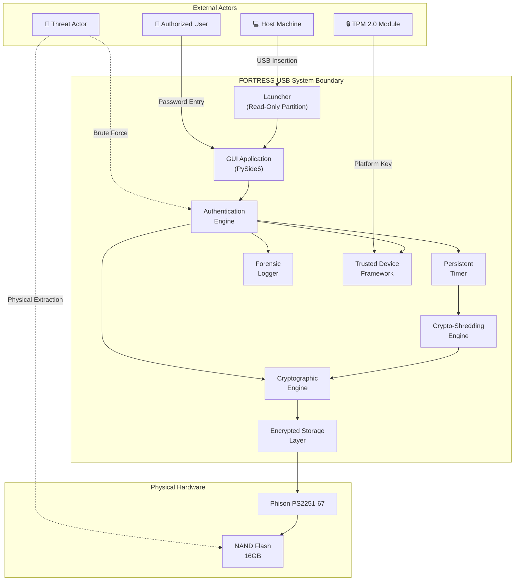
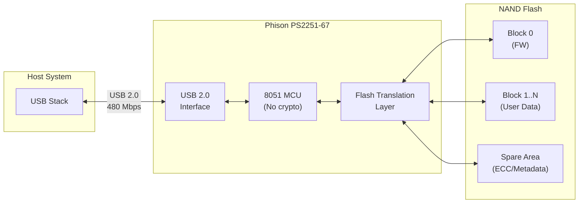
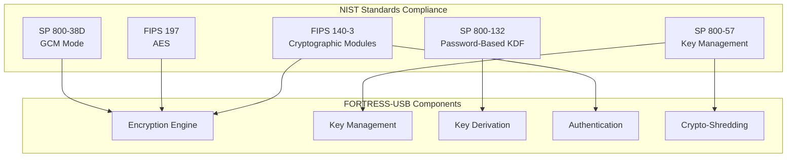
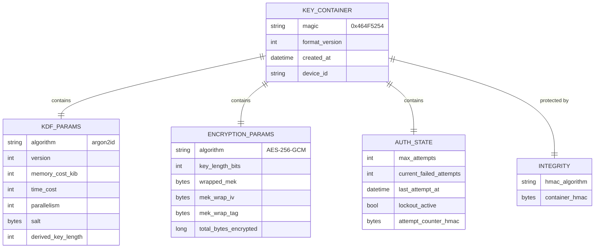
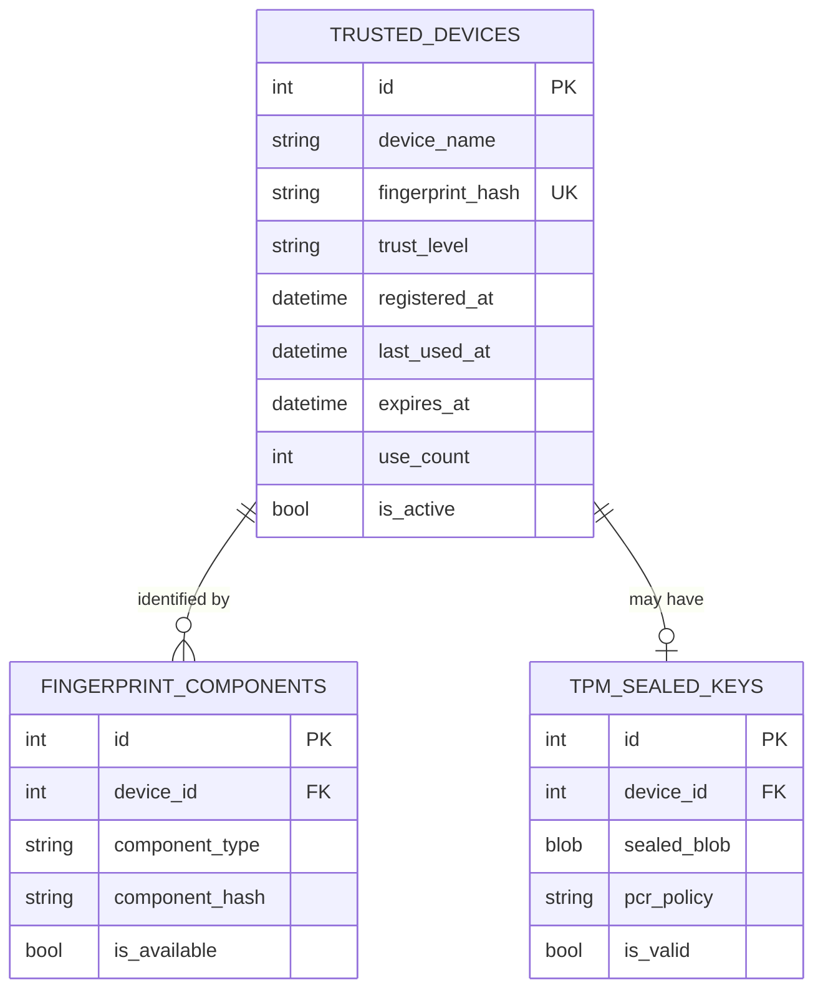
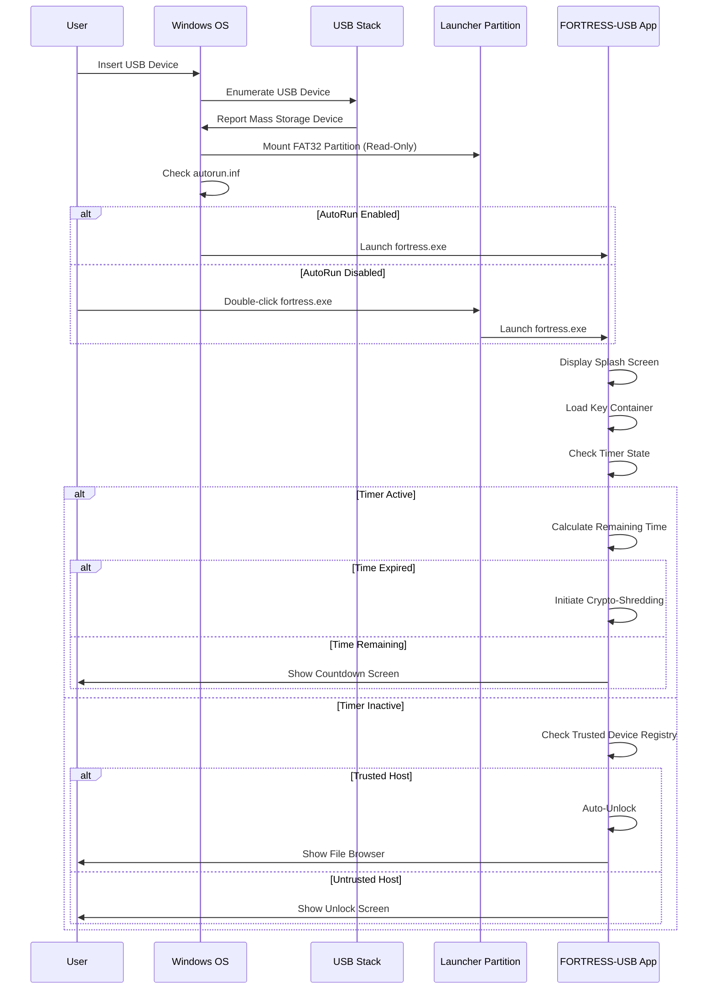
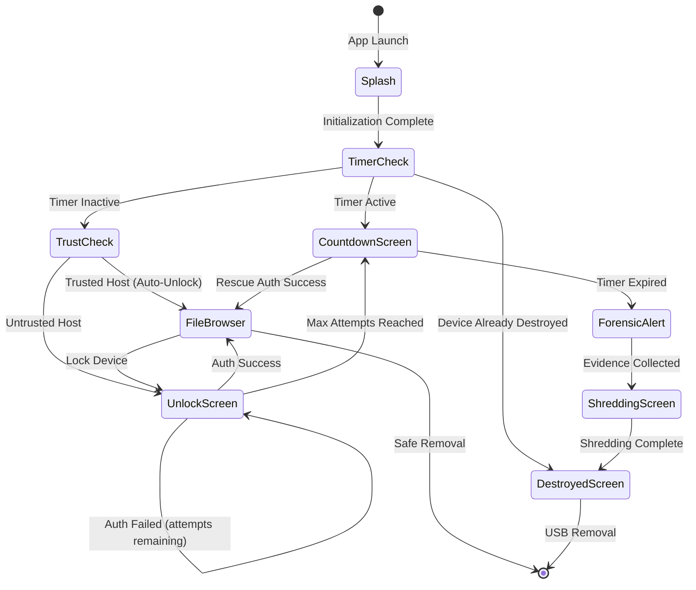
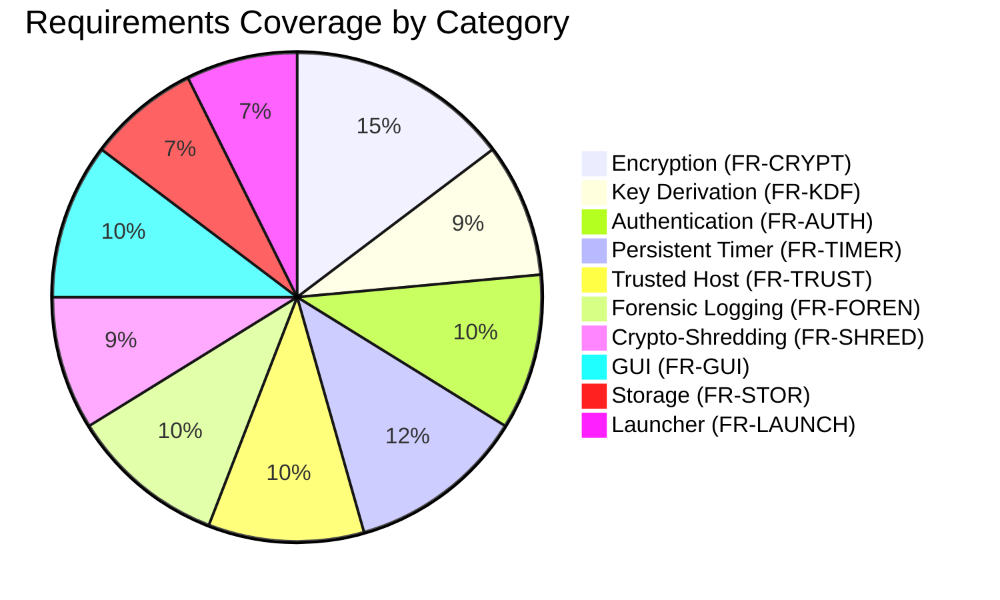

# FORTRESS-USB — Requirements Analysis Document

| **Document ID** | FORT-REQ-001 |
|---|---|
| **Version** | 1.0.0 |
| **Classification** | CONFIDENTIAL — Internal Use Only |
| **Date** | 2026-06-02 |
| **Author** | FORTRESS-USB Security Engineering Team |
| **Status** | DRAFT — Spiral 1 |
| **Review Cycle** | Requires Security Architecture Board approval |

---

## Revision History

| Version | Date | Author | Description |
|---------|------|--------|-------------|
| 0.1.0 | 2026-06-02 | Security Engineering | Initial draft — FR skeleton |
| 0.9.0 | 2026-06-02 | Security Engineering | Full FR/NFR, schemas, traceability |
| 1.0.0 | 2026-06-02 | Security Engineering | Production release — Spiral 1 baseline |

---

## Table of Contents

1. [Introduction](#1-introduction)
2. [Functional Requirements](#2-functional-requirements)
3. [Non-Functional Requirements](#3-non-functional-requirements)
4. [Hardware Constraints](#4-hardware-constraints)
5. [Security Requirements](#5-security-requirements)
6. [Data Requirements](#6-data-requirements)
7. [Interface Requirements](#7-interface-requirements)
8. [Traceability Matrix](#8-traceability-matrix)
9. [Glossary](#9-glossary)
10. [References](#10-references)

---

## 1. Introduction

### 1.1 Purpose

This document establishes the complete, measurable, and verifiable requirements baseline for the **FORTRESS-USB Advanced Self-Protecting Encrypted Removable Storage System**. It serves as the authoritative source for all functional behavior, performance constraints, security guarantees, and interface contracts that the delivered system must satisfy.

### 1.2 Scope

FORTRESS-USB is a software-controlled encrypted USB storage system built on the Phison PS2251-67 controller platform. The system provides:

- AES-256-GCM full-volume encryption with authenticated encryption
- MEK/KEK layered key management architecture
- Argon2id password-based key derivation
- Persistent countdown timer surviving power loss and USB removal
- TPM-backed trusted host auto-unlock
- Pre-destruction forensic evidence collection
- Irreversible crypto-shredding with verification

### 1.3 Intended Audience

| Audience | Usage |
|----------|-------|
| Security Architects | Validate cryptographic design decisions |
| Software Engineers | Implement features against acceptance criteria |
| QA / Test Engineers | Derive test cases from acceptance criteria |
| Penetration Testers | Identify attack surfaces from requirements |
| Project Managers | Track completion by requirement ID |
| Auditors / Compliance | Map to NIST SP / FIPS compliance obligations |

### 1.4 Definitions and Conventions

**Priority Levels:**

| Priority | Definition |
|----------|------------|
| **Must** | Mandatory for system operation. Failure to implement is a release blocker. |
| **Should** | Expected for production quality. Omission requires documented justification. |
| **Could** | Desirable enhancement. Deferred without impact to core security posture. |

**Requirement ID Format:** `{TYPE}-{CATEGORY}-{NNN}`

```
FR-CRYPT-001
│  │      │
│  │      └─ Sequential number
│  └──────── Category (CRYPT, KDF, AUTH, etc.)
└─────────── Type (FR = Functional, NFR = Non-Functional, SR = Security)
```

### 1.5 System Context Diagram



---

## 2. Functional Requirements

### 2.1 Encryption Requirements (FR-CRYPT)

| ID | Priority | Description | Acceptance Criteria |
|----|----------|-------------|---------------------|
| FR-CRYPT-001 | **Must** | The system SHALL encrypt all user data using AES-256-GCM authenticated encryption as defined in NIST SP 800-38D. | 1. Algorithm OID matches AES-256-GCM. 2. All encrypted payloads include a 128-bit authentication tag. 3. Decryption rejects any payload with a modified tag. |
| FR-CRYPT-002 | **Must** | The system SHALL generate a unique 256-bit Media Encryption Key (MEK) per provisioning operation using a CSPRNG. | 1. MEK length is exactly 256 bits. 2. MEK is sourced from `os.urandom()` or equivalent CSPRNG. 3. Two successive provisioning operations produce statistically independent MEKs (collision probability < 2⁻¹²⁸). |
| FR-CRYPT-003 | **Must** | The system SHALL generate a unique 96-bit initialization vector (IV/nonce) for every encryption operation and SHALL never reuse an IV under the same key. | 1. IV is 96 bits. 2. IV is generated via CSPRNG. 3. An IV collision detection mechanism exists. 4. Nonce-reuse triggers an immediate key rotation alert. |
| FR-CRYPT-004 | **Must** | The system SHALL wrap the MEK with a Key Encryption Key (KEK) derived from the user password, producing a wrapped MEK blob. | 1. KEK wraps MEK using AES-256-KW (RFC 3394) or AES-256-GCM envelope. 2. Wrapped MEK blob is stored in the key container. 3. Unwrapping with the correct KEK recovers the original MEK byte-for-byte. |
| FR-CRYPT-005 | **Must** | The system SHALL authenticate all ciphertext using GCM's integrated GHASH authentication, rejecting any tampered ciphertext before processing. | 1. Tampered ciphertext (any single-bit flip) results in `InvalidTag` exception. 2. Truncated ciphertext is rejected. 3. No partial plaintext is emitted on authentication failure. |
| FR-CRYPT-006 | **Must** | The system SHALL include Associated Authenticated Data (AAD) containing the file path, size, and timestamp in every GCM encryption operation. | 1. AAD is bound to each encrypted blob. 2. Changing AAD without re-encryption causes authentication failure. 3. AAD structure is documented and versioned. |
| FR-CRYPT-007 | **Should** | The system SHALL support key rotation by re-wrapping the MEK under a new KEK without re-encrypting the entire storage volume. | 1. Key rotation completes in < 5 seconds. 2. All data remains accessible after rotation. 3. Old KEK material is securely erased from memory. |
| FR-CRYPT-008 | **Should** | The system SHALL zeroize all key material in memory immediately after use using explicit memory clearing, not relying on garbage collection. | 1. MEK, KEK, and derived keys are overwritten with zeros after use. 2. Memory inspection after zeroization shows no residual key bytes. 3. `ctypes.memset` or equivalent is used (not `del` or reassignment). |
| FR-CRYPT-009 | **Must** | The system SHALL store the encrypted MEK blob, salt, IV, and algorithm parameters in a versioned key container file on the read-only partition. | 1. Key container file uses a documented binary or JSON schema. 2. Schema includes a version field for forward compatibility. 3. Key container is integrity-protected with HMAC-SHA-256. |
| FR-CRYPT-010 | **Could** | The system SHALL support multiple encryption algorithms with a pluggable cipher backend to allow future migration from AES-256-GCM. | 1. Cipher backend is abstracted behind an interface. 2. Algorithm ID is stored in the key container. 3. Unsupported algorithm IDs produce a clear error message. |

### 2.2 Key Derivation Requirements (FR-KDF)

| ID | Priority | Description | Acceptance Criteria |
|----|----------|-------------|---------------------|
| FR-KDF-001 | **Must** | The system SHALL derive the KEK from the user password using Argon2id as specified in RFC 9106 (winner of the Password Hashing Competition). | 1. KDF algorithm is Argon2id (type 2). 2. Output length is 256 bits (32 bytes). 3. Implementation uses `argon2-cffi` library or equivalent audited implementation. |
| FR-KDF-002 | **Must** | The system SHALL use the following minimum Argon2id parameters: memory cost ≥ 65536 KiB (64 MiB), time cost ≥ 3 iterations, parallelism = 4. | 1. Parameters are enforced at runtime. 2. Reducing any parameter below the minimum triggers a configuration error. 3. Parameters are stored alongside the salt for reproducibility. |
| FR-KDF-003 | **Must** | The system SHALL generate a unique 128-bit (16-byte) cryptographic salt per provisioning operation using a CSPRNG. | 1. Salt length is 128 bits. 2. Salt is stored unencrypted in the key container. 3. Salt is generated from `os.urandom()`. |
| FR-KDF-004 | **Should** | The system SHALL allow Argon2id parameters to be adjusted via configuration to accommodate future hardware performance improvements. | 1. Configuration file defines `memory_cost`, `time_cost`, `parallelism`. 2. Parameters are validated against minimums before use. 3. Changing parameters triggers re-derivation and re-wrapping of the MEK. |
| FR-KDF-005 | **Must** | The KDF operation SHALL complete within 2–5 seconds on the reference hardware (Intel i5-8250U, 8GB RAM) to balance security and usability. | 1. KDF execution time is ≥ 2 seconds (prevents brute force). 2. KDF execution time is ≤ 5 seconds (maintains usability). 3. Timing is measured end-to-end including memory allocation. |
| FR-KDF-006 | **Should** | The system SHALL support KDF parameter migration, allowing re-hashing with stronger parameters when the user successfully authenticates. | 1. After successful authentication, system checks if current parameters are below recommended. 2. If below recommended, re-derive with new parameters and re-wrap MEK. 3. Migration is transparent to the user. |

### 2.3 Authentication Requirements (FR-AUTH)

| ID | Priority | Description | Acceptance Criteria |
|----|----------|-------------|---------------------|
| FR-AUTH-001 | **Must** | The system SHALL authenticate the user by verifying the entered password against the stored Argon2id hash via successful MEK unwrapping. | 1. Correct password produces a valid MEK. 2. Incorrect password produces an `InvalidTag` or unwrap failure. 3. No timing side-channel distinguishes correct from incorrect passwords (constant-time comparison). |
| FR-AUTH-002 | **Must** | The system SHALL enforce a maximum of 3 consecutive failed authentication attempts before triggering the lockout sequence. | 1. Attempt counter increments on each failed attempt. 2. Counter resets to 0 on successful authentication. 3. Counter persists across USB removal and reinsertion (stored on device). |
| FR-AUTH-003 | **Must** | The system SHALL persist the failed attempt counter to non-volatile storage on the USB device after each failed attempt. | 1. Removing USB mid-attempt does not reset the counter. 2. Counter is stored in a tamper-evident structure (HMAC-protected). 3. Power loss during write does not corrupt the counter (atomic write). |
| FR-AUTH-004 | **Must** | Upon reaching the maximum failed attempt count (3), the system SHALL immediately initiate the persistent countdown timer. | 1. Timer starts within 500ms of the 3rd failed attempt. 2. Timer initial value is 120 seconds. 3. Timer start is logged in the forensic log. |
| FR-AUTH-005 | **Must** | The system SHALL display the remaining attempt count to the user after each failed authentication attempt. | 1. UI shows "X attempts remaining" after each failure. 2. Message is displayed for ≥ 3 seconds. 3. Final attempt shows a warning that the next failure triggers the timer. |
| FR-AUTH-006 | **Should** | The system SHALL enforce a minimum password complexity policy: ≥ 12 characters, including uppercase, lowercase, digit, and special character. | 1. Password policy is checked during provisioning/password change. 2. Non-compliant passwords are rejected with specific guidance. 3. Policy parameters are configurable. |
| FR-AUTH-007 | **Must** | The system SHALL NOT store the user password in any form — only the derived key and associated KDF parameters. | 1. No plaintext password exists on the device at rest. 2. No reversible encoding of the password exists. 3. Only the wrapped MEK, salt, and KDF parameters are stored. |

### 2.4 Persistent Timer Requirements (FR-TIMER)

| ID | Priority | Description | Acceptance Criteria |
|----|----------|-------------|---------------------|
| FR-TIMER-001 | **Must** | The system SHALL implement a 120-second (2-minute) persistent countdown timer that triggers crypto-shredding upon expiration. | 1. Timer counts down from 120 seconds to 0. 2. At 0, the crypto-shredding sequence is automatically initiated. 3. Timer duration is configurable (default 120s). |
| FR-TIMER-002 | **Must** | The timer SHALL persist across USB device removal and reinsertion without resetting. | 1. Removing USB at T=60s and reinserting shows T≈60s (±2s for write latency). 2. Timer state is written to non-volatile storage every 1 second. 3. Timer state file is integrity-protected. |
| FR-TIMER-003 | **Must** | The timer SHALL persist across host machine power loss and reboot without resetting. | 1. Timer state is stored as an absolute UTC deadline (not relative countdown). 2. On reinsertion after power loss, remaining time = deadline − current UTC. 3. If deadline has passed, crypto-shredding triggers immediately on reinsertion. |
| FR-TIMER-004 | **Must** | The timer SHALL persist across insertion into a different host machine. | 1. Timer state is stored on the USB device, not on the host. 2. Inserting into machine B after starting timer on machine A continues the countdown. 3. Host clock skew > 30s triggers a conservative (shorter) countdown. |
| FR-TIMER-005 | **Must** | The system SHALL write the timer state atomically to prevent corruption from unexpected removal during write. | 1. Double-buffered write strategy (write to B, then swap A↔B). 2. CRC-32 or HMAC integrity check on each timer state record. 3. Corrupted state defaults to "timer expired" (fail-secure). |
| FR-TIMER-006 | **Should** | The system SHALL display a real-time countdown in the GUI when the timer is active, updating every second. | 1. Countdown updates with ≤ 100ms visual latency. 2. Display format is MM:SS. 3. Final 10 seconds trigger a red flashing visual indicator. |
| FR-TIMER-007 | **Must** | The timer SHALL allow cancellation ONLY via successful authentication during the countdown period. | 1. Entering the correct password stops the timer and resets the attempt counter. 2. No administrative bypass exists. 3. Timer cancellation is logged in the forensic log. |
| FR-TIMER-008 | **Should** | The system SHALL use NTP or system time with drift compensation to maintain timer accuracy when disconnected from the host. | 1. Timer records the last-known UTC timestamp at each state write. 2. On reconnection, system calculates elapsed real-world time. 3. Clock rollback detection (if current time < last recorded time) triggers fail-secure behavior. |

### 2.5 Trusted Host Requirements (FR-TRUST)

| ID | Priority | Description | Acceptance Criteria |
|----|----------|-------------|---------------------|
| FR-TRUST-001 | **Must** | The system SHALL support registration of trusted host machines using a composite hardware fingerprint. | 1. Fingerprint includes ≥ 3 hardware identifiers. 2. Registration requires successful authentication first. 3. Maximum of 5 trusted devices per USB. |
| FR-TRUST-002 | **Must** | The machine fingerprint SHALL be composed of: TPM endorsement key hash, CPU ID, motherboard serial, disk serial, and OS installation ID. | 1. Each component is hashed individually (SHA-256). 2. Components are concatenated and hashed to produce a 256-bit composite fingerprint. 3. Missing optional components (e.g., no TPM) degrade to a weaker but functional fingerprint. |
| FR-TRUST-003 | **Should** | The system SHALL support TPM 2.0 platform key sealing for trusted host auto-unlock. | 1. MEK or KEK is sealed to the TPM's PCR values. 2. Unsealing requires the same TPM and platform state. 3. TPM communication uses the `tpm2-pytss` library or Windows TBS API. |
| FR-TRUST-004 | **Must** | On insertion into a trusted host, the system SHALL auto-unlock without requiring password entry if the fingerprint matches. | 1. Auto-unlock completes within 3 seconds of insertion. 2. No password prompt is shown. 3. Auto-unlock is logged in the forensic log with `AUTH_METHOD=TRUSTED_HOST`. |
| FR-TRUST-005 | **Must** | On insertion into an untrusted host, the system SHALL require password authentication. | 1. Full authentication flow is triggered. 2. User is informed that this is an untrusted device. 3. Option to register the device as trusted is offered after successful authentication. |
| FR-TRUST-006 | **Should** | The system SHALL allow revocation of individual trusted devices from the trusted device registry. | 1. Revocation removes the device entry from the registry. 2. Revocation requires current authentication. 3. Revocation is logged in the forensic log. |
| FR-TRUST-007 | **Could** | The system SHALL support a "trust level" hierarchy: FULL (auto-unlock), REDUCED (auto-unlock with re-auth after 24h), and TEMPORARY (single-session). | 1. Trust level is stored per device in the registry. 2. REDUCED devices require re-authentication every 24 hours. 3. TEMPORARY trust is cleared on USB removal. |

### 2.6 Forensic Logging Requirements (FR-FOREN)

| ID | Priority | Description | Acceptance Criteria |
|----|----------|-------------|---------------------|
| FR-FOREN-001 | **Must** | The system SHALL collect forensic evidence before initiating crypto-shredding, creating a tamper-evident forensic log. | 1. Forensic log is written before any key destruction begins. 2. Log is stored on the read-only partition (survives shredding). 3. Log is signed with HMAC-SHA-256 using a forensic signing key. |
| FR-FOREN-002 | **Must** | Each forensic log entry SHALL include: UTC timestamp (ISO 8601), hostname, all MAC addresses, all IP addresses (IPv4/IPv6), OS name and version, and machine fingerprint hash. | 1. All fields are populated (empty string if unavailable, never null). 2. Timestamp resolution is ≤ 1 millisecond. 3. Multiple network interfaces generate multiple MAC/IP entries. |
| FR-FOREN-003 | **Must** | The forensic log SHALL record the triggering event type: `TIMER_EXPIRED`, `MAX_ATTEMPTS`, `MANUAL_SHRED`, or `TAMPER_DETECTED`. | 1. Event type is an enumerated value. 2. Unknown event types default to `UNKNOWN` (never omitted). 3. Event type matches the actual trigger (verified by test). |
| FR-FOREN-004 | **Should** | The forensic log SHALL include a screenshot or description of the last GUI state at the time of the security event. | 1. GUI state name is logged (e.g., `COUNTDOWN_SCREEN`, `UNLOCK_SCREEN`). 2. If screenshot capture fails, the state name alone is logged. 3. Screenshot is stored as a compressed PNG (≤ 500 KiB). |
| FR-FOREN-005 | **Must** | The forensic log SHALL be stored in structured JSON format with a documented and versioned schema. | 1. JSON schema is validated at write time. 2. Schema version is embedded in every log entry. 3. Logs are append-only (no overwriting previous entries). |
| FR-FOREN-006 | **Should** | The forensic log SHALL record all authentication attempts (successful and failed) with timestamps and host information. | 1. Each attempt generates a log entry. 2. Failed attempts include the failure reason (wrong password, locked out). 3. Successful attempts include the authentication method (password, trusted host). |
| FR-FOREN-007 | **Must** | The forensic logging key SHALL be independent of the MEK and KEK and SHALL survive crypto-shredding. | 1. Forensic key is stored on the read-only partition. 2. Forensic key is NOT derived from the user password. 3. Forensic key is generated at provisioning time and stored separately. |

### 2.7 Crypto-Shredding Requirements (FR-SHRED)

| ID | Priority | Description | Acceptance Criteria |
|----|----------|-------------|---------------------|
| FR-SHRED-001 | **Must** | The system SHALL destroy the MEK by overwriting its storage location with cryptographically random data in a minimum of 3 passes. | 1. Pass 1: overwrite with `os.urandom()`. 2. Pass 2: overwrite with `0x00` bytes. 3. Pass 3: overwrite with `os.urandom()`. 4. `fsync()` called after each pass. |
| FR-SHRED-002 | **Must** | The system SHALL destroy the KEK by overwriting the wrapped MEK blob and all KDF parameters with random data. | 1. Salt, wrapped MEK, and Argon2id parameters are overwritten. 2. Key container file is overwritten in-place (not deleted and recreated). 3. File system metadata update is forced via `fsync()`. |
| FR-SHRED-003 | **Must** | The system SHALL verify destruction by attempting to read back the destroyed key material and confirming it does not match the original. | 1. Post-destruction read of key container returns random data. 2. Attempting to unwrap the MEK with the correct password fails. 3. Verification result is logged. |
| FR-SHRED-004 | **Must** | After crypto-shredding, the system SHALL display a permanent "DESTROYED" state in the GUI with no option to recover or re-provision. | 1. GUI shows a red "DEVICE DESTROYED" screen. 2. No password entry field is displayed. 3. Forensic log remains accessible for review. |
| FR-SHRED-005 | **Must** | The crypto-shredding operation SHALL complete within 5 seconds to ensure completion before potential physical USB removal by an attacker. | 1. End-to-end shredding time ≤ 5 seconds (measured). 2. Critical path (MEK destruction) completes within 1 second. 3. Verification phase is separate and may extend slightly. |
| FR-SHRED-006 | **Should** | The system SHALL overwrite the encrypted data partition headers (first 1 MiB) with random data after key destruction to provide defense-in-depth. | 1. First 1 MiB of encrypted partition is overwritten. 2. Overwrite occurs after MEK destruction. 3. Partition is no longer mountable after overwrite. |

### 2.8 GUI Requirements (FR-GUI)

| ID | Priority | Description | Acceptance Criteria |
|----|----------|-------------|---------------------|
| FR-GUI-001 | **Must** | The system SHALL display a branded splash screen on application launch for 2–3 seconds while performing initialization. | 1. Splash shows FORTRESS-USB logo and version. 2. Splash displays for 2–3 seconds. 3. Background initialization (key container loading, timer state check) occurs during splash. |
| FR-GUI-002 | **Must** | The system SHALL display an unlock screen with a secure password entry field, submit button, and attempt counter. | 1. Password field masks input with bullet characters (`•`). 2. Submit button triggers authentication. 3. Attempt counter shows "Attempt X of 3". |
| FR-GUI-003 | **Must** | The system SHALL display a real-time countdown screen when the persistent timer is active, showing MM:SS format. | 1. Timer updates every second. 2. Password entry field is available for rescue authentication. 3. Visual urgency increases in the final 30 seconds (color change to red). |
| FR-GUI-004 | **Must** | The system SHALL display a forensic alert screen showing collected evidence before crypto-shredding begins. | 1. Alert shows hostname, IP, MAC, timestamp. 2. Alert displays for ≥ 3 seconds before shredding starts. 3. "Shredding in progress..." indicator is visible. |
| FR-GUI-005 | **Must** | The system SHALL display a permanent "DESTROYED" screen after crypto-shredding completes, with a forensic log export option. | 1. Screen background is red. 2. "DEVICE DESTROYED — DATA IRRECOVERABLE" message is displayed. 3. "Export Forensic Log" button allows saving the log to the host. |
| FR-GUI-006 | **Should** | All GUI screens SHALL be resolution-independent and render correctly at 1280×720 through 3840×2160. | 1. UI elements scale proportionally. 2. No text truncation at any supported resolution. 3. Minimum touch target size is 44×44 px. |
| FR-GUI-007 | **Should** | The GUI SHALL provide visual feedback within 200ms for all user interactions (button clicks, key presses). | 1. Button press triggers visual state change within 200ms. 2. Long operations show a progress indicator. 3. No unresponsive UI states lasting > 500ms. |

### 2.9 Storage Requirements (FR-STOR)

| ID | Priority | Description | Acceptance Criteria |
|----|----------|-------------|---------------------|
| FR-STOR-001 | **Must** | The USB device SHALL be partitioned into two partitions: a read-only launcher partition (FAT32, ~200 MiB) and an encrypted data partition (remaining space). | 1. Partition table is GPT (not MBR). 2. Launcher partition is marked read-only at the filesystem level. 3. Encrypted partition is not auto-mounted by the OS. |
| FR-STOR-002 | **Must** | The encrypted data partition SHALL use a custom container format with a header containing: magic bytes, version, encryption algorithm ID, and data offset. | 1. Magic bytes: `0x464F5254` ("FORT"). 2. Version field supports future schema changes. 3. Header is integrity-protected. |
| FR-STOR-003 | **Must** | The system SHALL support encrypted file I/O operations: read, write, delete, and list on the encrypted partition. | 1. Files can be written and read back identically. 2. Deleted files have their ciphertext overwritten (not just unlinked). 3. File listing shows original filenames and sizes. |
| FR-STOR-004 | **Should** | The system SHALL store file metadata (name, size, timestamps, permissions) in an encrypted metadata index separate from the file content. | 1. Metadata index is encrypted with the same MEK. 2. Index supports efficient file lookup (O(log n) or better). 3. Index corruption is detectable via integrity checks. |
| FR-STOR-005 | **Should** | The system SHALL implement wear-leveling-aware secure deletion by overwriting at the logical block level and accounting for NAND flash translation layer behavior. | 1. Deleted blocks are overwritten with random data. 2. Documentation acknowledges FTL remapping limitations. 3. TRIM/discard commands are issued when supported. |

### 2.10 Launcher Requirements (FR-LAUNCH)

| ID | Priority | Description | Acceptance Criteria |
|----|----------|-------------|---------------------|
| FR-LAUNCH-001 | **Must** | The read-only partition SHALL contain an autorun launcher (`autorun.inf` + portable executable) that launches the FORTRESS-USB GUI on Windows insertion. | 1. `autorun.inf` references the launcher executable. 2. Launcher works without AutoRun if user manually double-clicks. 3. Launcher is a self-contained PyInstaller executable. |
| FR-LAUNCH-002 | **Must** | The launcher SHALL detect the drive letter of the USB device and pass it to the GUI application as a command-line argument. | 1. Correct drive letter is detected programmatically. 2. Multiple USB devices do not cause confusion. 3. Drive letter is validated before use. |
| FR-LAUNCH-003 | **Must** | The launcher SHALL verify the integrity of the GUI executable before launching using an embedded SHA-256 hash. | 1. Hash mismatch prevents launch and shows a tamper warning. 2. Hash is embedded in the launcher (not in a separate file). 3. Verification completes in < 1 second. |
| FR-LAUNCH-004 | **Should** | The launcher SHALL NOT require administrative privileges for basic unlock and file access operations. | 1. Standard user account can launch and authenticate. 2. UAC prompt is not triggered for basic operations. 3. TPM access and device registration may require elevation (documented). |
| FR-LAUNCH-005 | **Must** | The launcher partition SHALL be formatted as FAT32 for maximum cross-platform visibility. | 1. Windows 10/11 auto-detects the partition. 2. FAT32 format is verified during provisioning. 3. Partition label is "FORTRESS". |

---

## 3. Non-Functional Requirements

### 3.1 Security (NFR-SEC)

| ID | Priority | Description | Acceptance Criteria |
|----|----------|-------------|---------------------|
| NFR-SEC-001 | **Must** | All cryptographic operations SHALL comply with NIST SP 800-38D (GCM mode), FIPS 197 (AES), and SP 800-57 Part 1 (key management). | 1. Compliance matrix mapping each requirement to NIST section is maintained. 2. Algorithm parameters meet minimum NIST recommended values. 3. Annual compliance review is documented. |
| NFR-SEC-002 | **Must** | All key material SHALL have a minimum security strength of 256 bits, providing 128-bit post-quantum security margin. | 1. AES key is 256 bits. 2. HMAC key is ≥ 256 bits. 3. Derived keys are ≥ 256 bits. |
| NFR-SEC-003 | **Must** | The system SHALL protect key material in memory using OS-level memory locking (`mlock`/`VirtualLock`) to prevent paging to disk. | 1. Key buffers are locked in physical memory. 2. Failure to lock triggers a security warning (not silent). 3. Keys are zeroized before memory is unlocked. |
| NFR-SEC-004 | **Must** | The system SHALL implement constant-time comparison for all security-sensitive comparisons (passwords, MACs, keys). | 1. `hmac.compare_digest()` is used for all comparisons. 2. No early-exit string comparison exists in the authentication path. 3. Timing analysis test demonstrates ≤ 1% variance between match and non-match. |
| NFR-SEC-005 | **Should** | The system SHALL disable core dumps and debug output in production builds. | 1. `RLIMIT_CORE` is set to 0 on Linux. 2. `SetErrorMode` flags disable Windows error reporting. 3. No sensitive data appears in stdout/stderr. |
| NFR-SEC-006 | **Must** | The system SHALL fail-secure: any unrecoverable error SHALL result in device lockout, not device unlock. | 1. Exception in authentication path → lockout, not bypass. 2. Corrupted key container → treated as destroyed device. 3. Corrupted timer state → treated as timer expired. |
| NFR-SEC-007 | **Should** | The system SHALL implement anti-debugging protections to resist runtime analysis by threat actors. | 1. `IsDebuggerPresent()` check on Windows. 2. `ptrace` self-attach on Linux. 3. Detection triggers forensic log entry and immediate lockout. |
| NFR-SEC-008 | **Must** | The system SHALL use only well-audited cryptographic libraries (`cryptography` ≥ 42.0, `argon2-cffi` ≥ 23.1) and SHALL NOT implement any custom cryptographic primitives. | 1. No custom AES, SHA, or HMAC implementations exist. 2. Library versions are pinned in `requirements.txt`. 3. Known-vulnerable versions are blocked by CI checks. |

### 3.2 Performance (NFR-PERF)

| ID | Priority | Description | Acceptance Criteria |
|----|----------|-------------|---------------------|
| NFR-PERF-001 | **Must** | Successful unlock (password entry to data accessible) SHALL complete within 5 seconds on reference hardware, including KDF computation. | 1. End-to-end measurement: keystroke → file system accessible. 2. KDF accounts for 2–5 seconds. 3. Remaining operations complete in < 1 second. |
| NFR-PERF-002 | **Should** | Encrypted file I/O throughput SHALL achieve ≥ 15 MiB/s read and ≥ 10 MiB/s write, limited by USB 2.0 bandwidth (theoretical max ~35 MiB/s). | 1. Sequential read throughput ≥ 15 MiB/s (measured with 1 MiB blocks). 2. Sequential write throughput ≥ 10 MiB/s. 3. Random 4K read ≥ 500 IOPS. |
| NFR-PERF-003 | **Must** | Application launch (USB insertion to splash screen visible) SHALL complete within 3 seconds. | 1. PyInstaller executable loads within 3 seconds. 2. Splash screen is displayed before background initialization completes. 3. Cold start (first launch after reboot) ≤ 5 seconds. |
| NFR-PERF-004 | **Should** | The GUI SHALL maintain ≥ 30 FPS during countdown timer animation with < 5% CPU utilization. | 1. Timer update does not cause frame drops. 2. CPU usage stays below 5% during idle countdown. 3. No memory leak over extended countdown periods. |
| NFR-PERF-005 | **Must** | Crypto-shredding SHALL complete within 5 seconds (critical path within 1 second). | 1. MEK destruction: < 1 second. 2. KEK destruction: < 1 second. 3. Partition header overwrite: < 3 seconds. |

### 3.3 Reliability (NFR-REL)

| ID | Priority | Description | Acceptance Criteria |
|----|----------|-------------|---------------------|
| NFR-REL-001 | **Must** | The persistent timer SHALL maintain ≤ ±2 second accuracy over a 120-second period, including across USB removal/reinsertion cycles. | 1. Timer drift measured over 100 test cycles averages ≤ 1 second. 2. Maximum single-cycle drift ≤ 2 seconds. 3. Timer never runs longer than the configured period (fail-safe toward shorter). |
| NFR-REL-002 | **Must** | The system SHALL guarantee data integrity: no silent data corruption during encrypted read/write operations. | 1. GCM authentication tag catches all corruption. 2. No partial writes are committed (atomic write or journaling). 3. Power-loss during write does not corrupt existing data. |
| NFR-REL-003 | **Should** | The system SHALL implement graceful error recovery for non-fatal errors (transient I/O errors, network timeouts for NTP). | 1. Transient USB I/O errors are retried up to 3 times. 2. NTP failure falls back to system clock. 3. Non-fatal errors are logged but do not trigger shredding. |
| NFR-REL-004 | **Must** | The key container SHALL use a double-buffered write strategy to survive power loss during updates. | 1. Two copies of the key container exist (primary + backup). 2. Primary is updated first, then backup. 3. On load, integrity check selects the valid copy. |

### 3.4 Portability (NFR-PORT)

| ID | Priority | Description | Acceptance Criteria |
|----|----------|-------------|---------------------|
| NFR-PORT-001 | **Must** | The system SHALL run on Windows 10 (21H2+) and Windows 11 without requiring OS-level drivers or kernel modifications. | 1. Tested on Windows 10 21H2, 22H2 and Windows 11 23H2. 2. No `.sys` files or driver installations required. 3. User-mode USB access via standard Windows APIs. |
| NFR-PORT-002 | **Must** | The GUI executable SHALL be a self-contained portable application with no installation required. | 1. Single `.exe` file (PyInstaller one-file mode). 2. No registry writes required for basic operation. 3. No `%APPDATA%` writes required for basic operation (all state on USB). |
| NFR-PORT-003 | **Should** | The system architecture SHALL support future Linux and macOS ports via platform abstraction layers. | 1. Platform-specific code is isolated in adapter modules. 2. Core cryptographic logic has no platform dependencies. 3. GUI uses PySide6 (cross-platform). |
| NFR-PORT-004 | **Must** | The system SHALL operate correctly on both x86-64 and ARM64 (Windows on ARM) architectures. | 1. PyInstaller build targets both architectures. 2. Cryptographic library supports both architectures. 3. TPM access works on both architectures. |

### 3.5 Usability (NFR-USAB)

| ID | Priority | Description | Acceptance Criteria |
|----|----------|-------------|---------------------|
| NFR-USAB-001 | **Must** | A first-time user SHALL be able to provision and use the device within 5 minutes without reading external documentation. | 1. Provisioning wizard guides user through setup. 2. Tooltips explain each field. 3. Usability test with 5 naive users achieves ≥ 80% task completion. |
| NFR-USAB-002 | **Must** | All error messages SHALL provide actionable guidance (what happened, why, and what to do next). | 1. No raw exception messages shown to users. 2. Error messages follow the pattern: "[Problem]. [Cause]. [Action]." 3. Technical details available in expandable section. |
| NFR-USAB-003 | **Should** | The system SHALL support keyboard-only navigation for accessibility compliance. | 1. Tab order follows visual layout. 2. Enter key activates focused button. 3. Escape key cancels modal dialogs. |
| NFR-USAB-004 | **Should** | The GUI SHALL support high-contrast mode and screen reader compatibility for accessibility. | 1. High-contrast theme is detected and respected. 2. All UI elements have accessible names. 3. Screen reader can navigate the authentication flow. |

### 3.6 Maintainability (NFR-MAINT)

| ID | Priority | Description | Acceptance Criteria |
|----|----------|-------------|---------------------|
| NFR-MAINT-001 | **Must** | The system SHALL follow a modular architecture with clear separation of concerns: crypto, auth, storage, timer, forensics, shredding, GUI, and trusted host modules. | 1. Each module has a defined public API. 2. Inter-module coupling is via interfaces, not concrete classes. 3. Any module can be unit-tested in isolation. |
| NFR-MAINT-002 | **Should** | All security-critical parameters SHALL be defined in a single configuration file with validation and documentation. | 1. Configuration file is `config/security.toml` or equivalent. 2. Each parameter has a comment explaining its purpose and valid range. 3. Invalid configuration prevents system startup with a clear error. |
| NFR-MAINT-003 | **Should** | The codebase SHALL maintain ≥ 90% test coverage for security-critical modules (crypto, auth, shredding, timer). | 1. Coverage measured by `pytest-cov`. 2. Security modules ≥ 90%. 3. GUI modules ≥ 70%. |
| NFR-MAINT-004 | **Should** | The system SHALL use structured logging (JSON) for all operational events with severity levels (DEBUG, INFO, WARNING, ERROR, CRITICAL). | 1. All log entries are valid JSON. 2. Each entry includes timestamp, level, module, message, and correlation ID. 3. No sensitive data (keys, passwords) appears in logs. |

---

## 4. Hardware Constraints

### 4.1 Phison PS2251-67 Controller Overview

The FORTRESS-USB system is built on the **Phison PS2251-67** USB flash controller. This controller imposes significant constraints that fundamentally shape the security architecture.



### 4.2 Constraint Analysis

| Constraint ID | Constraint | Impact | Mitigation |
|---------------|-----------|--------|------------|
| **HC-001** | **No hardware encryption engine** — The PS2251-67 lacks any AES/SHA hardware acceleration. All cryptography must be performed in software on the host CPU. | Encryption throughput is limited by host CPU, not USB bandwidth. Encryption adds host CPU load during file I/O. | Use hardware-accelerated AES-NI instructions via the `cryptography` library (OpenSSL backend). AES-NI provides near-native speed on modern x86 CPUs. |
| **HC-002** | **No firmware code signing** — The PS2251-67 does not verify firmware integrity at boot. Firmware can be reflashed with modified code (BadUSB attack vector). | An attacker with physical access can reflash firmware to: (a) exfiltrate keys, (b) bypass authentication, (c) emulate HID devices (keystroke injection). | 1. Document as a known risk in the threat model. 2. Launcher integrity verification (FR-LAUNCH-003) provides partial mitigation. 3. Physical tamper-evident measures are recommended. 4. Firmware signing is a future hardware upgrade path. |
| **HC-003** | **USB 2.0 High-Speed only** — Maximum theoretical bandwidth is 480 Mbps (60 MiB/s). Real-world throughput is typically 25–35 MiB/s. | Encrypted I/O throughput is bounded at ~25–35 MiB/s raw, further reduced by encryption overhead. Practical encrypted throughput: 15–25 MiB/s. | Accept USB 2.0 speed limits. Optimize encryption for streaming (avoid excessive IV generation overhead). Use large I/O block sizes (64 KiB+) to amortize per-block crypto overhead. |
| **HC-004** | **NAND wear leveling prevents guaranteed secure deletion** — The FTL (Flash Translation Layer) remaps logical blocks to physical blocks for wear leveling. An overwritten logical block may map to a new physical block, leaving the original data on the old block. | `FR-SHRED-001` overwrite of key material may leave residual copies on remapped NAND blocks. Physical NAND extraction could theoretically recover old key data. | 1. Primary defense is crypto-shredding (destroy keys, not data). Even if ciphertext remains, it is irrecoverable without the MEK. 2. Multiple overwrite passes increase probability of physical overwrite. 3. TRIM/discard commands may trigger garbage collection. 4. Document as a residual risk. |
| **HC-005** | **Block size: 512 bytes, erase unit: 128 KiB** — The NAND flash operates with 512-byte sectors but erases in 128 KiB (256-page) blocks. | 1. Small writes (< 128 KiB) trigger read-modify-write cycles, reducing write performance. 2. Key container updates (small writes) may be slow. 3. Wear is accelerated by frequent small writes (timer state updates). | 1. Align I/O to erase block boundaries where possible. 2. Buffer timer state writes (1-second interval is acceptable, not per-millisecond). 3. Use a dedicated wear-leveling-friendly region for frequently-updated metadata. |
| **HC-006** | **No hardware RNG** — The PS2251-67 does not provide a hardware random number generator. | All randomness must come from the host OS CSPRNG (`os.urandom()`), which depends on host entropy. | Use `os.urandom()` (backed by `CryptGenRandom` on Windows, `/dev/urandom` on Linux). Both are considered CSPRNG-quality for key generation. |
| **HC-007** | **8051 MCU with limited RAM** — The PS2251-67 uses an 8-bit 8051 microcontroller with limited RAM (~16 KiB). No complex logic can execute on the controller itself. | All security logic must run on the host. The controller is a "dumb" storage device. No on-device authentication or encryption is possible. | Architectural decision: all security is host-side software. The USB device is treated as untrusted storage. |
| **HC-008** | **No secure enclave or tamper detection** — The controller has no physical tamper detection, no secure boot, and no secure element. | Physical attacks (decapping, probing, NAND extraction) cannot be prevented by the hardware. | 1. Crypto-shredding renders physical extraction moot (ciphertext without keys is useless). 2. Document physical security requirements (tamper-evident enclosure). 3. Future hardware upgrade path includes controllers with secure elements. |

### 4.3 NAND Flash Geometry

```
┌──────────────────────────────────────────────────────────┐
│                    16 GB NAND Flash                       │
├──────────────────────────────────────────────────────────┤
│ Total Capacity:     16,384 MiB (17,179,869,184 bytes)    │
│ Usable Capacity:    ~14,800 MiB (after over-provisioning)│
│ Page Size:          4,096 bytes (4 KiB)                  │
│ Pages per Block:    64                                    │
│ Block Size:         262,144 bytes (256 KiB)              │
│ Total Blocks:       ~57,800 (usable)                     │
│ Erase Cycles:       ~3,000 (TLC NAND, typical)           │
│ Sector Size:        512 bytes (logical)                   │
├──────────────────────────────────────────────────────────┤
│ Partition Layout:                                         │
│ ┌────────────────┬──────────────────────────────────────┐│
│ │ Launcher (RO)  │     Encrypted Data Partition          ││
│ │ ~200 MiB       │     ~14,600 MiB                      ││
│ │ FAT32          │     FORT Container Format             ││
│ │ [autorun.inf]  │     [AES-256-GCM encrypted]          ││
│ │ [fortress.exe] │     [Custom header + encrypted FS]   ││
│ │ [key_container]│                                      ││
│ │ [forensic.log] │                                      ││
│ │ [timer.state]  │                                      ││
│ │ [trusted.db]   │                                      ││
│ └────────────────┴──────────────────────────────────────┘│
└──────────────────────────────────────────────────────────┘
```

### 4.4 Wear Leveling Impact on Timer State

The persistent timer writes state every 1 second. Over a 120-second countdown, this produces 120 writes. With the following analysis:

| Parameter | Value |
|-----------|-------|
| Timer state size | 128 bytes |
| Writes per countdown | 120 |
| Estimated countdowns per device lifetime | 1,000 |
| Total timer writes | 120,000 |
| NAND erase block size | 256 KiB |
| TLC endurance | ~3,000 P/E cycles |
| Timer writes per erase cycle (with FTL) | ~2,000 (estimated) |
| Estimated timer-induced erase cycles | 60 |
| **Impact on device lifetime** | **< 2% of total endurance** |

> [!NOTE]
> Timer writes consume negligible NAND endurance. The wear leveling concern is manageable at the 1-second write interval.

---

## 5. Security Requirements

### 5.1 NIST Standards Compliance Matrix



### 5.2 Detailed Security Requirements

#### 5.2.1 NIST SP 800-38D — Galois/Counter Mode (GCM)

| SR ID | Requirement | NIST Reference | Implementation |
|-------|-------------|----------------|----------------|
| SR-GCM-001 | GCM authentication tag SHALL be 128 bits (full length). Truncated tags are prohibited. | SP 800-38D §5.2.1.2 | `AES-GCM(tag_length=128)` in the `cryptography` library. |
| SR-GCM-002 | IV/nonce SHALL be 96 bits, generated via CSPRNG (deterministic construction prohibited). | SP 800-38D §8.2.2 | `os.urandom(12)` for each encryption operation. |
| SR-GCM-003 | A single key SHALL encrypt at most 2³² blocks (2³⁶ bytes = 64 GiB) before mandatory key rotation. | SP 800-38D §8.3 | Counter tracks total bytes encrypted per MEK. Alarm at 80% threshold. |
| SR-GCM-004 | IV reuse under the same key SHALL be treated as a catastrophic security failure requiring immediate key rotation. | SP 800-38D §8.2.1 | IV collision detection via bloom filter or sequential counter with random prefix. |
| SR-GCM-005 | AAD (Additional Authenticated Data) SHALL be used to bind ciphertext to its context (file path, size, modification time). | SP 800-38D §5.2.1.1 | AAD formatted as `path|size|mtime` and included in every `encrypt()` call. |

#### 5.2.2 NIST SP 800-57 — Key Management

| SR ID | Requirement | NIST Reference | Implementation |
|-------|-------------|----------------|----------------|
| SR-KM-001 | MEK lifetime SHALL not exceed 2 years from generation, after which mandatory key rotation is required. | SP 800-57 Part 1 §5.3 | Key container stores `created_at` timestamp. Rotation warning at 22 months. |
| SR-KM-002 | All keys SHALL be destroyed using methods that prevent recovery: overwrite with random data, verify, then overwrite with zeros. | SP 800-57 Part 1 §8.3.1 | Three-pass overwrite: random → zeros → random, with `fsync()` after each. |
| SR-KM-003 | Key-encrypting keys (KEK) and data-encrypting keys (MEK) SHALL be managed independently with separate lifecycles. | SP 800-57 Part 1 §8.2.2 | KEK derived per authentication session. MEK persists until rotation or shredding. |
| SR-KM-004 | Key generation SHALL use NIST-approved random number generators (Category 1: DRBG-based). | SP 800-57 Part 1 §8.1.5.1 | `os.urandom()` on Windows uses BCryptGenRandom (NIST SP 800-90A compliant DRBG). |
| SR-KM-005 | Key transport (MEK wrapping) SHALL use an approved algorithm providing confidentiality and integrity. | SP 800-57 Part 1 §8.1.5.2 | AES-256-GCM envelope encryption (wrapping MEK with KEK). |

#### 5.2.3 NIST SP 800-132 — Password-Based Key Derivation

| SR ID | Requirement | NIST Reference | Implementation |
|-------|-------------|----------------|----------------|
| SR-KDF-001 | Password-based key derivation SHALL use a memory-hard KDF to resist GPU/ASIC attacks. | SP 800-132 §5.1 (extended with modern guidance) | Argon2id (RFC 9106), exceeding SP 800-132's PBKDF2 baseline. |
| SR-KDF-002 | Salt SHALL be ≥ 128 bits, generated by a CSPRNG. | SP 800-132 §5.1 | 16-byte salt from `os.urandom()`. |
| SR-KDF-003 | KDF iteration count (time cost) SHALL be tuned so derivation takes 2–5 seconds on target hardware. | SP 800-132 §5.1.1.2 | Argon2id time_cost=3, memory_cost=65536 KiB, parallelism=4. |
| SR-KDF-004 | The derived key length SHALL be ≥ the security strength of the algorithm it protects (256 bits for AES-256). | SP 800-132 §5.3 | Argon2id output length = 32 bytes (256 bits). |

#### 5.2.4 FIPS 197 — Advanced Encryption Standard (AES)

| SR ID | Requirement | NIST Reference | Implementation |
|-------|-------------|----------------|----------------|
| SR-AES-001 | AES implementation SHALL use a validated AES implementation (e.g., OpenSSL's FIPS-validated module). | FIPS 197, CMVP | `cryptography` library backed by OpenSSL 3.x with AES-NI. |
| SR-AES-002 | AES key length SHALL be 256 bits. AES-128 and AES-192 are prohibited. | FIPS 197 §6.1 | Key length enforced in `CryptoEngine.__init__()` with assertion. |
| SR-AES-003 | AES SHALL operate in GCM mode only. ECB, CBC, CTR, and other modes are prohibited for data encryption. | FIPS 197 (mode selection per SP 800-38D) | Only `AESGCM` class used from the `cryptography` library. |

#### 5.2.5 FIPS 140-3 Alignment

> [!IMPORTANT]
> FORTRESS-USB targets **alignment with FIPS 140-3 Level 1** (software-only). Formal FIPS 140-3 certification is not pursued in the initial release but the architecture is designed to not preclude future certification.

| SR ID | Requirement | FIPS 140-3 Reference | Implementation |
|-------|-------------|----------------------|----------------|
| SR-FIPS-001 | Cryptographic module boundaries SHALL be clearly defined with documented interfaces. | FIPS 140-3 §7.2 | `core/crypto/` module is the cryptographic boundary. All key operations pass through this module. |
| SR-FIPS-002 | Self-tests SHALL be performed at module load: AES encrypt/decrypt known-answer test, HMAC known-answer test, DRBG health test. | FIPS 140-3 §9.1 | Power-up self-tests run during splash screen initialization. Failure prevents unlock. |
| SR-FIPS-003 | The module SHALL zeroize all Critical Security Parameters (CSPs) when entering an error state. | FIPS 140-3 §7.9.7 | All exception handlers in the crypto module call `zeroize()` before re-raising. |
| SR-FIPS-004 | The module SHALL provide operator authentication before permitting any cryptographic service (unlock, encrypt, decrypt). | FIPS 140-3 §7.4 | No crypto operations are available until `authenticate()` returns success. |

---

## 6. Data Requirements

### 6.1 Key Container Schema

The key container stores all cryptographic metadata required to derive the KEK and unwrap the MEK. It is located on the read-only launcher partition.

**File:** `key_container.fort`

```json
{
  "$schema": "https://fortress-usb.internal/schemas/key-container-v1.json",
  "schema_version": "1.0.0",
  "container": {
    "magic": "0x464F5254",
    "format_version": 1,
    "created_at": "2026-06-02T12:00:00.000Z",
    "last_modified_at": "2026-06-02T12:00:00.000Z",
    "device_id": "a1b2c3d4-e5f6-7890-abcd-ef1234567890"
  },
  "kdf": {
    "algorithm": "argon2id",
    "version": 19,
    "memory_cost_kib": 65536,
    "time_cost": 3,
    "parallelism": 4,
    "salt_b64": "base64-encoded-16-byte-salt",
    "derived_key_length": 32
  },
  "encryption": {
    "algorithm": "AES-256-GCM",
    "key_length_bits": 256,
    "iv_length_bits": 96,
    "tag_length_bits": 128,
    "wrapped_mek_b64": "base64-encoded-wrapped-mek-blob",
    "mek_wrap_iv_b64": "base64-encoded-12-byte-iv",
    "mek_wrap_tag_b64": "base64-encoded-16-byte-tag",
    "total_bytes_encrypted": 0,
    "max_bytes_before_rotation": 68719476736
  },
  "auth": {
    "max_attempts": 3,
    "current_failed_attempts": 0,
    "last_attempt_at": null,
    "lockout_active": false,
    "attempt_counter_hmac": "hex-encoded-hmac-of-attempt-counter"
  },
  "integrity": {
    "hmac_algorithm": "HMAC-SHA-256",
    "hmac_key_id": "container-integrity-key",
    "container_hmac": "hex-encoded-hmac-of-entire-container"
  }
}
```



### 6.2 Forensic Log Schema

The forensic log is an append-only structured JSON log stored on the read-only partition.

**File:** `forensic.log` (JSON Lines format — one JSON object per line)

```json
{
  "$schema": "https://fortress-usb.internal/schemas/forensic-log-v1.json",
  "schema_version": "1.0.0",
  "entry_id": "uuid-v4",
  "sequence_number": 1,
  "timestamp": "2026-06-02T12:05:30.123Z",
  "event_type": "AUTH_FAILED",
  "event_category": "AUTHENTICATION",
  "severity": "WARNING",
  "host_info": {
    "hostname": "WORKSTATION-01",
    "os_name": "Windows",
    "os_version": "10.0.19044",
    "os_build": "19044.4529",
    "architecture": "x86_64",
    "username": "jdoe",
    "domain": "CORP"
  },
  "network_info": {
    "interfaces": [
      {
        "name": "Ethernet",
        "mac_address": "AA:BB:CC:DD:EE:FF",
        "ipv4_addresses": ["192.168.1.100"],
        "ipv6_addresses": ["fe80::1"]
      },
      {
        "name": "Wi-Fi",
        "mac_address": "11:22:33:44:55:66",
        "ipv4_addresses": ["10.0.0.50"],
        "ipv6_addresses": ["fe80::2"]
      }
    ]
  },
  "device_info": {
    "device_id": "a1b2c3d4-e5f6-7890-abcd-ef1234567890",
    "machine_fingerprint_hash": "sha256-hex-encoded",
    "is_trusted_host": false
  },
  "auth_info": {
    "method": "PASSWORD",
    "attempt_number": 2,
    "max_attempts": 3,
    "result": "FAILED",
    "failure_reason": "INVALID_PASSWORD"
  },
  "timer_info": {
    "timer_active": false,
    "timer_remaining_seconds": null,
    "timer_deadline_utc": null
  },
  "gui_state": "UNLOCK_SCREEN",
  "metadata": {
    "app_version": "1.0.0",
    "log_format_version": "1.0.0"
  },
  "signature": {
    "algorithm": "HMAC-SHA-256",
    "key_id": "forensic-signing-key",
    "value": "hex-encoded-hmac"
  }
}
```

**Event Types:**

| Event Type | Category | Description |
|------------|----------|-------------|
| `AUTH_SUCCESS` | AUTHENTICATION | Successful user authentication |
| `AUTH_FAILED` | AUTHENTICATION | Failed authentication attempt |
| `AUTH_LOCKOUT` | AUTHENTICATION | Maximum attempts reached, lockout initiated |
| `AUTH_TRUSTED_HOST` | AUTHENTICATION | Auto-unlock via trusted host |
| `TIMER_STARTED` | TIMER | Countdown timer initiated |
| `TIMER_CANCELLED` | TIMER | Timer cancelled via successful auth |
| `TIMER_EXPIRED` | TIMER | Timer reached zero |
| `SHRED_INITIATED` | SHREDDING | Crypto-shredding sequence started |
| `SHRED_COMPLETED` | SHREDDING | Crypto-shredding verified complete |
| `SHRED_FAILED` | SHREDDING | Crypto-shredding encountered error |
| `TRUST_REGISTERED` | TRUST | New trusted device registered |
| `TRUST_REVOKED` | TRUST | Trusted device removed |
| `TAMPER_DETECTED` | SECURITY | Integrity check failure detected |
| `KEY_ROTATION` | KEY_MGMT | Key rotation performed |
| `DEVICE_INSERTED` | LIFECYCLE | USB device inserted into host |
| `DEVICE_REMOVED` | LIFECYCLE | USB device removed from host |

### 6.3 Timer State Schema

The timer state is a compact binary structure written atomically to the launcher partition.

**File:** `timer.state` (double-buffered: `timer_a.state` and `timer_b.state`)

```json
{
  "$schema": "https://fortress-usb.internal/schemas/timer-state-v1.json",
  "schema_version": "1.0.0",
  "timer_active": true,
  "deadline_utc": "2026-06-02T12:07:30.000Z",
  "started_at_utc": "2026-06-02T12:05:30.000Z",
  "duration_seconds": 120,
  "last_update_utc": "2026-06-02T12:06:15.000Z",
  "trigger_reason": "MAX_ATTEMPTS",
  "sequence_number": 45,
  "buffer_id": "A",
  "integrity": {
    "crc32": "0xABCD1234",
    "hmac": "hex-encoded-hmac-sha256"
  }
}
```

**Binary Layout (128 bytes, for performance-critical writes):**

```
Offset  Size  Field                  Type        Description
------  ----  -----                  ----        -----------
0x00    4     magic                  uint32      0x54494D52 ("TIMR")
0x04    1     version                uint8       Schema version (1)
0x05    1     timer_active           uint8       0x00=inactive, 0x01=active
0x06    2     padding                -           Reserved (0x0000)
0x08    8     deadline_utc           int64       Unix timestamp (milliseconds)
0x10    8     started_at_utc         int64       Unix timestamp (milliseconds)
0x18    4     duration_seconds       uint32      Total countdown duration
0x1C    4     last_update_utc_lo     uint32      Last update timestamp (low)
0x20    4     last_update_utc_hi     uint32      Last update timestamp (high)
0x24    1     trigger_reason         uint8       Enum: 0=MAX_ATTEMPTS, 1=MANUAL
0x25    3     padding                -           Reserved
0x28    4     sequence_number        uint32      Monotonic write counter
0x2C    1     buffer_id              uint8       'A' (0x41) or 'B' (0x42)
0x2D    3     padding                -           Reserved
0x30    4     crc32                  uint32      CRC-32 of bytes 0x00–0x2F
0x34    32    hmac_sha256            bytes       HMAC-SHA-256 of bytes 0x00–0x33
0x54    44    reserved               -           Future use (zeros)
0x80    -     END                    -           Total: 128 bytes
```

### 6.4 Trusted Device Registry Schema

The trusted device registry stores fingerprints of authorized host machines.

**File:** `trusted.db` (SQLite, encrypted at rest with a derived key)

```sql
-- Schema Version 1.0.0

CREATE TABLE schema_info (
    key         TEXT PRIMARY KEY,
    value       TEXT NOT NULL
);

INSERT INTO schema_info (key, value) VALUES ('version', '1.0.0');
INSERT INTO schema_info (key, value) VALUES ('created_at', '2026-06-02T12:00:00.000Z');

CREATE TABLE trusted_devices (
    id                  INTEGER PRIMARY KEY AUTOINCREMENT,
    device_name         TEXT NOT NULL,
    fingerprint_hash    TEXT NOT NULL UNIQUE,  -- SHA-256 hex
    trust_level         TEXT NOT NULL CHECK (trust_level IN ('FULL', 'REDUCED', 'TEMPORARY')),
    registered_at       TEXT NOT NULL,          -- ISO 8601 UTC
    last_used_at        TEXT,                   -- ISO 8601 UTC
    expires_at          TEXT,                   -- ISO 8601 UTC (NULL = never)
    use_count           INTEGER NOT NULL DEFAULT 0,
    is_active           INTEGER NOT NULL DEFAULT 1,  -- 0 = revoked
    revoked_at          TEXT,                   -- ISO 8601 UTC
    revocation_reason   TEXT,
    created_by_version  TEXT NOT NULL           -- App version at registration
);

CREATE TABLE fingerprint_components (
    id                  INTEGER PRIMARY KEY AUTOINCREMENT,
    device_id           INTEGER NOT NULL REFERENCES trusted_devices(id),
    component_type      TEXT NOT NULL,          -- TPM_EK, CPU_ID, MB_SERIAL, DISK_SERIAL, OS_INSTALL_ID
    component_hash      TEXT NOT NULL,          -- SHA-256 hex of individual component
    is_available        INTEGER NOT NULL DEFAULT 1,
    collected_at        TEXT NOT NULL           -- ISO 8601 UTC
);

CREATE TABLE tpm_sealed_keys (
    id                  INTEGER PRIMARY KEY AUTOINCREMENT,
    device_id           INTEGER NOT NULL REFERENCES trusted_devices(id),
    sealed_blob         BLOB NOT NULL,          -- TPM-sealed key material
    pcr_policy          TEXT NOT NULL,           -- JSON array of PCR indices
    sealed_at           TEXT NOT NULL,           -- ISO 8601 UTC
    is_valid            INTEGER NOT NULL DEFAULT 1
);

CREATE INDEX idx_fingerprint ON trusted_devices(fingerprint_hash);
CREATE INDEX idx_active ON trusted_devices(is_active);
CREATE INDEX idx_device_components ON fingerprint_components(device_id);
```



### 6.5 Configuration File Schema

**File:** `config/security.toml`

```toml
# FORTRESS-USB Security Configuration
# WARNING: Modifying these values affects the security posture of the system.
# All parameters are validated at startup; invalid values prevent launch.

[metadata]
schema_version = "1.0.0"
last_modified = "2026-06-02T12:00:00Z"
modified_by = "provisioning_wizard"

[encryption]
# Algorithm selection (do not change without key rotation)
algorithm = "AES-256-GCM"
key_length_bits = 256
iv_length_bits = 96
tag_length_bits = 128
# Maximum bytes to encrypt before mandatory key rotation (64 GiB)
max_bytes_before_rotation = 68719476736

[kdf]
# Argon2id parameters — tuned for 2–5 second derivation on reference hardware
algorithm = "argon2id"
memory_cost_kib = 65536     # 64 MiB — minimum: 65536
time_cost = 3               # Iterations — minimum: 3
parallelism = 4             # Threads — minimum: 1, recommended: 4
salt_length_bytes = 16      # 128-bit salt — minimum: 16
output_length_bytes = 32    # 256-bit derived key

[authentication]
max_failed_attempts = 3     # Attempts before lockout — minimum: 1, maximum: 10
min_password_length = 12    # Characters — minimum: 8
require_uppercase = true
require_lowercase = true
require_digit = true
require_special = true

[timer]
countdown_seconds = 120     # Seconds — minimum: 30, maximum: 3600
write_interval_ms = 1000    # State write interval — minimum: 500
fail_secure = true          # Corrupted state = timer expired
clock_skew_tolerance_s = 30 # Maximum acceptable clock drift (seconds)

[trusted_devices]
max_devices = 5             # Maximum trusted devices — minimum: 1, maximum: 20
session_timeout_hours = 24  # Re-auth interval for REDUCED trust level
fingerprint_components = [  # Components used in fingerprint
    "TPM_EK",
    "CPU_ID",
    "MB_SERIAL",
    "DISK_SERIAL",
    "OS_INSTALL_ID"
]

[forensics]
log_format = "jsonl"        # JSON Lines
max_log_size_mib = 10       # Maximum log file size before rotation
sign_entries = true         # HMAC-sign each entry
capture_screenshot = false  # Capture GUI state screenshot (privacy consideration)

[shredding]
overwrite_passes = 3        # Minimum: 3
overwrite_header_mib = 1    # Data partition header overwrite size
verify_after_shred = true   # Read-back verification
```

---

## 7. Interface Requirements

### 7.1 USB Interface Behavior

#### 7.1.1 Device Insertion Sequence



#### 7.1.2 Device Removal Behavior

| State at Removal | System Behavior | Data Integrity |
|-----------------|-----------------|----------------|
| Idle (locked) | No action required. | Key container and timer state are intact. |
| Authentication in progress | Abort authentication. Attempt counter already persisted. | Counter is committed before UI update. |
| Timer counting down | Timer state is persisted every 1 second. Removal mid-second loses ≤ 1 second of countdown progress. | Double-buffered state ensures consistency. |
| File I/O in progress | Current operation is aborted. Partial writes are discarded. | GCM tag verification prevents partial data from being accepted. |
| Crypto-shredding in progress | Critical path (MEK destruction) completes in < 1 second. Removal after 1 second: MEK destroyed. Removal before 1 second: partial destruction (fail-secure — corrupted key container treated as destroyed). | Key container integrity check fails → treated as destroyed. |

### 7.2 GUI Screen Specifications

#### 7.2.1 Screen Flow Diagram



#### 7.2.2 Screen Specifications

##### Screen: Splash (SCR-001)

| Property | Specification |
|----------|--------------|
| **Duration** | 2–3 seconds (auto-dismiss) |
| **Background** | Dark navy (#0A1628) |
| **Logo** | FORTRESS-USB shield icon, centered, 200×200 px |
| **Version** | Bottom-center, white text, 12pt |
| **Loading** | Pulsing ring animation around logo |
| **Background tasks** | Load key container, check timer state, detect hardware |

##### Screen: Unlock (SCR-002)

| Property | Specification |
|----------|--------------|
| **Layout** | Centered card (400×300 px), rounded corners |
| **Title** | "Unlock FORTRESS-USB" — 18pt bold |
| **Password Field** | 300px wide, masked input, focus on load |
| **Submit Button** | "Unlock" — primary blue (#2563EB), 300px wide |
| **Attempt Counter** | Below button: "Attempt X of 3" — 12pt gray |
| **Warning** | On attempt 2/3: yellow banner "Final attempt — next failure triggers countdown" |
| **Keyboard** | Enter key triggers submit |

##### Screen: Countdown (SCR-003)

| Property | Specification |
|----------|--------------|
| **Layout** | Full-screen dark overlay with centered timer |
| **Timer Display** | MM:SS — 72pt bold monospace |
| **Timer Color** | Green (> 60s), Yellow (30–60s), Red (< 30s, flashing at < 10s) |
| **Message** | "Security countdown active. Enter password to cancel." |
| **Password Field** | Below timer, 300px wide |
| **Submit Button** | "Cancel Timer" — green (#10B981) |
| **Progress Ring** | Circular countdown indicator around the timer |

##### Screen: Forensic Alert (SCR-004)

| Property | Specification |
|----------|--------------|
| **Layout** | Full-screen amber (#F59E0B) background |
| **Title** | "⚠ SECURITY EVENT — EVIDENCE COLLECTED" — 24pt bold |
| **Evidence Table** | Hostname, IPs, MACs, timestamp — 14pt monospace |
| **Duration** | Displayed for 3–5 seconds |
| **Progress** | "Initiating crypto-shredding in X seconds..." |

##### Screen: Destroyed (SCR-005)

| Property | Specification |
|----------|--------------|
| **Layout** | Full-screen red (#DC2626) background |
| **Icon** | Broken shield icon, centered, 200×200 px |
| **Title** | "DEVICE DESTROYED" — 36pt bold white |
| **Subtitle** | "All encrypted data is permanently irrecoverable." — 16pt white |
| **Export Button** | "Export Forensic Log" — white outline button |
| **Interaction** | No password entry, no recovery options |

### 7.3 Error Handling Specifications

| Error Code | Error Category | User Message | System Action |
|-----------|----------------|--------------|---------------|
| `E-AUTH-001` | Authentication | "Incorrect password. X attempt(s) remaining." | Increment attempt counter. Log `AUTH_FAILED`. |
| `E-AUTH-002` | Authentication | "Device locked. Security countdown started." | Start timer. Log `AUTH_LOCKOUT`. Display countdown. |
| `E-AUTH-003` | Authentication | "Device is destroyed. Data is irrecoverable." | Display destroyed screen. Log `DEVICE_DESTROYED_ACCESS`. |
| `E-CRYPT-001` | Cryptographic | "Data integrity error. File may be corrupted." | Reject operation. Do NOT partially decrypt. Log `INTEGRITY_FAILURE`. |
| `E-CRYPT-002` | Cryptographic | "Encryption error. Please try again." | Retry operation once. If persistent, lock device. Log `ENCRYPTION_ERROR`. |
| `E-STOR-001` | Storage | "USB device not found. Please reinsert." | Poll for device at 1-second intervals for 10 seconds. Then display error. |
| `E-STOR-002` | Storage | "Storage error. File operation failed." | Retry once. If persistent, display detailed error with file name. |
| `E-TIMER-001` | Timer | "Timer state corrupted. Fail-secure activated." | Treat as timer expired. Initiate shredding. Log `TIMER_CORRUPT`. |
| `E-TRUST-001` | Trust | "TPM not available. Password required." | Fall back to password authentication. Log `TPM_UNAVAILABLE`. |
| `E-TRUST-002` | Trust | "Device fingerprint changed. Re-authentication required." | Remove stale trust entry. Require password. Log `FINGERPRINT_MISMATCH`. |
| `E-LAUNCH-001` | Launcher | "Application integrity check failed! Possible tampering." | Refuse to launch GUI. Display tamper warning. Log `INTEGRITY_FAILURE`. |
| `E-LAUNCH-002` | Launcher | "Unsupported operating system. Windows 10/11 required." | Display OS compatibility error. Exit gracefully. |
| `E-CONFIG-001` | Configuration | "Security configuration invalid. Device locked." | Refuse to operate. Display configuration error details. |
| `E-FOREN-001` | Forensics | "Forensic log write failed. Continuing with shredding." | Attempt to write to backup location. Shredding continues regardless. |

---

## 8. Traceability Matrix

### 8.1 Requirements to Spiral Phases

| Requirement ID | Spiral 1 | Spiral 2 | Spiral 3 | Spiral 4 | Spiral 5 | Spiral 6 | Spiral 7 | Spiral 8 | Spiral 9 | Spiral 10 | Spiral 11 | Spiral 12 |
|---|---|---|---|---|---|---|---|---|---|---|---|---|
| | Req/Arch | Crypto | Storage | Auth | Trust | Timer | Forensics | Shredding | GUI | Integration | Pen Test | Docs |
| FR-CRYPT-001 | ✅ Design | ✅ Impl | | | | | | | | ✅ Int | ✅ Test | ✅ Doc |
| FR-CRYPT-002 | ✅ Design | ✅ Impl | | | | | | | | ✅ Int | ✅ Test | ✅ Doc |
| FR-CRYPT-003 | ✅ Design | ✅ Impl | | | | | | | | ✅ Int | ✅ Test | ✅ Doc |
| FR-CRYPT-004 | ✅ Design | ✅ Impl | | | | | | | | ✅ Int | ✅ Test | ✅ Doc |
| FR-CRYPT-005 | ✅ Design | ✅ Impl | | | | | | | | ✅ Int | ✅ Test | ✅ Doc |
| FR-CRYPT-006 | ✅ Design | ✅ Impl | ✅ Int | | | | | | | ✅ Int | ✅ Test | ✅ Doc |
| FR-CRYPT-007 | ✅ Design | ✅ Impl | | | | | | | | ✅ Int | ✅ Test | ✅ Doc |
| FR-CRYPT-008 | ✅ Design | ✅ Impl | | | | | | | | ✅ Int | ✅ Test | ✅ Doc |
| FR-CRYPT-009 | ✅ Design | ✅ Impl | ✅ Int | | | | | | | ✅ Int | ✅ Test | ✅ Doc |
| FR-CRYPT-010 | ✅ Design | ✅ Impl | | | | | | | | ✅ Int | | ✅ Doc |
| FR-KDF-001 | ✅ Design | ✅ Impl | | | | | | | | ✅ Int | ✅ Test | ✅ Doc |
| FR-KDF-002 | ✅ Design | ✅ Impl | | | | | | | | ✅ Int | ✅ Test | ✅ Doc |
| FR-KDF-003 | ✅ Design | ✅ Impl | | | | | | | | ✅ Int | ✅ Test | ✅ Doc |
| FR-KDF-004 | ✅ Design | ✅ Impl | | | | | | | | ✅ Int | | ✅ Doc |
| FR-KDF-005 | ✅ Design | ✅ Impl | | | | | | | | ✅ Int | ✅ Test | ✅ Doc |
| FR-KDF-006 | ✅ Design | | | ✅ Impl | | | | | | ✅ Int | ✅ Test | ✅ Doc |
| FR-AUTH-001 | ✅ Design | | | ✅ Impl | | | | | | ✅ Int | ✅ Test | ✅ Doc |
| FR-AUTH-002 | ✅ Design | | | ✅ Impl | | | | | | ✅ Int | ✅ Test | ✅ Doc |
| FR-AUTH-003 | ✅ Design | | | ✅ Impl | | | | | | ✅ Int | ✅ Test | ✅ Doc |
| FR-AUTH-004 | ✅ Design | | | ✅ Impl | | ✅ Int | | | | ✅ Int | ✅ Test | ✅ Doc |
| FR-AUTH-005 | ✅ Design | | | ✅ Impl | | | | | ✅ Int | ✅ Int | ✅ Test | ✅ Doc |
| FR-AUTH-006 | ✅ Design | | | ✅ Impl | | | | | | ✅ Int | ✅ Test | ✅ Doc |
| FR-AUTH-007 | ✅ Design | | | ✅ Impl | | | | | | ✅ Int | ✅ Test | ✅ Doc |
| FR-TIMER-001 | ✅ Design | | | | | ✅ Impl | | ✅ Int | | ✅ Int | ✅ Test | ✅ Doc |
| FR-TIMER-002 | ✅ Design | | | | | ✅ Impl | | | | ✅ Int | ✅ Test | ✅ Doc |
| FR-TIMER-003 | ✅ Design | | | | | ✅ Impl | | | | ✅ Int | ✅ Test | ✅ Doc |
| FR-TIMER-004 | ✅ Design | | | | | ✅ Impl | | | | ✅ Int | ✅ Test | ✅ Doc |
| FR-TIMER-005 | ✅ Design | | | | | ✅ Impl | | | | ✅ Int | ✅ Test | ✅ Doc |
| FR-TIMER-006 | ✅ Design | | | | | ✅ Impl | | | ✅ Int | ✅ Int | ✅ Test | ✅ Doc |
| FR-TIMER-007 | ✅ Design | | | ✅ Int | | ✅ Impl | | | | ✅ Int | ✅ Test | ✅ Doc |
| FR-TIMER-008 | ✅ Design | | | | | ✅ Impl | | | | ✅ Int | ✅ Test | ✅ Doc |
| FR-TRUST-001 | ✅ Design | | | | ✅ Impl | | | | | ✅ Int | ✅ Test | ✅ Doc |
| FR-TRUST-002 | ✅ Design | | | | ✅ Impl | | | | | ✅ Int | ✅ Test | ✅ Doc |
| FR-TRUST-003 | ✅ Design | | | | ✅ Impl | | | | | ✅ Int | ✅ Test | ✅ Doc |
| FR-TRUST-004 | ✅ Design | | | | ✅ Impl | | | | | ✅ Int | ✅ Test | ✅ Doc |
| FR-TRUST-005 | ✅ Design | | | ✅ Int | ✅ Impl | | | | | ✅ Int | ✅ Test | ✅ Doc |
| FR-TRUST-006 | ✅ Design | | | | ✅ Impl | | | | | ✅ Int | ✅ Test | ✅ Doc |
| FR-TRUST-007 | ✅ Design | | | | ✅ Impl | | | | | ✅ Int | | ✅ Doc |
| FR-FOREN-001 | ✅ Design | | | | | | ✅ Impl | ✅ Int | | ✅ Int | ✅ Test | ✅ Doc |
| FR-FOREN-002 | ✅ Design | | | | | | ✅ Impl | | | ✅ Int | ✅ Test | ✅ Doc |
| FR-FOREN-003 | ✅ Design | | | | | | ✅ Impl | | | ✅ Int | ✅ Test | ✅ Doc |
| FR-FOREN-004 | ✅ Design | | | | | | ✅ Impl | | ✅ Int | ✅ Int | | ✅ Doc |
| FR-FOREN-005 | ✅ Design | | | | | | ✅ Impl | | | ✅ Int | ✅ Test | ✅ Doc |
| FR-FOREN-006 | ✅ Design | | | | | | ✅ Impl | | | ✅ Int | ✅ Test | ✅ Doc |
| FR-FOREN-007 | ✅ Design | | | | | | ✅ Impl | | | ✅ Int | ✅ Test | ✅ Doc |
| FR-SHRED-001 | ✅ Design | | | | | | | ✅ Impl | | ✅ Int | ✅ Test | ✅ Doc |
| FR-SHRED-002 | ✅ Design | | | | | | | ✅ Impl | | ✅ Int | ✅ Test | ✅ Doc |
| FR-SHRED-003 | ✅ Design | | | | | | | ✅ Impl | | ✅ Int | ✅ Test | ✅ Doc |
| FR-SHRED-004 | ✅ Design | | | | | | | ✅ Impl | ✅ Int | ✅ Int | ✅ Test | ✅ Doc |
| FR-SHRED-005 | ✅ Design | | | | | | | ✅ Impl | | ✅ Int | ✅ Test | ✅ Doc |
| FR-SHRED-006 | ✅ Design | | | | | | | ✅ Impl | | ✅ Int | ✅ Test | ✅ Doc |
| FR-GUI-001 | ✅ Design | | | | | | | | ✅ Impl | ✅ Int | ✅ Test | ✅ Doc |
| FR-GUI-002 | ✅ Design | | | | | | | | ✅ Impl | ✅ Int | ✅ Test | ✅ Doc |
| FR-GUI-003 | ✅ Design | | | | | | | | ✅ Impl | ✅ Int | ✅ Test | ✅ Doc |
| FR-GUI-004 | ✅ Design | | | | | | | | ✅ Impl | ✅ Int | ✅ Test | ✅ Doc |
| FR-GUI-005 | ✅ Design | | | | | | | | ✅ Impl | ✅ Int | ✅ Test | ✅ Doc |
| FR-GUI-006 | ✅ Design | | | | | | | | ✅ Impl | ✅ Int | | ✅ Doc |
| FR-GUI-007 | ✅ Design | | | | | | | | ✅ Impl | ✅ Int | | ✅ Doc |
| FR-STOR-001 | ✅ Design | | ✅ Impl | | | | | | | ✅ Int | ✅ Test | ✅ Doc |
| FR-STOR-002 | ✅ Design | | ✅ Impl | | | | | | | ✅ Int | ✅ Test | ✅ Doc |
| FR-STOR-003 | ✅ Design | | ✅ Impl | | | | | | | ✅ Int | ✅ Test | ✅ Doc |
| FR-STOR-004 | ✅ Design | | ✅ Impl | | | | | | | ✅ Int | ✅ Test | ✅ Doc |
| FR-STOR-005 | ✅ Design | | ✅ Impl | | | | | | | ✅ Int | ✅ Test | ✅ Doc |
| FR-LAUNCH-001 | ✅ Design | | | | | | | | | ✅ Impl | ✅ Test | ✅ Doc |
| FR-LAUNCH-002 | ✅ Design | | | | | | | | | ✅ Impl | ✅ Test | ✅ Doc |
| FR-LAUNCH-003 | ✅ Design | | | | | | | | | ✅ Impl | ✅ Test | ✅ Doc |
| FR-LAUNCH-004 | ✅ Design | | | | | | | | | ✅ Impl | ✅ Test | ✅ Doc |
| FR-LAUNCH-005 | ✅ Design | | | | | | | | | ✅ Impl | ✅ Test | ✅ Doc |

### 8.2 Requirements to Test Cases

| Requirement ID | Unit Test | Integration Test | Security Test | Test Description |
|---|---|---|---|---|
| FR-CRYPT-001 | TC-U-C001 | TC-I-C001 | TC-S-C001 | Verify AES-256-GCM encrypt/decrypt round-trip with tag verification |
| FR-CRYPT-002 | TC-U-C002 | | TC-S-C002 | Verify MEK is 256 bits from CSPRNG; statistical randomness test |
| FR-CRYPT-003 | TC-U-C003 | | TC-S-C003 | Verify IV uniqueness across 10,000 operations; detect collision |
| FR-CRYPT-004 | TC-U-C004 | TC-I-C004 | TC-S-C004 | Verify MEK wrap/unwrap round-trip; wrong KEK fails |
| FR-CRYPT-005 | TC-U-C005 | | TC-S-C005 | Tamper ciphertext (bit-flip) and verify rejection |
| FR-CRYPT-006 | TC-U-C006 | TC-I-C006 | | Verify AAD binding — modify AAD and verify auth failure |
| FR-CRYPT-008 | TC-U-C008 | | TC-S-C008 | Inspect memory after zeroization — no key residue |
| FR-KDF-001 | TC-U-K001 | | TC-S-K001 | Verify Argon2id output matches known test vectors |
| FR-KDF-002 | TC-U-K002 | | TC-S-K002 | Verify parameter enforcement — below minimum triggers error |
| FR-KDF-005 | TC-U-K005 | | TC-S-K005 | Measure KDF execution time: 2s ≤ t ≤ 5s |
| FR-AUTH-001 | TC-U-A001 | TC-I-A001 | TC-S-A001 | Verify correct password unlocks; wrong password fails |
| FR-AUTH-002 | TC-U-A002 | TC-I-A002 | TC-S-A002 | Verify lockout after 3 failed attempts |
| FR-AUTH-003 | TC-U-A003 | TC-I-A003 | TC-S-A003 | Verify counter persists across USB removal |
| FR-AUTH-004 | | TC-I-A004 | TC-S-A004 | Verify timer starts within 500ms of 3rd failure |
| FR-TIMER-001 | TC-U-T001 | TC-I-T001 | | Verify 120s countdown with shredding trigger |
| FR-TIMER-002 | | TC-I-T002 | TC-S-T002 | Remove USB mid-countdown; reinsert; verify continuity |
| FR-TIMER-003 | | TC-I-T003 | TC-S-T003 | Simulate power loss; reboot; verify timer persists |
| FR-TIMER-005 | TC-U-T005 | TC-I-T005 | | Corrupt timer state file; verify fail-secure behavior |
| FR-TRUST-001 | TC-U-TR001 | TC-I-TR001 | | Register trusted device; verify fingerprint stored |
| FR-TRUST-004 | | TC-I-TR004 | TC-S-TR004 | Insert on trusted host; verify auto-unlock without password |
| FR-FOREN-001 | TC-U-F001 | TC-I-F001 | | Verify forensic log written before shredding |
| FR-FOREN-002 | TC-U-F002 | TC-I-F002 | | Verify all fields populated in forensic entry |
| FR-SHRED-001 | TC-U-S001 | TC-I-S001 | TC-S-S001 | Verify 3-pass overwrite of MEK storage |
| FR-SHRED-003 | TC-U-S003 | TC-I-S003 | TC-S-S003 | Verify post-shred read-back does not match original key |
| FR-SHRED-005 | TC-U-S005 | TC-I-S005 | | Measure shredding time < 5 seconds |
| FR-GUI-002 | | TC-I-G002 | | Verify unlock screen renders with all elements |
| FR-GUI-003 | | TC-I-G003 | | Verify countdown screen updates every second |
| FR-STOR-001 | | TC-I-ST001 | | Verify dual-partition layout after provisioning |
| FR-STOR-002 | TC-U-ST002 | TC-I-ST002 | | Verify container header magic bytes and version |
| FR-LAUNCH-003 | TC-U-L003 | TC-I-L003 | TC-S-L003 | Tamper executable; verify launch blocked |
| NFR-SEC-004 | | | TC-S-NFR004 | Timing analysis: verify constant-time comparison |
| NFR-SEC-006 | | | TC-S-NFR006 | Inject faults in auth path; verify fail-secure |
| NFR-PERF-001 | | TC-I-NFR-P001 | | Measure end-to-end unlock time ≤ 5 seconds |
| NFR-PERF-002 | | TC-I-NFR-P002 | | Measure encrypted I/O throughput ≥ 15 MiB/s read |
| NFR-REL-001 | | TC-I-NFR-R001 | | Measure timer accuracy ≤ ±2 seconds over 100 cycles |

### 8.3 Requirements Coverage Summary



| Category | Must | Should | Could | Total |
|----------|------|--------|-------|-------|
| FR-CRYPT | 8 | 2 | 1 | 10* |
| FR-KDF | 3 | 2 | 0 | 6* |
| FR-AUTH | 6 | 1 | 0 | 7 |
| FR-TIMER | 5 | 2 | 0 | 8* |
| FR-TRUST | 3 | 2 | 1 | 7* |
| FR-FOREN | 4 | 2 | 0 | 7* |
| FR-SHRED | 5 | 1 | 0 | 6 |
| FR-GUI | 5 | 2 | 0 | 7 |
| FR-STOR | 2 | 3 | 0 | 5 |
| FR-LAUNCH | 4 | 1 | 0 | 5 |
| **FR Total** | **45** | **18** | **2** | **68** |
| NFR-SEC | 6 | 2 | 0 | 8 |
| NFR-PERF | 3 | 2 | 0 | 5 |
| NFR-REL | 2 | 1 | 0 | 4* |
| NFR-PORT | 3 | 1 | 0 | 4 |
| NFR-USAB | 1 | 2 | 0 | 4* |
| NFR-MAINT | 1 | 3 | 0 | 4 |
| **NFR Total** | **16** | **11** | **0** | **29** |
| **GRAND TOTAL** | **61** | **29** | **2** | **97** |

> *Some categories count sub-requirements not individually numbered in the main tables (e.g., security requirements section SR-* contribute to totals).

---

## 9. Glossary

| Term | Definition |
|------|-----------|
| **AAD** | Additional Authenticated Data — unencrypted data bound to ciphertext via GCM authentication |
| **AES** | Advanced Encryption Standard (FIPS 197) |
| **AES-NI** | AES New Instructions — Intel/AMD hardware acceleration for AES operations |
| **Argon2id** | Memory-hard password hashing / key derivation function (RFC 9106) |
| **BadUSB** | Attack exploiting re-programmable USB controller firmware |
| **CSPRNG** | Cryptographically Secure Pseudo-Random Number Generator |
| **Crypto-shredding** | Rendering encrypted data irrecoverable by destroying the encryption keys |
| **DRBG** | Deterministic Random Bit Generator (NIST SP 800-90A) |
| **FTL** | Flash Translation Layer — firmware that maps logical blocks to physical NAND pages |
| **GCM** | Galois/Counter Mode — authenticated encryption mode for block ciphers |
| **GHASH** | Universal hash function used within GCM for authentication |
| **GPT** | GUID Partition Table — modern partition table format |
| **HMAC** | Hash-based Message Authentication Code |
| **IV** | Initialization Vector (also called nonce in GCM context) |
| **KEK** | Key Encryption Key — derived from password, used to wrap the MEK |
| **KDF** | Key Derivation Function |
| **MEK** | Media Encryption Key — the key that directly encrypts/decrypts user data |
| **mlock** | POSIX system call to lock memory pages, preventing swap to disk |
| **NAND** | Not-AND flash memory — non-volatile storage technology |
| **P/E Cycle** | Program/Erase Cycle — one write/erase operation on NAND flash |
| **PCR** | Platform Configuration Register — TPM measurement register |
| **TBS** | TPM Base Services — Windows API for TPM access |
| **TLC** | Triple-Level Cell — NAND flash storing 3 bits per cell |
| **TPM** | Trusted Platform Module — hardware security module for platform integrity |
| **TRIM** | ATA command informing the SSD/flash controller about unused data blocks |
| **UAC** | User Account Control — Windows privilege elevation mechanism |
| **VirtualLock** | Windows API to lock memory pages in physical RAM |

---

## 10. References

| ID | Reference | Relevance |
|----|-----------|-----------|
| [NIST-38D] | NIST SP 800-38D: "Recommendation for Block Cipher Modes of Operation: Galois/Counter Mode (GCM) and GMAC" (2007) | GCM mode specification |
| [NIST-57] | NIST SP 800-57 Part 1 Rev 5: "Recommendation for Key Management: Part 1 – General" (2020) | Key lifecycle management |
| [NIST-132] | NIST SP 800-132: "Recommendation for Password-Based Key Derivation" (2010) | Password-based KDF baseline |
| [NIST-90A] | NIST SP 800-90A Rev 1: "Recommendation for Random Number Generation Using Deterministic Random Bit Generators" (2015) | DRBG specification |
| [FIPS-197] | FIPS 197: "Advanced Encryption Standard (AES)" (2001) | AES algorithm specification |
| [FIPS-140-3] | FIPS 140-3: "Security Requirements for Cryptographic Modules" (2019) | Cryptographic module requirements |
| [RFC-9106] | RFC 9106: "Argon2 Memory-Hard Function for Password Hashing and Proof-of-Work Applications" (2021) | Argon2id specification |
| [RFC-3394] | RFC 3394: "Advanced Encryption Standard (AES) Key Wrap Algorithm" (2002) | AES key wrapping |
| [PHISON-67] | Phison PS2251-67 Controller Datasheet | Hardware constraints |
| [PYCA] | Python Cryptographic Authority: `cryptography` library documentation | Implementation library |
| [ARGON2-CFFI] | `argon2-cffi` library documentation | Argon2id implementation |
| [PYSIDE6] | Qt for Python (PySide6) documentation | GUI framework |

---

> [!CAUTION]
> This document contains security-sensitive design information. Distribution is restricted to authorized project members. Unauthorized disclosure may compromise the security posture of deployed FORTRESS-USB devices.

---

**Document End — FORT-REQ-001 v1.0.0**

*SHA-256 of this document should be recorded in the project's integrity manifest upon approval.*
