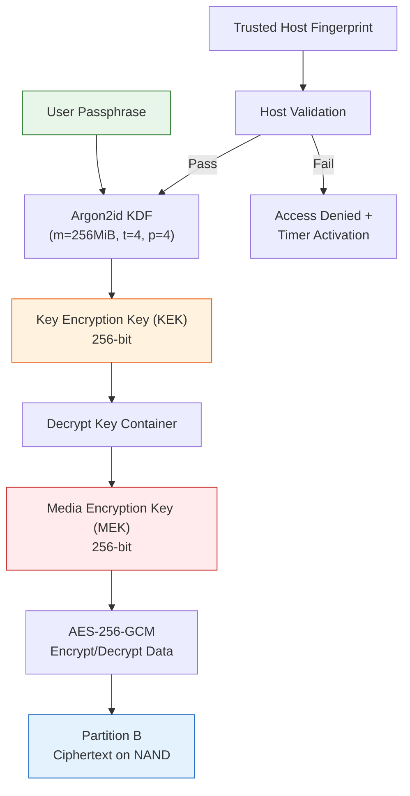
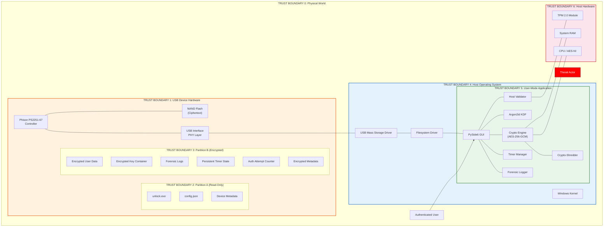
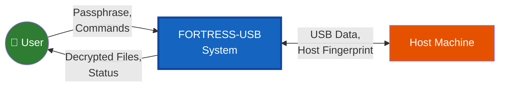
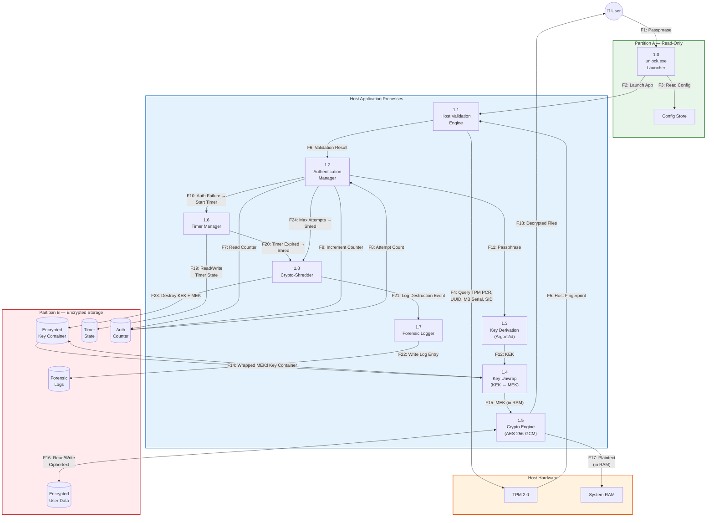
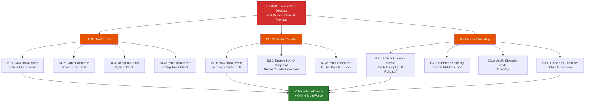
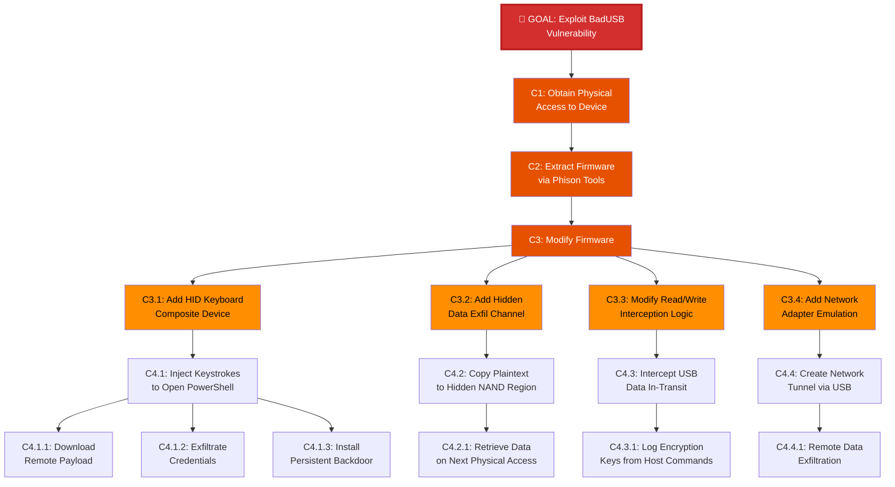
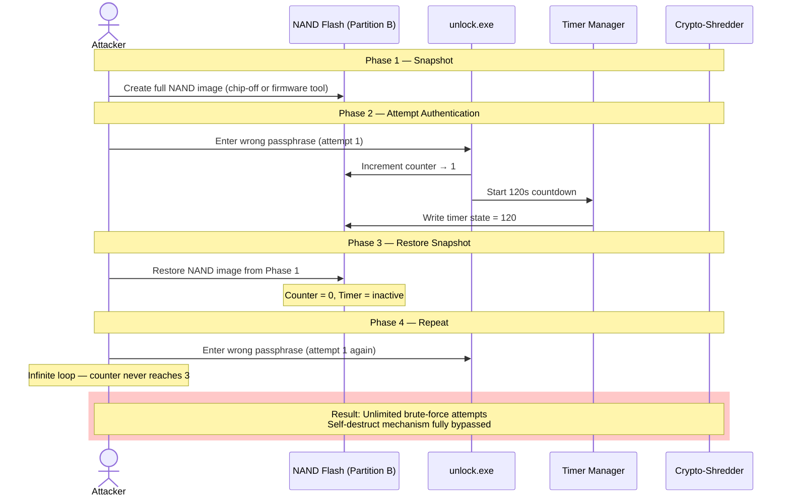
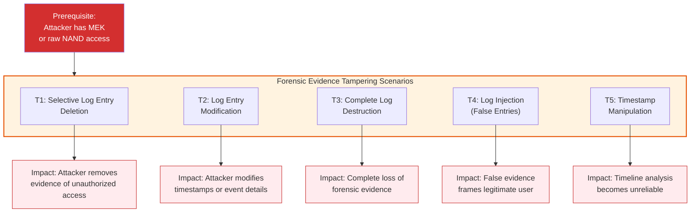
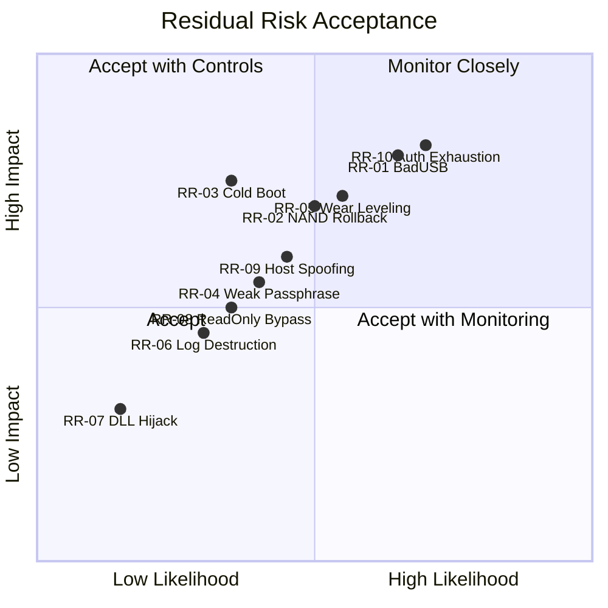

# FORTRESS-USB — STRIDE Threat Model

**Document Classification:** CONFIDENTIAL — Internal Security Architecture  
**Version:** 1.0.0  
**Date:** 2026-06-02  
**Author:** Security Architecture Team  
**Status:** ACTIVE  
**Review Cycle:** Quarterly or upon design change  

---

## Table of Contents

1. [Executive Summary](#1-executive-summary)
2. [System Overview & Scope](#2-system-overview--scope)
3. [Trust Boundaries](#3-trust-boundaries)
4. [Data Flow Diagrams](#4-data-flow-diagrams)
5. [Asset Inventory](#5-asset-inventory)
6. [STRIDE Analysis by Component](#6-stride-analysis-by-component)
7. [Comprehensive Threat Matrix](#7-comprehensive-threat-matrix)
8. [Attack Tree Diagrams](#8-attack-tree-diagrams)
9. [Specialized Attack Analyses](#9-specialized-attack-analyses)
10. [Risk Heatmap](#10-risk-heatmap)
11. [Residual Risk Assessment](#11-residual-risk-assessment)
12. [Appendices](#12-appendices)

---

## 1. Executive Summary

This document presents a formal STRIDE-based threat model for the **FORTRESS-USB Advanced Self-Protecting Encrypted Removable USB Storage System**. The system is designed to protect sensitive data at rest on a removable USB storage device, employing defense-in-depth strategies including software-based AES-256-GCM encryption, a MEK/KEK key hierarchy with Argon2id key derivation, persistent self-destruct countdown timers, forensic logging, trusted host binding, and crypto-shredding capabilities.

> [!CAUTION]
> **Critical Architectural Constraint:** The Phison PS2251-67 controller provides **no hardware encryption**, **no firmware signing**, and is **known-vulnerable to BadUSB-class attacks**. This is the single most consequential architectural limitation and elevates multiple threat categories to HIGH or CRITICAL severity. All cryptographic protections are implemented in software on the host, meaning the device's NAND flash stores ciphertext that the controller treats as opaque data.

This analysis identifies **50 unique threats** across all STRIDE categories, evaluates each against likelihood and impact scales, and maps mitigations to residual risk. The model covers physical, logical, firmware, and side-channel attack surfaces.

### Threat Distribution Summary

| STRIDE Category        | Threat Count | Critical | High | Medium | Low |
|------------------------|:------------:|:--------:|:----:|:------:|:---:|
| Spoofing               | 9            | 1        | 3    | 4      | 1   |
| Tampering              | 10           | 2        | 4    | 3      | 1   |
| Repudiation            | 5            | 0        | 2    | 2      | 1   |
| Information Disclosure | 11           | 2        | 4    | 4      | 1   |
| Denial of Service      | 8            | 1        | 2    | 3      | 2   |
| Elevation of Privilege | 7            | 2        | 3    | 1      | 1   |
| **Total**              | **50**       | **8**    | **18** | **17** | **7** |

---

## 2. System Overview & Scope

### 2.1 System Description

FORTRESS-USB is a portable encrypted storage solution built upon commodity USB flash hardware. It implements a two-partition architecture with a software-defined security boundary enforced by host-side applications.

### 2.2 Hardware Platform

| Attribute              | Specification                                      |
|------------------------|----------------------------------------------------|
| Controller             | Phison PS2251-67                                   |
| Hardware Encryption    | **None** — all encryption is software-based        |
| Firmware Signing       | **Not supported** — firmware is unsigned            |
| USB Interface          | USB 3.0 / USB 2.0 fallback                        |
| NAND Type              | TLC/MLC (vendor-dependent)                         |
| BadUSB Vulnerability   | **Confirmed** — controller firmware is reflashable |

### 2.3 Partition Architecture

```
┌──────────────────────────────────────────────────────┐
│                   FORTRESS-USB Device                 │
├──────────────────────┬───────────────────────────────┤
│   PARTITION A        │   PARTITION B                  │
│   (Read-Only)        │   (Encrypted Storage)          │
│                      │                                │
│   ▪ unlock.exe       │   ▪ Encrypted User Data        │
│   ▪ config.json      │   ▪ Encrypted Metadata         │
│   ▪ device_metadata  │   ▪ Forensic Audit Logs        │
│   ▪ PySide6 runtime  │   ▪ Encrypted Key Container    │
│   ▪ autorun.inf      │     (KEK-wrapped MEK)          │
│                      │                                │
│   Filesystem: FAT32  │   Filesystem: Raw/Encrypted    │
│   Access: Read-Only  │   Access: Authenticated Only    │
└──────────────────────┴───────────────────────────────┘
```

### 2.4 Key Architecture



### 2.5 Security Mechanisms Summary

| Mechanism                  | Implementation                           | Location     |
|----------------------------|------------------------------------------|--------------|
| Data Encryption            | AES-256-GCM (software)                  | Host-side    |
| Key Derivation             | Argon2id (m=256MiB, t=4, p=4)           | Host-side    |
| Key Architecture           | MEK wrapped by KEK                      | Partition B  |
| Authentication Limit       | 3 attempts, persists across reinsertion | Partition B  |
| Self-Destruct Timer        | 120s countdown, survives USB removal    | Partition B  |
| Trusted Host Validation    | TPM PCR, Machine UUID, MB Serial, SID   | Host-side    |
| Crypto-Shredding           | Destroy keys, not data                  | Partition B  |
| Forensic Logging           | Pre-destruction audit trail             | Partition B  |
| Launcher Integrity         | Read-only partition                     | Partition A  |

---

## 3. Trust Boundaries

### 3.1 Trust Boundary Diagram



### 3.2 Trust Boundary Descriptions

| Boundary | Name                     | Trust Level | Description |
|:--------:|--------------------------|:-----------:|-------------|
| TB0      | Physical World           | Untrusted   | Physical environment; adversary has potential physical access |
| TB1      | USB Device Hardware      | Low Trust   | Phison controller is untrusted; no firmware verification |
| TB2      | Partition A (Read-Only)  | Limited     | Integrity depends on OS-level write protection; no cryptographic assurance |
| TB3      | Partition B (Encrypted)  | Moderate    | Confidentiality via AES-256-GCM; integrity via GCM authentication tags |
| TB4      | Host Operating System    | Conditional | Trusted only if host passes validation; kernel-level threats exist |
| TB5      | User-Mode Application    | High        | Core security logic; must resist tampering and reverse engineering |
| TB6      | Host Hardware            | Conditional | TPM integrity depends on host machine; RAM is volatile but vulnerable to cold boot |

---

## 4. Data Flow Diagrams

### 4.1 DFD Level 0 — Context Diagram



### 4.2 DFD Level 1 — Detailed Data Flows



### 4.3 Data Flow Inventory

| Flow ID | Source → Destination | Data Element | Confidentiality | Integrity | Availability |
|:-------:|----------------------|--------------|:---------------:|:---------:|:------------:|
| F1  | User → Launcher           | Passphrase                  | HIGH   | HIGH   | HIGH   |
| F2  | Launcher → Host Validator | Execution context           | MEDIUM | HIGH   | HIGH   |
| F3  | Launcher → Config Store   | Configuration parameters    | LOW    | HIGH   | MEDIUM |
| F4  | Host Validator → TPM      | PCR query                   | MEDIUM | HIGH   | MEDIUM |
| F5  | TPM → Host Validator      | Host fingerprint            | HIGH   | HIGH   | MEDIUM |
| F12 | KDF → Key Unwrap          | KEK (derived)               | CRITICAL | CRITICAL | HIGH |
| F15 | Key Unwrap → Crypto Engine| MEK (plaintext in RAM)      | CRITICAL | CRITICAL | HIGH |
| F16 | Crypto Engine ↔ Part. B   | Ciphertext blocks           | MEDIUM | HIGH   | HIGH   |
| F17 | Crypto Engine → RAM       | Plaintext data              | CRITICAL | HIGH   | MEDIUM |
| F19 | Timer Mgr ↔ Part. B      | Timer/counter state         | MEDIUM | CRITICAL | CRITICAL |
| F23 | Shredder → Key Container  | Key destruction command     | LOW    | CRITICAL | N/A    |

---

## 5. Asset Inventory

### 5.1 Primary Assets

| Asset ID | Asset                      | Classification | Storage Location | Protection Mechanism |
|:--------:|----------------------------|:--------------:|------------------|----------------------|
| A1       | User Data (plaintext)      | CRITICAL       | RAM (transient)  | Memory lifetime only |
| A2       | Media Encryption Key (MEK) | CRITICAL       | RAM / Part. B (wrapped) | KEK wrapping, Argon2id |
| A3       | Key Encryption Key (KEK)   | CRITICAL       | RAM (derived)    | Argon2id derivation |
| A4       | User Passphrase            | CRITICAL       | RAM (transient)  | Immediate zeroization |
| A5       | Encrypted User Data        | HIGH           | Partition B NAND | AES-256-GCM |
| A6       | Host Fingerprint Binding   | HIGH           | Partition B      | Encrypted storage |
| A7       | Forensic Audit Logs        | HIGH           | Partition B      | Integrity protection |
| A8       | Timer/Counter State        | HIGH           | Partition B      | Persistence mechanism |
| A9       | unlock.exe Binary          | MEDIUM         | Partition A      | Read-only partition |
| A10      | Configuration Data         | MEDIUM         | Partition A      | Read-only partition |
| A11      | GCM Authentication Tags    | HIGH           | Partition B      | Part of ciphertext |

### 5.2 Supporting Assets

| Asset ID | Asset                     | Classification | Notes |
|:--------:|---------------------------|:--------------:|-------|
| S1       | Phison Controller Firmware | HIGH          | Unsigned; BadUSB attack surface |
| S2       | USB Interface (PHY)        | MEDIUM        | Physical layer; bus sniffing possible |
| S3       | TPM 2.0 Module             | HIGH          | Host-bound; not portable with device |
| S4       | System RAM                 | HIGH          | Cold boot attack surface |
| S5       | Host OS Integrity          | HIGH          | Assumed semi-trusted |

---

## 6. STRIDE Analysis by Component

### 6.1 Phison PS2251-67 Controller

| STRIDE Category        | Applicable | Analysis |
|------------------------|:----------:|----------|
| **Spoofing**           | ✅ YES     | Controller can be reflashed to impersonate a different USB device class (HID keyboard, network adapter). Attacker with physical access can reprogram the controller to present a malicious device identity to the host. |
| **Tampering**          | ✅ YES     | Firmware is unsigned. An attacker can modify controller firmware to alter data in transit between NAND and USB interface, inject malicious payloads, or silently redirect reads/writes. |
| **Repudiation**        | ✅ YES     | Firmware-level modifications leave no auditable trail. The controller has no logging capability; malicious firmware changes are undetectable without external forensic analysis of the firmware image. |
| **Info Disclosure**    | ✅ YES     | Modified firmware could exfiltrate data by copying plaintext to hidden NAND regions, encoding data in USB timing side-channels, or leaking data via modified USB descriptors. |
| **Denial of Service**  | ✅ YES     | Firmware can be corrupted to brick the controller, refuse to present storage volumes, or selectively corrupt NAND read operations, rendering the device unusable. |
| **Elevation of Privilege** | ✅ YES | **BadUSB attack**: Reflashed firmware can present the device as a HID keyboard + storage composite device, enabling arbitrary keystroke injection on the host with the privileges of the logged-in user. |

### 6.2 Partition A — Read-Only Launcher

| STRIDE Category        | Applicable | Analysis |
|------------------------|:----------:|----------|
| **Spoofing**           | ✅ YES     | A cloned device can present a trojanized `unlock.exe` that mimics the legitimate UI to harvest passphrases. The read-only flag is a filesystem attribute, not a hardware write-protect. |
| **Tampering**          | ✅ YES     | The "read-only" property is enforced by the OS filesystem driver, not by hardware. An attacker with raw NAND access (controller reflash or chip-off) can modify `unlock.exe` to include credential-harvesting code. |
| **Repudiation**        | ⚠️ PARTIAL | No code-signing or integrity verification of the launcher binary. Users cannot cryptographically verify they are running the genuine launcher. |
| **Info Disclosure**    | ⚠️ PARTIAL | `config.json` may expose device metadata, version information, or configuration parameters that aid targeted attacks. |
| **Denial of Service**  | ✅ YES     | Corruption of `unlock.exe` or its dependencies renders the entire device inaccessible, as the launcher is the sole entry point. |
| **Elevation of Privilege** | ⚠️ PARTIAL | If `unlock.exe` runs with elevated privileges or requests UAC elevation, a tampered binary inherits those privileges. |

### 6.3 Partition B — Encrypted Storage

| STRIDE Category        | Applicable | Analysis |
|------------------------|:----------:|----------|
| **Spoofing**           | ⚠️ PARTIAL | An attacker could substitute the key container with one for which they know the KEK, effectively replacing the encryption envelope. |
| **Tampering**          | ✅ YES     | GCM authentication tags protect individual blocks, but an attacker with raw NAND access can perform block-level reordering, truncation, or rollback attacks if metadata versioning is insufficient. |
| **Repudiation**        | ⚠️ PARTIAL | Forensic logs stored on the same medium could be tampered with if key material is compromised. |
| **Info Disclosure**    | ✅ YES     | Ciphertext is directly accessible via NAND extraction. While AES-256-GCM is computationally secure, metadata patterns (file sizes, block counts, access timestamps) may leak information. |
| **Denial of Service**  | ✅ YES     | Destruction or corruption of the key container permanently denies access to all encrypted data — this is by design (crypto-shredding) but can be weaponized. |
| **Elevation of Privilege** | ⚠️ PARTIAL | Compromise of the key container grants full read/write access to all encrypted data, bypassing per-file access controls if any exist. |

### 6.4 Authentication Manager

| STRIDE Category        | Applicable | Analysis |
|------------------------|:----------:|----------|
| **Spoofing**           | ✅ YES     | Credential stuffing using leaked passphrases; shoulder surfing; phishing via trojanized launcher. |
| **Tampering**          | ✅ YES     | Direct manipulation of the attempt counter stored on Partition B to reset the 3-attempt limit. |
| **Repudiation**        | ✅ YES     | Failed authentication attempts must be logged; if logging fails, attacker actions are non-attributable. |
| **Info Disclosure**    | ✅ YES     | Timing side-channels in Argon2id verification could leak passphrase length or entropy characteristics. |
| **Denial of Service**  | ✅ YES     | Intentional exhaustion of the 3-attempt limit to lock out the legitimate user. |
| **Elevation of Privilege** | ✅ YES | Bypass of authentication via memory inspection (reading derived KEK/MEK from RAM) or debugger attachment. |

### 6.5 Argon2id KDF

| STRIDE Category        | Applicable | Analysis |
|------------------------|:----------:|----------|
| **Spoofing**           | ⚠️ PARTIAL | If the KDF parameters (salt, memory cost, iterations) are tampered with, a weaker key may be derived from the correct passphrase, enabling a downgrade attack. |
| **Tampering**          | ✅ YES     | Modification of KDF parameters stored in config/metadata to reduce computational cost, making brute-force feasible. |
| **Repudiation**        | ❌ NO      | KDF is a deterministic function; no repudiation concerns. |
| **Info Disclosure**    | ✅ YES     | KDF parameters (salt, cost factors) are necessary for key derivation and must be stored; their exposure enables precomputation attacks if salt is weak or reused. |
| **Denial of Service**  | ✅ YES     | Corrupting KDF parameters prevents key derivation entirely, denying access even with the correct passphrase. |
| **Elevation of Privilege** | ⚠️ PARTIAL | Downgraded KDF parameters enable brute-force recovery of the KEK from the passphrase. |

### 6.6 AES-256-GCM Crypto Engine

| STRIDE Category        | Applicable | Analysis |
|------------------------|:----------:|----------|
| **Spoofing**           | ❌ NO      | Symmetric encryption; no identity component. |
| **Tampering**          | ✅ YES     | GCM authentication tags detect tampering, but nonce reuse would be catastrophic — enabling plaintext recovery and forgery. Implementation must guarantee nonce uniqueness. |
| **Repudiation**        | ❌ NO      | Symmetric scheme; no non-repudiation property. |
| **Info Disclosure**    | ✅ YES     | AES-NI side-channels are minimal, but software fallback paths may be vulnerable to cache-timing attacks. Key material in RAM is vulnerable to cold boot and DMA attacks. |
| **Denial of Service**  | ✅ YES     | Corruption of GCM authentication tags causes legitimate decryption to fail, denying access to data. |
| **Elevation of Privilege** | ❌ NO  | No privilege hierarchy within the crypto engine. |

### 6.7 Persistent Timer Manager

| STRIDE Category        | Applicable | Analysis |
|------------------------|:----------:|----------|
| **Spoofing**           | ⚠️ PARTIAL | An attacker could present a manipulated system clock to the timer manager if it relies on host time. |
| **Tampering**          | ✅ YES     | **Critical:** Timer state persisted on Partition B can be directly manipulated via raw NAND access to reset the countdown or freeze it permanently. |
| **Repudiation**        | ✅ YES     | Timer reset events must be logged; without tamper-evident logging, an attacker can reset the timer without evidence. |
| **Info Disclosure**    | ⚠️ PARTIAL | Timer state reveals that an unauthorized access attempt occurred and how much time remains. |
| **Denial of Service**  | ✅ YES     | Setting the timer to zero or a past value triggers premature crypto-shredding, destroying all data. |
| **Elevation of Privilege** | ✅ YES | Resetting the timer grants unlimited additional authentication attempts, effectively bypassing the self-destruct mechanism. |

### 6.8 Trusted Host Validator

| STRIDE Category        | Applicable | Analysis |
|------------------------|:----------:|----------|
| **Spoofing**           | ✅ YES     | TPM PCR values can be replayed if measured boot is not used. Machine UUID, motherboard serial, and Windows SID can be spoofed in software or via registry manipulation on a compromised host. |
| **Tampering**          | ✅ YES     | The stored trusted host fingerprint on Partition B can be replaced with the attacker's host fingerprint via raw NAND manipulation. |
| **Repudiation**        | ⚠️ PARTIAL | Host validation events should be logged; without this, access from unauthorized hosts is non-attributable. |
| **Info Disclosure**    | ✅ YES     | The stored fingerprint reveals which machine(s) are authorized, potentially identifying the device owner's primary workstation. |
| **Denial of Service**  | ✅ YES     | Corrupting the stored fingerprint causes all hosts to fail validation, locking out the legitimate user. |
| **Elevation of Privilege** | ✅ YES | Spoofing all four host identifiers (TPM, UUID, MB serial, SID) grants full authentication access on an unauthorized machine. |

### 6.9 Crypto-Shredder

| STRIDE Category        | Applicable | Analysis |
|------------------------|:----------:|----------|
| **Spoofing**           | ❌ NO      | Destruction is a one-way operation; no identity to spoof. |
| **Tampering**          | ✅ YES     | An attacker could modify the shredder code to perform incomplete key destruction, leaving recoverable key fragments in NAND spare areas or wear-leveled blocks. |
| **Repudiation**        | ✅ YES     | Without verifiable proof of destruction, the owner cannot demonstrate that data was irrecoverably destroyed (compliance concern). |
| **Info Disclosure**    | ✅ YES     | Crypto-shredding destroys keys but leaves ciphertext intact. If any key material persists (NAND wear-leveling copies, RAM remnants), the ciphertext becomes vulnerable. |
| **Denial of Service**  | ✅ YES     | Premature triggering of crypto-shredding permanently destroys all data. This is by design but can be weaponized. |
| **Elevation of Privilege** | ❌ NO  | Destruction does not grant elevated access. |

### 6.10 Forensic Logger

| STRIDE Category        | Applicable | Analysis |
|------------------------|:----------:|----------|
| **Spoofing**           | ✅ YES     | Log entries could be injected with forged timestamps or source identifiers to frame legitimate users or mask attacker actions. |
| **Tampering**          | ✅ YES     | Logs stored on the same encrypted partition can be modified or deleted if the attacker has decryption access. |
| **Repudiation**        | ✅ YES     | If log integrity is not cryptographically guaranteed (e.g., hash chains), events can be repudiated. |
| **Info Disclosure**    | ✅ YES     | Forensic logs may contain sensitive operational metadata: timestamps, host identifiers, partial error messages that reveal system internals. |
| **Denial of Service**  | ✅ YES     | Filling the log storage allocation prevents new entries from being recorded, creating a blind spot. |
| **Elevation of Privilege** | ⚠️ PARTIAL | If log processing has parsing vulnerabilities, crafted log entries could trigger code execution. |

---

## 7. Comprehensive Threat Matrix

> **Scoring Methodology:**  
> - **Likelihood:** 1 (Rare) → 5 (Almost Certain)  
> - **Impact:** 1 (Negligible) → 5 (Catastrophic)  
> - **Risk Score:** Likelihood × Impact (1–25)  
> - **Risk Level:** LOW (1–4), MEDIUM (5–9), HIGH (10–16), CRITICAL (17–25)

### 7.1 Spoofing Threats (S)

| ID | Threat Description | Affected Component | Likelihood | Impact | Risk Score | Risk Level | Mitigation |
|:--:|-------------------|-------------------|:----------:|:------:|:----------:|:----------:|------------|
| S-01 | **BadUSB Device Impersonation:** Attacker reflashes Phison firmware to present device as HID keyboard, injecting keystrokes to exfiltrate data or install malware on the host. | Controller (S1) | 4 | 5 | **20** | CRITICAL | Host-side USB device class whitelisting; USB device policy enforcement; physical tamper-evident seals on device housing. |
| S-02 | **Trojanized Launcher Phishing:** Attacker creates a clone device with a modified `unlock.exe` that harvests passphrases while displaying a fake "authentication failed" message. | Partition A (A9) | 3 | 5 | **15** | HIGH | Code signing of `unlock.exe` with certificate pinning; launcher integrity check via external secure hash comparison. |
| S-03 | **Host Fingerprint Spoofing:** Attacker clones all four host identifiers (TPM PCR replay, UUID spoof, MB serial SMBIOS edit, SID registry manipulation) on an attacker-controlled machine. | Host Validator | 3 | 5 | **15** | HIGH | Use TPM-based attestation with nonce-challenge (not static PCR reads); bind to TPM endorsement key; combine with network location awareness. |
| S-04 | **Credential Replay Attack:** Attacker captures the derived KEK from a memory dump and replays it to unwrap the MEK without knowing the passphrase. | Auth Manager, KDF | 3 | 5 | **15** | HIGH | Immediate zeroization of KEK after MEK unwrap; encrypt KEK in RAM using DPAPI or memory encryption; session binding. |
| S-05 | **Rogue USB Hub Interception:** Attacker interposes a malicious USB hub between device and host to intercept and replay USB transactions. | USB Interface (S2) | 2 | 4 | **8** | MEDIUM | USB transaction-level encryption (if supported); physical inspection protocols; USB port sealing. |
| S-06 | **TPM PCR Value Replay:** Attacker records legitimate TPM PCR values and replays them on a compromised host to pass host validation. | Host Validator, TPM | 3 | 4 | **12** | HIGH | TPM2_Quote with fresh nonce; verify quote signature with TPM endorsement key; reject static PCR reads. |
| S-07 | **Evil Maid Clone Device:** Attacker substitutes the entire USB device with an identical-looking device that logs the passphrase on first use, then presents an error. | Physical Device | 2 | 5 | **10** | HIGH | Device-unique hardware identifier verification; physical tamper-evident features; user education. |
| S-08 | **Windows SID Impersonation:** Attacker creates a local account with a matching SID on the attacker's machine to pass the SID component of host validation. | Host Validator | 3 | 3 | **9** | MEDIUM | SID should be combined with other identifiers and never used as sole factor; weight TPM-based attestation higher. |
| S-09 | **Config Metadata Spoofing:** Attacker modifies `config.json` to point to attacker-controlled key derivation parameters. | Partition A (A10) | 2 | 3 | **6** | MEDIUM | Integrity-protect config with HMAC keyed by device-unique secret; validate config hash before use. |

### 7.2 Tampering Threats (T)

| ID | Threat Description | Affected Component | Likelihood | Impact | Risk Score | Risk Level | Mitigation |
|:--:|-------------------|-------------------|:----------:|:------:|:----------:|:----------:|------------|
| T-01 | **Firmware Reflash (BadUSB):** Attacker uses publicly available Phison tools to reflash controller firmware with malicious payload, intercepting all data in transit. | Controller (S1) | 4 | 5 | **20** | CRITICAL | Physical tamper-evident device housing; epoxy-fill USB connector to prevent disassembly; host-side firmware version monitoring. |
| T-02 | **Authentication Counter Reset:** Attacker directly manipulates Partition B storage to reset the 3-attempt counter to zero, granting unlimited authentication attempts. | Auth Counter (A8) | 3 | 5 | **15** | HIGH | Store counter with cryptographic MAC; use monotonic counter if hardware supports it; chain counter to timer state. |
| T-03 | **Timer State Manipulation:** Attacker modifies the persistent timer value on Partition B to reset the 120-second countdown, preventing crypto-shredding. | Timer State (A8) | 3 | 5 | **15** | HIGH | Cryptographic commitment to timer state; hash-chain timer decrements; detect tampering via MAC verification on each read. |
| T-04 | **KDF Parameter Downgrade:** Attacker modifies stored Argon2id parameters (reduce memory cost from 256MiB to 1MiB, iterations from 4 to 1), making brute-force feasible. | KDF Config | 3 | 5 | **15** | HIGH | HMAC-protect KDF parameters with a key derived from a device constant; enforce minimum parameter thresholds in code; reject parameters below floor values. |
| T-05 | **GCM Nonce Manipulation:** Attacker forces nonce reuse by tampering with the nonce counter stored on Partition B, enabling plaintext recovery. | Crypto Engine | 2 | 5 | **10** | HIGH | Use random 96-bit nonces (probabilistically unique); maintain nonce counter with MAC protection; detect nonce regression. |
| T-06 | **NAND Block Rollback:** Attacker uses NAND programmer to restore Partition B to a previous state (before counter increment or timer activation), undoing security state changes. | Partition B (All) | 3 | 4 | **12** | HIGH | Monotonic state counter with forward-secure hash chain; detect rollback via expected state hash mismatch. |
| T-07 | **Launcher Binary Patching:** Attacker modifies `unlock.exe` on Partition A to bypass host validation, disable timer checks, or exfiltrate derived keys. | Partition A (A9) | 3 | 5 | **15** | HIGH | Code signing with embedded certificate; runtime self-integrity check (hash of own binary); Authenticode verification. |
| T-08 | **Forensic Log Deletion:** Attacker with key access modifies or deletes forensic log entries to cover tracks of unauthorized access attempts. | Forensic Logs (A7) | 2 | 4 | **8** | MEDIUM | Hash-chain log entries (each entry includes hash of previous); replicate critical log entries to multiple NAND locations. |
| T-09 | **Key Container Substitution:** Attacker replaces the encrypted key container with one wrapped under a known KEK, effectively rekeying the device to attacker-controlled keys. | Key Container (A2) | 2 | 5 | **10** | HIGH | Bind key container to device hardware identifier; include device-specific salt in KEK derivation; detect container substitution via binding MAC. |
| T-10 | **Config File Injection:** Attacker modifies `config.json` to alter security parameters (e.g., increasing max auth attempts, disabling timer, changing trusted host list). | Config (A10) | 3 | 4 | **12** | HIGH | HMAC-protect entire config file; enforce config integrity check at application startup; hardcode critical security parameters. |

### 7.3 Repudiation Threats (R)

| ID | Threat Description | Affected Component | Likelihood | Impact | Risk Score | Risk Level | Mitigation |
|:--:|-------------------|-------------------|:----------:|:------:|:----------:|:----------:|------------|
| R-01 | **Unattributed Access:** Successful authentication is not logged with sufficient detail to attribute access to a specific user or host session. | Forensic Logger (A7) | 3 | 4 | **12** | HIGH | Log authentication events with timestamp, host fingerprint, session ID, and authentication method; protect log integrity with hash chains. |
| R-02 | **Deniable Timer Reset:** Attacker resets the self-destruct timer via NAND manipulation; no evidence of the reset persists in forensic logs. | Timer Manager, Logs | 3 | 4 | **12** | HIGH | Log all timer state transitions; store timer-state snapshots in multiple locations; use write-once log entries with hash chains. |
| R-03 | **Unverifiable Crypto-Shredding:** After key destruction, no independently verifiable proof exists that shredding was complete and irreversible. | Crypto-Shredder | 2 | 4 | **8** | MEDIUM | Generate destruction certificate with timestamp and hash of destroyed key container; store certificate in tamper-evident log region. |
| R-04 | **Firmware Tampering Without Trace:** Controller firmware modifications leave no audit trail; device continues to function normally with malicious firmware. | Controller (S1) | 3 | 3 | **9** | MEDIUM | Firmware hash measurement at startup (host-side); compare against known-good hash database; log firmware hash verification results. |
| R-05 | **Log Saturation Evasion:** Attacker fills log storage with benign entries, causing the system to drop or overwrite legitimate forensic evidence. | Forensic Logger (A7) | 2 | 3 | **6** | MEDIUM | Implement log rotation with integrity-protected archive; reserve space for critical events; prioritize security event logging. |

### 7.4 Information Disclosure Threats (I)

| ID | Threat Description | Affected Component | Likelihood | Impact | Risk Score | Risk Level | Mitigation |
|:--:|-------------------|-------------------|:----------:|:------:|:----------:|:----------:|------------|
| I-01 | **Cold Boot Attack on MEK/KEK:** Attacker performs cold boot attack on host RAM to extract plaintext MEK or KEK while device is unlocked, or within minutes of lock/removal. | RAM (S4), Keys (A2, A3) | 3 | 5 | **15** | HIGH | Aggressive key zeroization on lock/unmount; use memory encryption (Windows Credential Guard); minimize key lifetime in RAM; use AES-NI registers for key storage. |
| I-02 | **NAND Chip-Off Extraction:** Attacker desolders NAND flash chip and reads raw ciphertext using a chip programmer, bypassing all software-level access controls. | NAND Flash, Part. B | 4 | 3 | **12** | HIGH | Ciphertext is computationally secure under AES-256-GCM; ensure no plaintext key material is stored in NAND spare areas; verify NAND wear-leveling does not retain cleartext copies. |
| I-03 | **USB Bus Sniffing:** Attacker uses a hardware USB protocol analyzer to capture data transfers between device and host, obtaining plaintext data during active read/write sessions. | USB Interface (S2) | 2 | 5 | **10** | HIGH | Data is encrypted on NAND; decryption occurs on host; USB traffic contains only ciphertext during reads. **However**, write operations may transmit plaintext if encryption occurs after USB transfer — ensure encrypt-then-write architecture. |
| I-04 | **Metadata Pattern Analysis:** Even with encrypted data, block access patterns, file sizes, modification timestamps, and directory structure metadata may leak information. | Partition B (A5) | 3 | 3 | **9** | MEDIUM | Pad files to uniform block sizes; encrypt metadata alongside data; use constant-time access patterns where feasible; obfuscate directory structure. |
| I-05 | **Config Data Exposure:** `config.json` on the read-only partition contains device configuration that reveals security architecture details, version information, and operational parameters. | Config (A10) | 3 | 2 | **6** | MEDIUM | Minimize information in config; encrypt sensitive parameters; treat config as public and ensure no secrets are stored there. |
| I-06 | **Forensic Log Information Leakage:** Encrypted forensic logs, if decrypted by an attacker with key access, reveal operational patterns, access times, host identities, and security events. | Forensic Logs (A7) | 2 | 3 | **6** | MEDIUM | Encrypt logs with a separate log-specific key; implement log key rotation; consider forward-secure logging (delete old log keys). |
| I-07 | **DMA Attack via Thunderbolt/FireWire:** Attacker uses DMA-capable interface to read host RAM contents, extracting decrypted data or key material from memory. | RAM (S4) | 2 | 5 | **10** | HIGH | Require host to enable IOMMU/VT-d; use Windows Kernel DMA Protection; detect DMA-capable devices; warn user. |
| I-08 | **Wear-Leveling Key Remnants:** NAND wear-leveling may retain copies of the key container in spare blocks after the primary copy is destroyed during crypto-shredding. | NAND Flash (A2) | 3 | 5 | **15** | HIGH | Overwrite key container location with random data multiple times; issue TRIM/UNMAP commands; the Phison controller's wear-leveling behavior must be characterized and accounted for. |
| I-09 | **Side-Channel Timing Attack on Authentication:** Variations in authentication response time could reveal whether the host validation, passphrase check, or key derivation step failed. | Auth Manager | 2 | 3 | **6** | MEDIUM | Implement constant-time comparison for all authentication steps; add fixed-duration delays regardless of failure point. |
| I-10 | **Host Fingerprint Exposure:** The stored trusted host fingerprint on Partition B reveals the TPM state, hardware UUID, motherboard serial, and Windows SID of the authorized machine. | Host Validator (A6) | 3 | 3 | **9** | MEDIUM | Encrypt the host fingerprint with a key derived from the passphrase; the fingerprint should only be readable after successful authentication. |
| I-11 | **Electromagnetic Emanation (TEMPEST):** The USB device or host processor may emit electromagnetic signals during cryptographic operations that could be captured and analyzed. | Physical Device, CPU | 1 | 4 | **4** | LOW | Use TEMPEST-rated equipment for high-security deployments; AES-NI reduces EM signature; physical shielding of USB device. |

### 7.5 Denial of Service Threats (D)

| ID | Threat Description | Affected Component | Likelihood | Impact | Risk Score | Risk Level | Mitigation |
|:--:|-------------------|-------------------|:----------:|:------:|:----------:|:----------:|------------|
| D-01 | **Deliberate Auth Exhaustion:** Attacker intentionally enters 3 wrong passphrases to trigger crypto-shredding and permanently destroy all data. | Auth Manager (A8) | 4 | 5 | **20** | CRITICAL | Implement progressive delay between attempts (1s, 5s, 30s); require physical interaction (button press) for each attempt; consider requiring a secondary destruction authorization. |
| D-02 | **Timer-Triggered Premature Shredding:** Attacker activates the 120-second timer by failing authentication, then prevents the legitimate user from authenticating before expiration. | Timer Manager (A8) | 3 | 5 | **15** | HIGH | Allow timer pause with correct partial authentication (e.g., host validation pauses timer); provide emergency override mechanism with secondary credentials. |
| D-03 | **Firmware Bricking:** Attacker corrupts the Phison controller firmware, rendering the device completely non-functional at the hardware level. | Controller (S1) | 2 | 5 | **10** | HIGH | Physical tamper-evident housing; epoxy-fill critical components; firmware hash verification on startup (requires host-side tooling). |
| D-04 | **Key Container Corruption:** Attacker corrupts the encrypted key container on Partition B, making MEK recovery impossible even with the correct passphrase. | Key Container (A2) | 2 | 5 | **10** | HIGH | Maintain redundant key container copies in separate NAND regions; implement key container integrity checks (CRC + MAC). |
| D-05 | **Launcher Corruption:** Corruption or deletion of `unlock.exe` on Partition A prevents users from accessing the authentication interface. | Partition A (A9) | 2 | 4 | **8** | MEDIUM | Embed launcher recovery mechanism; provide alternate access method (command-line tool on separate media); backup launcher hash for recovery verification. |
| D-06 | **NAND Wear Exhaustion:** Repeated write cycles to timer/counter storage locations exhaust NAND write endurance, causing permanent failure. | NAND Flash | 2 | 4 | **8** | MEDIUM | Distribute writes across multiple NAND blocks; implement wear-leveling for security state storage; use SLC-mode blocks for critical counters. |
| D-07 | **USB Electrical Damage:** Attacker applies overvoltage or ESD to the USB port, physically destroying the flash memory controller or NAND. | Physical Device | 2 | 5 | **10** | HIGH | Include voltage regulation and ESD protection circuits; use TVS diodes on USB data lines; ruggedized enclosure. |
| D-08 | **Log Storage Exhaustion:** Attacker triggers repeated events (auth failures, timer activations) to fill the forensic log partition, potentially impacting operational storage. | Forensic Logger (A7) | 2 | 2 | **4** | LOW | Fixed-size circular log buffer; rate-limit log entries; separate log allocation from data allocation. |

### 7.6 Elevation of Privilege Threats (E)

| ID | Threat Description | Affected Component | Likelihood | Impact | Risk Score | Risk Level | Mitigation |
|:--:|-------------------|-------------------|:----------:|:------:|:----------:|:----------:|------------|
| E-01 | **BadUSB Keystroke Injection:** Reflashed controller firmware presents the device as a HID keyboard, injecting keystrokes to execute arbitrary commands with the logged-in user's privileges. | Controller (S1) | 4 | 5 | **20** | CRITICAL | Host-side USB device class policy (block composite devices with HID + storage); physical write-protect on controller flash; monitor for unexpected HID device enumeration. |
| E-02 | **Memory Injection via Debug Interface:** Attacker attaches a debugger to the running `unlock.exe` process to modify authentication state in memory, bypassing auth checks. | Application (TB5) | 3 | 5 | **15** | HIGH | Anti-debugging techniques (IsDebuggerPresent, timing checks); obfuscate critical code paths; use process protection (PPL if feasible); detect virtual machine environments. |
| E-03 | **Privilege Escalation via Launcher:** If `unlock.exe` requires or requests elevated (Administrator) privileges, exploitation of any vulnerability in the launcher grants full system access. | Partition A (A9) | 2 | 5 | **10** | HIGH | Run launcher with minimum required privileges (standard user); avoid requesting UAC elevation; use a service architecture for privileged operations. |
| E-04 | **Host Validation Bypass via VM Spoofing:** Attacker runs a VM configured with cloned TPM, UUID, MB serial, and SID, gaining authenticated access on any physical hardware. | Host Validator | 3 | 4 | **12** | HIGH | Detect virtualization (hypervisor CPUID, timing variations); include virtualization detection in host validation; weight bare-metal indicators higher. |
| E-05 | **DLL Hijacking of Launcher:** Attacker places a malicious DLL in the Partition A directory or USB root that `unlock.exe` loads, executing arbitrary code in the launcher's context. | Application (A9) | 3 | 5 | **15** | HIGH | Specify absolute DLL paths; use DLL search order hardening; manifest-based DLL loading; set `SetDllDirectory("")`. |
| E-06 | **Kernel Driver Exploitation:** Attacker exploits a vulnerability in the USB mass storage driver or filesystem driver to gain kernel-level access during device enumeration. | Host OS (TB4) | 2 | 5 | **10** | HIGH | Keep host OS patched; use driver blocklist; sandboxed device enumeration; restrict filesystem auto-parsing. |
| E-07 | **Bypass Auth via Process Hollowing:** Attacker replaces the running `unlock.exe` process memory with malicious code that directly accesses Partition B using an already-derived MEK. | Application (TB5) | 2 | 5 | **10** | HIGH | Code integrity enforcement; runtime memory protection; tie MEK usage to authenticated process state; use Windows Code Integrity Guard. |

---

## 8. Attack Tree Diagrams

### 8.1 Primary Attack Tree — Unauthorized Data Access

```mermaid
graph TD
    ROOT["🎯 GOAL: Access Protected Data<br/>on FORTRESS-USB"]

    ROOT --> A1["A1: Obtain Plaintext<br/>Key Material"]
    ROOT --> A2["A2: Bypass<br/>Authentication"]
    ROOT --> A3["A3: Exploit<br/>Firmware"]
    ROOT --> A4["A4: Physical<br/>Extraction"]

    A1 --> A1a["A1.1: Cold Boot Attack<br/>on Host RAM<br/>(I-01)"]
    A1 --> A1b["A1.2: DMA Attack via<br/>Thunderbolt/PCIe<br/>(I-07)"]
    A1 --> A1c["A1.3: Debugger Attach<br/>to unlock.exe<br/>(E-02)"]
    A1 --> A1d["A1.4: Memory Dump of<br/>Running Process<br/>(I-01)"]
    A1 --> A1e["A1.5: NAND Wear-Level<br/>Key Remnants<br/>(I-08)"]

    A2 --> A2a["A2.1: Brute-Force<br/>Passphrase"]
    A2 --> A2b["A2.2: Reset Auth<br/>Counter (T-02)"]
    A2 --> A2c["A2.3: Reset Self-Destruct<br/>Timer (T-03)"]
    A2 --> A2d["A2.4: Spoof Host<br/>Fingerprint (S-03)"]
    A2 --> A2e["A2.5: Trojanized Launcher<br/>Passphrase Capture (S-02)"]
    A2 --> A2f["A2.6: KDF Parameter<br/>Downgrade (T-04)"]

    A2a --> A2a1["A2.1.1: Offline Brute-Force<br/>after NAND Extraction"]
    A2a --> A2a2["A2.1.2: Online Brute-Force<br/>with Counter Reset"]

    A2a2 --> A2b

    A3 --> A3a["A3.1: BadUSB HID<br/>Injection (E-01)"]
    A3 --> A3b["A3.2: Firmware Data<br/>Interception (T-01)"]
    A3 --> A3c["A3.3: Firmware-Level<br/>Key Logging (I-03)"]

    A4 --> A4a["A4.1: NAND Chip-Off<br/>(I-02)"]
    A4 --> A4b["A4.2: Bus Sniffing<br/>(I-03)"]
    A4 --> A4c["A4.3: EM Emanation<br/>Analysis (I-11)"]

    A4a --> A4a1["A4.1.1: Extract Ciphertext<br/>+ Offline Brute-Force"]
    A4a --> A4a2["A4.1.2: Extract Key<br/>Remnants from<br/>Spare Blocks"]

    style ROOT fill:#d32f2f,color:#fff,stroke:#b71c1c,stroke-width:3px
    style A1 fill:#e65100,color:#fff
    style A2 fill:#e65100,color:#fff
    style A3 fill:#e65100,color:#fff
    style A4 fill:#e65100,color:#fff
    style A1a fill:#ff8f00,color:#000
    style A1b fill:#ff8f00,color:#000
    style A2b fill:#ff8f00,color:#000
    style A2c fill:#ff8f00,color:#000
    style A3a fill:#ff8f00,color:#000
    style A4a fill:#ff8f00,color:#000
```



### 8.2 Attack Tree — Self-Destruct Mechanism Bypass



### 8.3 Attack Tree — BadUSB Exploitation



---

## 9. Specialized Attack Analyses

### 9.1 BadUSB Threat Analysis

> [!CAUTION]
> The Phison PS2251-67 is a **known-vulnerable** controller. Public tools exist for firmware extraction and modification. This is not a theoretical threat — it is a **demonstrated, weaponized attack class**.

#### 9.1.1 Attack Prerequisites

| Requirement | Difficulty | Notes |
|-------------|:----------:|-------|
| Physical access to device | Low | Device is portable by design |
| Phison firmware tools | Low | Publicly available (psychson, etc.) |
| Custom firmware development | Medium | Templates and examples exist |
| Re-insertion into victim host | Low | Device appears identical externally |

#### 9.1.2 Attack Variants

| Variant | Description | Impact | Detection Difficulty |
|---------|-------------|:------:|:--------------------:|
| **HID Keyboard Injection** | Device enumerates as composite HID+MSC; injects keystrokes to execute arbitrary commands | CRITICAL | High — appears as legitimate keyboard |
| **Network Adapter Emulation** | Device presents as RNDIS/ECM network adapter; intercepts DNS or routes traffic through attacker proxy | CRITICAL | Medium — unexpected network adapter appearance |
| **Hidden Storage Partition** | Firmware creates invisible partition that logs all data read/written through the controller | HIGH | Very High — invisible to host OS |
| **Data Interception** | Firmware silently copies all data passing through the controller to hidden NAND region | CRITICAL | Very High — no behavioral change visible |
| **Selective Data Corruption** | Firmware randomly corrupts specific blocks to cause gradual data degradation | HIGH | High — corruption appears as hardware fault |

#### 9.1.3 Mitigation Stack

```
┌─────────────────────────────────────────────────────────────────┐
│ Layer 5: User Education & Policy                                │
│   • Never insert untrusted USB devices                          │
│   • Inspect device for physical tampering                       │
│   • Verify device firmware hash before use                      │
├─────────────────────────────────────────────────────────────────┤
│ Layer 4: Host-Side USB Policy Enforcement                       │
│   • Windows Group Policy: Block USB composite devices           │
│   • USBGuard / Device Installation Restrictions                 │
│   • Whitelist specific USB VID/PID combinations                 │
├─────────────────────────────────────────────────────────────────┤
│ Layer 3: Device Class Filtering                                 │
│   • Block HID class when MSC class is expected                  │
│   • Monitor for device re-enumeration events                    │
│   • Alert on unexpected device class changes                    │
├─────────────────────────────────────────────────────────────────┤
│ Layer 2: Physical Tamper Evidence                                │
│   • Tamper-evident seal on device housing                       │
│   • Epoxy fill on controller chip (prevents desoldering)        │
│   • Unique serial number etched on housing                      │
├─────────────────────────────────────────────────────────────────┤
│ Layer 1: Firmware Integrity Monitoring                          │
│   • Host-side firmware hash comparison at each insertion        │
│   • Maintain known-good firmware hash database                  │
│   • Alert on firmware hash mismatch                             │
└─────────────────────────────────────────────────────────────────┘
```

#### 9.1.4 Residual Risk Assessment

Despite all mitigations, the BadUSB vulnerability **cannot be fully eliminated** without a controller that supports firmware signing. The Phison PS2251-67's lack of firmware authentication is an **accepted architectural risk**. The residual risk is rated **HIGH** with all mitigations applied, and **CRITICAL** without host-side USB policy enforcement.

---

### 9.2 Timer/Counter Reset Attack Analysis

#### 9.2.1 Attack Scenario

The self-destruct mechanism relies on two persistent state values stored on Partition B:
1. **Authentication Attempt Counter** — incremented on each failed attempt; shreds at 3.
2. **Countdown Timer State** — starts at 120 seconds; shreds at 0.

Both values are stored on NAND flash, which is directly accessible via:
- Controller firmware modification (see §9.1)
- NAND chip-off and external programming
- Raw block device access if OS filesystem protections are bypassed

#### 9.2.2 Attack Flow



#### 9.2.3 Mitigation Analysis

| Mitigation | Effectiveness | Implementation Complexity | Notes |
|------------|:-------------:|:-------------------------:|-------|
| **Cryptographic MAC on state values** | Medium | Low | Attacker can restore the MAC alongside the counter — rollback still works |
| **Monotonic counter in controller** | High | High | Phison PS2251-67 does not support hardware monotonic counters |
| **Hash-chain state progression** | High | Medium | Each state transition includes hash of previous state; rollback detectable if any forward state is observed |
| **Distributed state across NAND** | Medium | Medium | Store counter copies in multiple blocks; majority-vote on read; harder to atomically rollback all copies |
| **External state anchor** | High | High | Store state component on a remote server or in TPM NVRAM; requires connectivity or host trust |
| **Wear-leveling-aware state storage** | Low | Low | Store state in blocks that are likely to be wear-leveled, creating copies; unreliable |

> [!IMPORTANT]
> **Key Finding:** Without a hardware-backed monotonic counter, the NAND rollback attack is fundamentally difficult to prevent. The most practical software-only mitigation is the **hash-chain state progression** combined with **multi-location state storage** and **forensic detection** of rollback events.

---

### 9.3 Cold Boot Attack Analysis

#### 9.3.1 Threat Description

When the FORTRESS-USB device is unlocked, the following sensitive material resides in host system RAM:

| Material | Lifetime in RAM | Sensitivity | Recovery Window |
|----------|:---------------:|:-----------:|:---------------:|
| User Passphrase | Milliseconds (should be zeroized immediately) | CRITICAL | Negligible if zeroized |
| KEK (derived from passphrase) | Seconds to minutes (until MEK unwrap completes) | CRITICAL | Short |
| MEK (unwrapped) | Duration of unlocked session | CRITICAL | Full session duration |
| Plaintext file data | Duration of active file I/O | HIGH | Active I/O window |
| GCM authentication state | Duration of crypto operation | MEDIUM | Crypto operation window |

#### 9.3.2 Attack Procedure

1. **Prepare:** Attacker prepares a bootable USB with cold boot attack tools and a can of compressed air (for cooling RAM).
2. **Freeze:** While the FORTRESS-USB is unlocked and MEK is in RAM, attacker sprays RAM modules with compressed air to cool them to approximately -50°C.
3. **Reboot:** Force a hard reboot (power cycle) of the host machine.
4. **Boot Attack Tool:** Boot from attacker's prepared USB into a minimal OS that avoids overwriting RAM contents.
5. **Scan Memory:** Scan RAM contents for AES key schedules (256-bit key has a distinctive expanded key schedule of 240 bytes).
6. **Recover Key:** Extract MEK from RAM dump; use it to decrypt Partition B ciphertext obtained via NAND extraction.

#### 9.3.3 RAM Persistence Characteristics

```
Temperature vs. Data Retention (DRAM):
───────────────────────────────────────
  Room temp (20°C):    ~1-5 seconds after power loss
  Cooled (-10°C):      ~10-30 seconds
  Frozen (-50°C):      ~5-15 minutes
  Cryogenic (-196°C):  ~hours (liquid nitrogen)
───────────────────────────────────────
  Note: DDR4/DDR5 have shorter retention
  than DDR3 due to smaller cell capacitance
```

#### 9.3.4 Mitigation Strategies

| Strategy | Effectiveness | Feasibility | Implementation |
|----------|:-------------:|:-----------:|----------------|
| **Immediate key zeroization on lock** | High | High | `SecureZeroMemory()` on all key buffers; triggered on device removal, lock, or timeout |
| **AES-NI register key storage** | Medium | Medium | Store key in CPU registers only; complex to maintain across function calls |
| **Windows Credential Guard** | High | Medium | Uses VBS to isolate secrets in a separate virtual trust level; requires Hyper-V |
| **Encrypted RAM (AMD SME/SEV)** | High | Low | Hardware-specific; not universally available; requires BIOS configuration |
| **Split key architecture** | Medium | Medium | Store half the MEK in TPM NVRAM, half in RAM; both needed for decryption |
| **Reduced unlock window** | Medium | High | Auto-lock after inactivity timeout; minimize time MEK is in RAM |

---

### 9.4 Offline NAND Extraction Attack Analysis

#### 9.4.1 Attack Description

An attacker with physical access desolders the NAND flash chip from the USB device PCB and reads the raw contents using a NAND chip programmer (e.g., Xeltek, Dataman). This provides a complete bit-for-bit copy of all partitions, including:

- Partition A contents (launcher, config — in plaintext)
- Partition B contents (ciphertext, encrypted key container, timer/counter state, forensic logs)
- NAND spare area data (ECC, metadata, possibly partial copies of overwritten data)
- Wear-leveled block copies (previous versions of data that have been logically overwritten)

#### 9.4.2 Data Classification After Extraction

| Extracted Data | Confidentiality State | Attacker Value |
|---------------|:---------------------:|:--------------:|
| Partition A (launcher, config) | Plaintext | MEDIUM — reveals architecture details |
| Encrypted user data | AES-256-GCM ciphertext | LOW (without MEK) |
| Encrypted key container | Ciphertext (KEK-wrapped MEK) | HIGH — brute-force target |
| KDF parameters (salt, cost) | Plaintext (must be) | MEDIUM — enables offline attack |
| Auth counter / timer state | Plaintext or MAC-protected | MEDIUM — enables state analysis |
| Forensic logs | Encrypted | LOW (without log key) |
| NAND spare area | Mixed | HIGH — may contain key remnants |
| Wear-leveled ghost blocks | Mixed | HIGH — may contain pre-shred key copies |

#### 9.4.3 Offline Brute-Force Analysis

Given the extracted key container and KDF parameters, the attacker can attempt offline brute-force:

```
Argon2id Parameters: m=256MiB, t=4, p=4
────────────────────────────────────────────────────
Estimated cost per guess:
  • Single core:     ~2.5 seconds
  • 8-core machine:  ~0.6 seconds (limited by memory bandwidth)
  • GPU (inefficient for Argon2id): ~1.5 seconds

Brute-force estimates:
  • 4-digit PIN:          10,000 guesses × 2.5s = ~7 hours
  • 6-char lowercase:     308M guesses × 2.5s  = ~24 years
  • 8-char mixed case:    218T guesses × 2.5s  = ~17,000 years
  • 12-char passphrase:   Computationally infeasible

  ⚠ CRITICAL: Passphrase complexity is the PRIMARY defense
              against offline brute-force after NAND extraction.
```

> [!WARNING]
> If the user chooses a weak passphrase (e.g., 4-digit PIN), the Argon2id parameters delay but do NOT prevent offline brute-force. The system **MUST** enforce minimum passphrase complexity requirements.

#### 9.4.4 NAND Spare Area Risk

NAND flash stores additional metadata in "spare" or "out-of-band" (OOB) areas for each page. These areas may contain:

- ECC data (standard)
- Block metadata managed by the Phison controller
- **Partial copies of data from failed or interrupted write operations**
- **Previous versions of key container data** that persist after logical overwrite

The Phison PS2251-67's Flash Translation Layer (FTL) behavior must be characterized to understand what data may persist in spare areas after crypto-shredding.

---

### 9.5 Forensic Evidence Tampering Analysis

#### 9.5.1 Log Architecture Vulnerabilities

The forensic logging system has the following architectural constraints:

1. **Co-located storage:** Logs reside on the same NAND as user data (Partition B).
2. **Same encryption domain:** If the attacker has the MEK, they can read AND modify logs.
3. **No external witness:** No independent third party verifies or receives log copies.
4. **Pre-destruction logging:** Logs are written BEFORE crypto-shredding — but shredding destroys the MEK needed to read them.

#### 9.5.2 Attack Scenarios



#### 9.5.3 Log Integrity Protection Recommendations

| Mechanism | Description | Protection Level |
|-----------|-------------|:----------------:|
| **Hash-Chain Linking** | Each log entry includes SHA-256 hash of the previous entry, creating a tamper-evident chain. Deletion or modification of any entry breaks the chain. | HIGH |
| **Separate Log Encryption Key** | Encrypt logs with a key independent of the data MEK. Log key could be derived from a separate KDF invocation or stored in TPM NVRAM. | HIGH |
| **Append-Only Log Structure** | Implement logs in a write-once region (if NAND controller supports write-once blocks) or detect out-of-order writes. | MEDIUM |
| **External Log Replication** | Transmit critical log entries to an external syslog server, SIEM, or cloud endpoint when network connectivity is available. | HIGH |
| **Signed Timestamps** | Include cryptographic timestamps (RFC 3161) from a trusted time source in critical log entries. | MEDIUM |
| **Log Canary Values** | Embed known values at fixed log offsets; their absence indicates tampering. | LOW |

#### 9.5.4 Post-Shredding Log Paradox

> [!IMPORTANT]
> **Design Paradox:** Forensic logs are encrypted with the MEK. Crypto-shredding destroys the MEK. Therefore, **forensic logs become permanently unreadable after crypto-shredding**. This is a fundamental design tension between data destruction and forensic accountability.

**Resolution Options:**
1. Encrypt forensic logs with a **separate key** that is NOT destroyed during crypto-shredding.
2. Write critical forensic entries to an **unencrypted, integrity-protected** region of Partition A (read-only, but a dedicated space could be reserved).
3. Exfiltrate critical forensic entries to an **external system** before shredding.
4. Store a **destruction certificate** in a cleartext region with HMAC integrity protection.

---

## 10. Risk Heatmap

### 10.1 Risk Heatmap Table

Threats are plotted by Likelihood (columns) vs. Impact (rows). Cell values are threat IDs.

| | **L1 (Rare)** | **L2 (Unlikely)** | **L3 (Possible)** | **L4 (Likely)** | **L5 (Almost Certain)** |
|:-:|:---:|:---:|:---:|:---:|:---:|
| **I5 (Catastrophic)** | | D-03, D-04, D-07, E-03, E-06, E-07 | S-04, T-02, T-03, T-04, T-07, T-09, D-02, E-02, E-05 | S-01, T-01, D-01, E-01 | |
| **I4 (Major)** | | T-08, D-05, D-06 | S-06, T-06, T-10, R-01, R-02, E-04 | | |
| **I3 (Moderate)** | | | S-08, I-04, I-10, R-04 | | |
| **I2 (Minor)** | | D-08 | I-05, R-05 | | |
| **I1 (Negligible)** | | | | | |

### 10.2 Color-Coded Risk Distribution

```
Risk Level Distribution:
═══════════════════════════════════════════════
  ██████████████████  CRITICAL (17-25):  8 threats  (16%)
  ██████████████████████████████████  HIGH (10-16): 18 threats (36%)
  █████████████████████████████████  MEDIUM (5-9):  17 threats (34%)
  ██████████████  LOW (1-4):                         7 threats (14%)
═══════════════════════════════════════════════
  Total: 50 threats identified
```

### 10.3 Top 10 Critical & High-Risk Threats

| Rank | ID | Risk Score | Category | Threat |
|:----:|:--:|:----------:|:--------:|--------|
| 1 | S-01 | 20 | CRITICAL | BadUSB device impersonation |
| 2 | T-01 | 20 | CRITICAL | Firmware reflash (BadUSB) |
| 3 | D-01 | 20 | CRITICAL | Deliberate auth exhaustion |
| 4 | E-01 | 20 | CRITICAL | BadUSB keystroke injection |
| 5 | S-02 | 15 | HIGH | Trojanized launcher phishing |
| 6 | S-03 | 15 | HIGH | Host fingerprint spoofing |
| 7 | S-04 | 15 | HIGH | Credential replay attack |
| 8 | T-02 | 15 | HIGH | Authentication counter reset |
| 9 | T-03 | 15 | HIGH | Timer state manipulation |
| 10 | T-04 | 15 | HIGH | KDF parameter downgrade |

---

## 11. Residual Risk Assessment

After applying all identified mitigations, the following residual risks remain. These are risks that **cannot be fully eliminated** due to architectural constraints, hardware limitations, or fundamental design trade-offs.

### 11.1 Residual Risk Register

| ID | Residual Risk | Original Risk | Residual Level | Root Cause | Acceptance Rationale |
|:--:|---------------|:-------------:|:--------------:|------------|----------------------|
| RR-01 | **BadUSB firmware manipulation remains possible** | CRITICAL (20) | **HIGH (12)** | Phison PS2251-67 does not support firmware signing. No hardware-level mitigation exists. | Accepted: Host-side USB policy enforcement and physical tamper evidence reduce likelihood. Hardware replacement would require full architecture redesign. |
| RR-02 | **NAND rollback of timer/counter state is feasible** | HIGH (15) | **MEDIUM (9)** | Without a hardware monotonic counter, software-only rollback prevention can be circumvented by a determined attacker with NAND access. | Accepted: Hash-chain state progression and multi-location storage increase attacker effort. Complete prevention requires hardware upgrade. |
| RR-03 | **Cold boot attack on MEK in RAM** | HIGH (15) | **MEDIUM (8)** | RAM retains data after power loss. Software zeroization is effective on orderly shutdown but not against surprise power removal with cooling. | Accepted: Attack requires physical access to host AND time-critical execution. Credential Guard and auto-lock reduce exposure window. |
| RR-04 | **Weak passphrase enables offline brute-force** | HIGH (15) | **MEDIUM (6)** | Argon2id increases cost but cannot prevent brute-force of low-entropy passphrases after NAND extraction. | Accepted: Enforce minimum passphrase complexity (12+ characters, mixed). User education on passphrase selection. |
| RR-05 | **Wear-leveling retains key material copies** | HIGH (15) | **HIGH (10)** | Phison controller's FTL may retain copies of the key container in spare blocks after logical overwrite. Behavior is not fully documented. | Accepted: Multiple overwrite passes and TRIM commands reduce risk. Full elimination requires chip-level verification. |
| RR-06 | **Forensic logs destroyed by crypto-shredding** | MEDIUM (8) | **MEDIUM (6)** | Logs are encrypted with the MEK, which is destroyed during shredding. Without separate log key or external exfiltration, logs are lost. | Accepted: Implement separate log encryption key and/or external log replication. Post-shredding audit trail is a best-effort capability. |
| RR-07 | **DLL hijacking of launcher** | HIGH (15) | **LOW (4)** | Standard Windows DLL search order is exploitable if not hardened. | Mitigated: Manifest-based loading, absolute paths, and `SetDllDirectory("")` reduce risk to LOW. |
| RR-08 | **Partition A "read-only" is software-enforced** | MEDIUM (10) | **MEDIUM (8)** | No hardware write-protect switch; read-only is a filesystem attribute that can be bypassed with raw disk access. | Accepted: Code signing of launcher binary provides integrity assurance independent of partition protection. |
| RR-09 | **Host validation identifiers are spoofable** | HIGH (15) | **MEDIUM (9)** | Machine UUID, MB serial, and Windows SID can be spoofed in software. TPM PCR replay is possible without measured boot. | Accepted: Combined multi-factor validation increases spoofing difficulty. TPM2_Quote with nonce mitigates PCR replay. |
| RR-10 | **Deliberate auth exhaustion for data destruction** | CRITICAL (20) | **HIGH (12)** | Anyone with physical access can enter 3 wrong passphrases to destroy all data. This is a fundamental design trade-off between security and availability. | Accepted: Progressive delays and physical interaction requirements reduce accidental triggering. This is an intentional security property — data loss is preferred over unauthorized access. |

### 11.2 Risk Acceptance Matrix



### 11.3 Residual Risk Summary

| Risk Level | Count | Percentage | Action Required |
|:----------:|:-----:|:----------:|-----------------|
| CRITICAL   | 0     | 0%         | — (all mitigated below critical threshold) |
| HIGH       | 3     | 30%        | Continuous monitoring; compensating controls; hardware upgrade roadmap |
| MEDIUM     | 5     | 50%        | Periodic review; user awareness training; configuration hardening |
| LOW        | 2     | 20%        | Accept; include in security awareness documentation |

---

## 12. Appendices

### Appendix A: STRIDE Category Reference

| Category | Description | Security Property Violated |
|----------|-------------|---------------------------|
| **S**poofing | Pretending to be something or someone else | Authentication |
| **T**ampering | Modifying data or code without authorization | Integrity |
| **R**epudiation | Claiming to have not performed an action | Non-repudiation |
| **I**nformation Disclosure | Exposing information to unauthorized entities | Confidentiality |
| **D**enial of Service | Denying or degrading service to users | Availability |
| **E**levation of Privilege | Gaining capabilities without proper authorization | Authorization |

### Appendix B: Likelihood Scale

| Score | Level | Description |
|:-----:|-------|-------------|
| 1 | Rare | Requires nation-state resources or extraordinary circumstances |
| 2 | Unlikely | Requires specialized equipment and significant expertise |
| 3 | Possible | Achievable by a skilled, motivated individual with moderate resources |
| 4 | Likely | Publicly documented attack with available tools |
| 5 | Almost Certain | Trivial to execute; requires minimal skill or resources |

### Appendix C: Impact Scale

| Score | Level | Description |
|:-----:|-------|-------------|
| 1 | Negligible | Information disclosure of non-sensitive metadata only |
| 2 | Minor | Temporary service disruption; no data exposure |
| 3 | Moderate | Partial information disclosure; recoverable data integrity impact |
| 4 | Major | Significant data exposure; loss of security mechanism; persistent compromise |
| 5 | Catastrophic | Complete data breach; full key compromise; irrecoverable data destruction; host system compromise |

### Appendix D: Threat-to-Mitigation Traceability Matrix

| Threat ID | Primary Mitigation | Secondary Mitigation | Verification Method |
|:---------:|-------------------|----------------------|---------------------|
| S-01 | USB device class policy | Tamper-evident housing | Policy audit; physical inspection |
| T-01 | Physical tamper evidence | Firmware hash monitoring | Visual inspection; hash verification |
| T-02 | Cryptographic MAC on counter | Multi-location storage | MAC verification test; NAND analysis |
| T-03 | Hash-chain timer state | MAC protection | State integrity test; rollback detection test |
| T-04 | HMAC-protected KDF params | Minimum parameter floor | Parameter validation test; HMAC verification |
| D-01 | Progressive delay | Physical interaction requirement | Timing test; UI verification |
| E-01 | USB device class blocking | HID enumeration monitoring | Policy test; device enumeration audit |
| I-01 | Immediate key zeroization | Credential Guard | Memory dump analysis; key recovery attempt |
| I-08 | Multi-pass overwrite | TRIM commands | NAND spare area forensic analysis |

### Appendix E: References

1. NIST SP 800-154: Guide to Data-Centric System Threat Modeling (2016)
2. Microsoft STRIDE Threat Model (SDL Documentation)
3. Karsten Nohl & Jakob Lell, "BadUSB — On Accessories that Turn Evil," Black Hat USA 2014
4. Adam Caudill & Brandon Wilson, "Making BadUSB Work for You," Derbycon 2014 (Phison PS2251-67 specific)
5. J. Alex Halderman et al., "Lest We Remember: Cold Boot Attacks on Encryption Keys," USENIX Security 2008
6. NIST SP 800-88 Rev. 1: Guidelines for Media Sanitization (2014)
7. NIST SP 800-132: Recommendation for Password-Based Key Derivation (2010)
8. Biryukov, A., Dinu, D., & Khovratovich, D., "Argon2: New Generation of Memory-Hard Functions," IEEE Euro S&P 2016
9. OWASP Threat Modeling Methodology
10. Common Weakness Enumeration (CWE) — USB-related entries

### Appendix F: Document Revision History

| Version | Date | Author | Changes |
|:-------:|------|--------|---------|
| 1.0.0 | 2026-06-02 | Security Architecture Team | Initial STRIDE threat model |

### Appendix G: Glossary

| Term | Definition |
|------|------------|
| **AES-256-GCM** | Advanced Encryption Standard with 256-bit key in Galois/Counter Mode; provides authenticated encryption |
| **Argon2id** | Memory-hard password hashing / key derivation function; hybrid of Argon2i (side-channel resistant) and Argon2d (GPU resistant) |
| **BadUSB** | Class of attacks exploiting reprogrammable USB controller firmware to impersonate arbitrary device types |
| **Cold Boot Attack** | Physical attack extracting cryptographic keys from DRAM that retains data briefly after power loss |
| **Crypto-Shredding** | Rendering encrypted data irrecoverable by destroying the encryption key rather than overwriting the ciphertext |
| **DMA** | Direct Memory Access; allows hardware devices to read/write system RAM without CPU involvement |
| **FTL** | Flash Translation Layer; firmware component that manages NAND block mapping and wear-leveling |
| **GCM** | Galois/Counter Mode; provides both confidentiality and integrity (authenticated encryption) |
| **KEK** | Key Encryption Key; used to wrap (encrypt) other keys |
| **KDF** | Key Derivation Function; derives cryptographic keys from passwords or other input keying material |
| **MEK** | Media Encryption Key; the key used to encrypt/decrypt the actual data |
| **NAND** | Non-volatile flash memory type used in USB drives and SSDs |
| **OOB** | Out-of-Band; spare area in NAND pages used for ECC and metadata |
| **STRIDE** | Microsoft threat categorization model: Spoofing, Tampering, Repudiation, Information Disclosure, Denial of Service, Elevation of Privilege |
| **TPM** | Trusted Platform Module; hardware security module for platform integrity |
| **TRIM** | Command that informs the storage controller which data blocks are no longer in use |

---

*End of FORTRESS-USB STRIDE Threat Model — Document Version 1.0.0*
